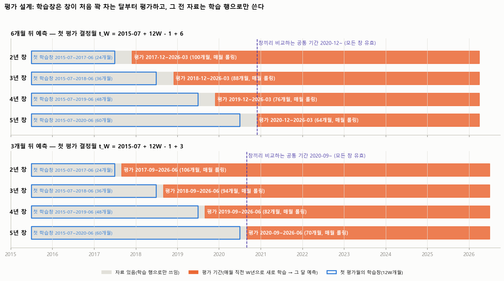
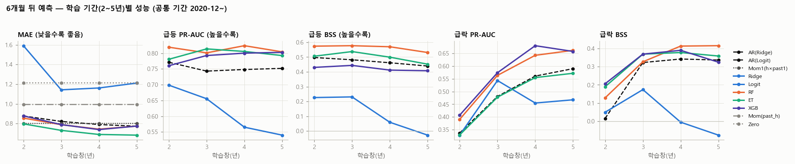
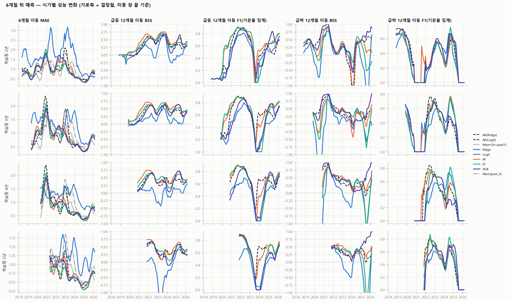
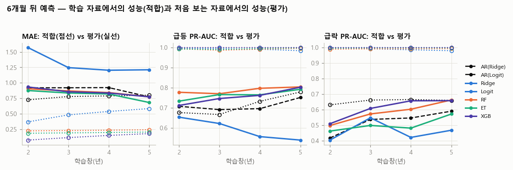
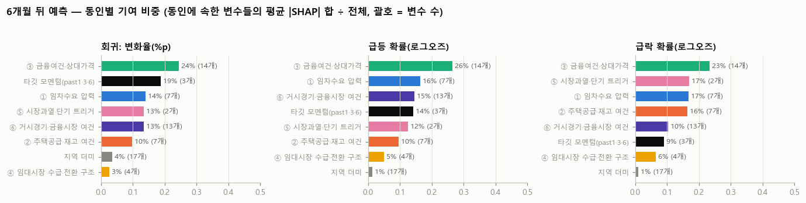
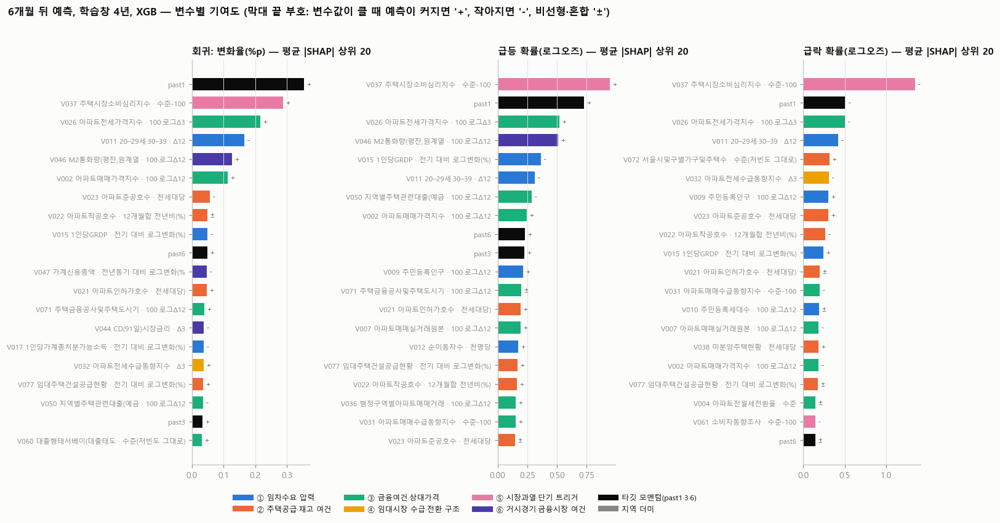

# 10차(2026-10) 재구축 — 팀원용 개요

브랜치 `experiment_KS`, 2026-10-07~10. 9차(RMPI)의 연장이 아니라 **전처리부터 모형까지 처음부터 다시 만든 라운드**다.
이 문서 하나로 (1) 무엇이 달라졌는지, (2) 데이터와 결과가 어디 있는지, (3) 어떻게 다시 만드는지를 확인할 수 있게 썼다.

## 1. 한 줄 요약

- 데이터사전 변수 52개(+사용자 추가 V078)를 **raw API 원자료 기준으로 하나씩 보고** 변환 1개·공표시차·결측 처리를 결정했다(`docs/전처리결정로그_10차.csv`, 변수마다 탐색 카드).
- 그 결정으로 **17개 시도 × 결정월(2014-01~2026-09) 학습 데이터**를 만들었다(설명변수 47열 + 타깃 8열).
- 베이스라인(타깃 자신의 모멘텀) 대비 설명변수의 효과를 **롤링 학습창(2·3·4·5년) 전진 평가**로 쟀고, 급등·급락(±1%) 분류와 변화율 회귀를 Ridge/Logit·RF·ET·XGB로 비교했다.
- 결과(각 학습창을 창이 처음 꽉 차는 달부터 평가): 6개월 뒤 예측에서 트리 모형이 같은 창의 AR 베이스라인보다 MAE 5~12% 낮고, 급등·급락 분류 PR-AUC가 0.05~0.11 높다. 단순 규칙 mom1 과는 기간에 따라 뒤집힌다(5년 창 2020-12~ 에서는 ET가 15% 낫지만, 2020 급등 초입을 포함하는 2~4년 창에서는 mom1이 낫다). 이득은 2021~23 전환기에 집중된다. 기여도는 ③ 금융여건·상대가격 동인과 소비심리지수(V037)·모멘텀이 가장 크다. (수치와 평가 설계의 한계는 5장)

## 2. 9차와 달라진 점

| 항목 | 9차 (RMPI) | 10차 |
|---|---|---|
| 입력 자료 | 취합본 xlsx(1차 결측보완·2차 공표시점반영 시트) | **raw API 원자료만**(`raw/`), 취합본·processed 미사용. 국토부 실거래는 건별 파일을 직접 집계 |
| 변수 처리 | 41열을 동인 지수 6개(RMPI)로 압축, 훈련창 표준화·부호 | **변수당 변환 1개**를 정상성(ADF·KPSS)·탐색창 상관·역할(취약성/트리거)로 결정, 지수 압축 없음 |
| 변수 수 | 공통 41 + 지역 31 | 설명변수 47 (52개 중 흡수 4·종료 1 제외, V078 추가) |
| 특수 처리 | — | 임대주택 공급(V077)은 KOSIS 표가 바뀐 연도를 API로 이어 공공+민간 한 계열, 실거래(V006·V007)는 건별 집계, 주택가격전망CSI(V061~63)는 권역→시도 매핑, 임금(V066)·가계소득(V074)은 개정 계열 접합 |
| 학습 방식 | 2016~ 확장창, 매월, Ridge | **롤링 학습창 2·3·4·5년**(민감도), 매월, 정답 확정 행만(s ≤ t−h) |
| 베이스라인 | mom1(h×최근 1개월 변화) | AR(Ridge: past1·3·6) + 참고로 mom1·lasth·zero |
| 모형 | Ridge | Ridge/Logit, RF, ET, XGB (1차 고정 파라미터, 2차 RF·ET·XGB 중첩 시계열 CV 튜닝) |
| 사건 정의 | 급락 연율 −2% | 급등 G_h ≥ +1%, 급락 G_h ≤ −1% (h = 6 주, 3 보조) |
| 지표 | MAE, DM, Brier | MAE / F1 / PR-AUC / BSS, 학습창 안 적합 성능(과적합 진단), SHAP·순열 중요도 |
| 평가 기간 | 2018-01~2025-12 | **학습창마다 창이 처음 꽉 차는 달부터** ~2026-03(h=6) / ~2026-06(h=3). h=6 기준 2년 2017-12, 3년 2018-12, 4년 2019-12, 5년 2020-12 (그 전 자료는 학습 행으로만). 창 비교는 공통 기간(2020-12~) |

## 3. 산출물 지도 (GitHub에서 바로 열리는 것 → ✅, html 카드는 내려받아 브라우저로)

| 무엇 | 어디 | 비고 |
|---|---|---|
| 전처리 결정 로그 (변수 52개: 변환·시차·결측·정상성·비고) | [`docs/전처리결정로그_10차.csv`](전처리결정로그_10차.csv) | ✅ |
| 변수별 탐색 카드(raw 상태·후보 변환·정상성·타깃 관계·권고) | `analysis/output/변수카드/V0xx_*.html` | 내려받아 열기 |
| 변수 통합 소개 카드(목록·시계열·상관) | `analysis/output/변수카드/00_변수통합소개_10차.html` | 내려받아 열기; 그림은 `analysis/output/그림_10차/변수소개_*.png` ✅ |
| **학습 데이터(값)** | [`analysis/output/모형입력표_10차_values.csv`](../analysis/output/모형입력표_10차_values.csv) | ✅ 17 시도 × 결정월, region·결정월·구간 + 타깃 8열 + 설명변수 47열 |
| 학습 데이터(수식 버전) | `analysis/output/모형입력표_10차.xlsx` | 원값 열 + 변환 수식 열, 시트 `설명`에 열 뜻 |
| 모형 결과 카드(맨 위 요약·용어·설정·사건 수·민감도·개선·튜닝·시간 변화·과적합·기여도·분석) | `analysis/output/모형결과_10차/모형결과카드_10차.html` | 내려받아 열기; 그림은 `analysis/output/그림_10차/모형결과_*.png` ✅ |
| 학습·검증·평가 구조 대화형 그림(결정월·예측 기간·학습창을 바꿔 가며 확인) | `analysis/output/모형결과_10차/학습구조_시각화_10차.html` | 내려받아 열기(단일 파일) |
| 모형 지표 표 | [`metrics_summary.csv`](../analysis/output/모형결과_10차/metrics_summary.csv) · [`rolling_metrics.csv`](../analysis/output/모형결과_10차/rolling_metrics.csv)(결정월별) · [`fit_metrics.csv`](../analysis/output/모형결과_10차/fit_metrics.csv)(학습창 안 적합) | ✅ 창별 전체 유효 기간 기준(공통 기간 지표는 카드 ③에서 예측값으로 계산) |
| 모형 예측값 원자료 | [`predictions_h6.csv`](../analysis/output/모형결과_10차/predictions_h6.csv) · [`predictions_h3.csv`](../analysis/output/모형결과_10차/predictions_h3.csv) | ✅ 모형·학습창·결정월·시도별 예측과 정답(창별 첫 유효월부터) |
| 튜닝(2차) 결과 | `analysis/output/모형결과_10차_tuned/` (`metrics_summary.csv`, `tuned_params.csv` = 결정월별 선택 파라미터) | ✅ |
| 기여도(SHAP·순열) | [`contrib_var.csv`](../analysis/output/모형결과_10차/contrib_var.csv)(변수별) · [`contrib_driver.csv`](../analysis/output/모형결과_10차/contrib_driver.csv)(동인별) · `contrib_driver_time.csv`(시점별, 전체 기간) · `contrib_perm.csv` | ✅ 4년 창의 평가 행(h=6 2019-12~, h=3 2019-09~) 기준 |
| 결과 분석 글(전반적 평가·한계·보완) | [`analysis/output/모형결과_10차/분석_notes.html`](../analysis/output/모형결과_10차/분석_notes.html) | 카드 ⑨에 포함 |
| 9차·TH_v19 리뷰(10차 설계의 출발점) | [`리뷰_9차_모형입력_학습방법.md`](리뷰_9차_모형입력_학습방법.md) · [`리뷰_TH_v19_모형입력_학습방법.md`](리뷰_TH_v19_모형입력_학습방법.md) | ✅ |

큰 파일 두 개는 git에 넣지 않았다(재생성 가능): SHAP 긴 형식 `contrib_shap_long.csv`(68MB), 순열 원자료 `contrib_perm_long.csv`.

## 4. 코드 지도 (실행 순서)

| 단계 | 스크립트 | 입력 → 출력 |
|---|---|---|
| 0 수집 | `collect/collect_kosis.py` 등 (`.env` API 키 필요) | API → `raw/` |
| 1 변수 카드·결정 | `analysis/variable_card.py <ID>` / `--decide <ID> 키=값…` | raw → 카드 html, 결정 로그, 입력표 xlsx(`analysis/model_sheet.py`) |
| 2 값 데이터 | `analysis/model_values.py` | 결정 로그 + raw → `모형입력표_10차_values.csv` |
| 3 변수 소개 카드 | `analysis/dataset_card.py` | 값 CSV → `00_변수통합소개_10차.html` |
| 4 모형 | `analysis/rolling_models.py` (`--tune RF ET XGB --tag _tuned` 로 2차) | 값 CSV → `모형결과_10차/` |
| 5 기여도 | `analysis/contrib_analysis.py` (`--from-csv` 로 저장된 SHAP 값만 다시 요약) | 값 CSV → `contrib_*.csv`, 카드 ⑧ 본문 |
| 6 결과 카드 | `analysis/model_card.py` (평가 시작 규칙 = `rolling_models.first_full`: 창이 처음 꽉 차는 달) | 4·5 결과 + `분석_notes.html` → `모형결과카드_10차.html` |
| 7 그림 추출 | `analysis/export_card_figures.py` | 카드 html → `analysis/output/그림_10차/*.png` |

환경: python 3.11, 패키지 버전은 [`requirements_10차.txt`](../requirements_10차.txt) (pandas 2.3.3, scikit-learn 1.7.1, xgboost 3.1.2, statsmodels 0.14.5, matplotlib 3.10, openpyxl 3.1.5). Windows에서는 `PYTHONUTF8=1`로 실행, 그림의 한글 글꼴은 Malgun Gothic(다른 OS는 글꼴 지정 필요). 실행 시간: 모형 1차 약 40분, 기여도 약 45분, 튜닝 약 8시간.

재현 확인(2026-10-10): 브랜치를 빈 폴더에 새로 받아 저장소 파일만으로 `model_values.py`를 돌리면 커밋된 학습 데이터와 **수치가 완전히 일치**했고(최대 차이 0), 카드 생성과 모형 스크립트도 그대로 돌았다. API 키(.env)는 raw를 다시 수집할 때만 필요하다. 모형을 다시 돌리면 XGBoost 병렬 계산 때문에 지표가 ±0.02 안에서 달라질 수 있다.

## 5. 핵심 결과 (최종 자료: V078 = 최근 12개월 변경 합)

**평가 기간**: 학습창 W는 자료의 첫 정답(2015-07)으로부터 창이 처음 꽉 차는 달 t_W = 2015-07 + 12W − 1 + h 부터 평가한다. 그 전 달은 그 창으로 학습·평가하지 않고, 자료는 학습 행으로만 쓴다. 17개 시도 풀링. 수치 원본은 `metrics_summary.csv`·`predictions_h*.csv`.

| 학습창 | 6개월 뒤 예측 평가 | 3개월 뒤 예측 평가 |
|---|---|---|
| 2년 | 2017-12~2026-03 (100개월, 1,700행) | 2017-09~2026-06 (106개월) |
| 3년 | 2018-12~ (88개월, 1,496행) | 2018-09~ (94개월) |
| 4년 | 2019-12~ (76개월, 1,292행) | 2019-09~ (82개월) |
| 5년 | 2020-12~ (64개월, 1,088행) | 2020-09~ (70개월) |

창마다 평가 기간이 다르므로, **창 길이끼리 비교하고 최선 창을 고를 때는 네 창이 모두 유효한 공통 기간(h=6 2020-12~, h=3 2020-09~)** 을 쓰고, 같은 창 안에서 모형과 베이스라인을 비교할 때는 그 창의 전체 유효 기간을 쓴다.

**6개월 뒤 예측(주)** — 최선 창은 공통 기간에서 고르고, 값은 그 창의 전체 유효 기간

| 과제 | 최선 모형 | 평가 기간 | 최선 값 | 같은 창 AR | 개선 | 공통 기간 값 |
|---|---|---|---|---|---|---|
| 회귀 MAE(%p) | ET 5년 | 2020-12~ | 0.682 | 0.773 | −12% (mom1 0.801 대비 −15%) | 0.682 vs AR 0.773 |
| 급등 PR-AUC / BSS | RF 4년 | 2019-12~ | 0.80 / 0.52 | 0.70 / 0.38 | +0.10 / +0.14 | 0.82 / 0.57 |
| 급락 PR-AUC / BSS | XGB 4년 | 2019-12~ | 0.66 / 0.42 | 0.55 / 0.37 | +0.11 / +0.05 | 0.68 / 0.39 |

- **트리 모형은 네 창 모두에서 같은 창의 AR을 이긴다.** 회귀 MAE는 5~12% 낮고(2년 ET 0.876 vs AR 0.920 ~ 5년 0.682 vs 0.773), 급등 PR-AUC는 +0.05~+0.10, 급락은 +0.07~+0.11 높다.
- **단순 규칙 mom1과의 비교는 기간에 따라 뒤집힌다.** 5년 창(2020-12~)에서는 ET가 mom1보다 15% 낫지만, 2020 급등 초입을 평가에 포함하는 짧은 창에서는 mom1이 낫다(2년 ET 0.876 vs mom1 0.788, 3년 0.836 vs 0.798, 4년 0.820 vs 0.811). 국면별로 mom1은 2018~19 급락기와 2020 급등 초입에 강하고(2년 창 2020년 mom1 0.88 vs ET 1.58), ET는 2021 급등 말기와 2022~23 하락·전환기에 강하며(5년 창 2022~23 ET 0.71 vs mom1 0.92), 2024~26은 비슷하다. 설명변수의 이득은 전환기에 집중된다.
- **학습창은 4~5년이 낫다.** 공통 기간 ET MAE는 2년 0.797 → 3년 0.730 → 4년 0.689 → 5년 0.682. 2년 창은 급락 예측이 무너진다(공통 기간 PR-AUC 0.33~0.41, 양성 비율 9%).
- 전체 변수를 넣은 선형 모형(Ridge MAE 1.20~1.57, Logit 급등 BSS −0.03~0.21)은 모든 창에서 베이스라인보다 나쁘다(과적합). 트리 모형만 이긴다.
- 튜닝(RF·ET·XGB 중첩 시계열 CV, 4·5년 창 3개월 간격 표본 21~25개월): RF는 회귀·급락이 0.02~0.05 좋아지지만 급등은 나빠지고, ET는 회귀가 나빠지는 등 방향이 엇갈려 보류(카드 ⑤, V078 변경 전 자료 기준).

**평가 설계의 한계**(카드 맨 위 상자에도 명시): 창마다 평가 기간과 국면 구성이 달라 창별 전체 기간 수치를 서로 직접 비교하면 안 된다. 4·5년 창은 2018~19 급락기(급락 121건, 전체 219건의 55%)를 평가하지 못해, 급락 성능이 사실상 2022~23 한 국면(공통 기간 급락 98건의 81%)으로 판단된다. 공통 기간은 1,088행·급락 98건으로 표본이 작고, 유의성 검정은 하지 않았다. 9차·TH_v19(2018~ 평가)와 기간이 비슷한 것은 2년 창 결과뿐이다. 롤링은 달마다 독립 학습이라 겹치는 달의 예측은 2018-01부터 모든 창을 평가했던 이전 실행(커밋 c0003b3)과 동일하다(재실행으로 확인). 바뀐 것은 창이 안 찬 달을 평가에서 뺀 것뿐이다.

**3개월 뒤 예측(보조)**: 회귀는 ET 5년 0.321 vs AR 0.351(−8%)이나 mom1 0.324와 같고, 2~4년 창에서는 mom1이 가장 좋다(0.303~0.312). 분류는 급등 AR(Logit) 5년 0.74/0.50이 가장 좋고 급락은 XGB 0.69 ≈ AR 0.68. 3개월 안의 급등·급락은 모멘텀이 거의 설명한다.

**과적합(카드 ⑦)**: 트리 모형은 학습창 안 적합 오차가 평가의 1/3~1/5(4년 창 ET 0.20 vs 0.82, 5년 창 0.21 vs 0.68)이지만 평가 성능이 베이스라인을 넘고 창이 길수록 개선 → 해로운 과적합은 아님. 전체 변수 Ridge·Logit은 적합만 좋고 평가가 나쁜 전형적 과적합. 튜닝 모형의 CV 점수는 평가보다 낮거나 비슷해 선택 과적합 징후 없음.

**기여도(카드 ⑧, XGB TreeSHAP, 학습창 4년, 6개월 뒤 예측, 4년 창 평가 행 2019-12~)**: 동인별 비중은 ③ 금융여건·상대가격 23~27%, 타깃 모멘텀 9~19%, ① 임차수요 14~17%, ⑤ 시장과열·단기 트리거 13~17%, ⑥ 거시 10~15%, ② 공급·재고 10~16%(급락에서 큼), ④ 수급·전환 3~6%, 지역 더미 1~4%. 변수 하나로는 회귀에서 past1(15%)·주택시장 소비심리지수(V037, 13%)·전세가격지수 3개월 변화(V026, 9%)·청년 인구 비중 Δ12(V011)·M2 전년비(V046)·매매가격지수 전년비(V002) 순(상위 5개가 50%)이고, 급등·급락 확률에서는 V037이 1위(11%·15%). 부호는 직관과 맞고(심리·전세·매매 상승·모멘텀·M2 증가 → 월세 상승·급등↑, 준공 증가·보급률 상승 → 급락↑), 전세·매매 변화율과 M2는 임계형 비선형이라 선형 모형이 놓친 부분이 트리 모형 이득의 원천이다. ET·RF의 표본 외 순열 중요도도 같은 변수를 꼽는다. 수치는 `contrib_var.csv`·`contrib_driver.csv`.

**9차·TH_v19와의 비교(같은 mom1 기준)**: TH는 2021~25에서 mom1 대비 −9%, 2018~25 전체에서는 mom1보다 7~12% 나빴고 9차 패널은 0~3% 개선에 그쳤다. 평가 기간이 비슷한 10차 2년 창(2017-12~)도 ET가 mom1보다 11% 나쁘다(0.876 vs 0.788). 2020 급등 초입을 평가에 포함하면 세 실험 모두 학습 모형이 mom1에 지는 셈이다. 10차의 급락 분류는 2년 창에서도 XGB PR-AUC 0.51(사건비율 0.13의 4배)로 AR 0.42보다 낫다. 국면이 두세 개뿐이고 같은 평가창을 세 실험이 반복해서 본 한계는 그대로다.

### 핵심 그림 (카드에서 뽑은 PNG, 전체 73장은 `analysis/output/그림_10차/`)

평가 설계 — 학습창마다 창이 처음 꽉 차는 달부터 평가(회색 = 학습 행으로만 쓰이는 기간), 보라 점선 = 창 비교용 공통 기간

학습 기간(2~5년)별 성능, 6개월 뒤 예측, 공통 기간(2020-12~) — 창이 길수록 좋아지고, 트리 모형(RF·ET·XGB)만 베이스라인(검은 점선)을 넘으며, 전체 변수 Ridge(파랑)는 더 나쁘다

시기별 성능(6개월·12개월 이동 창, 창별 첫 유효월부터) — 2년 창 행에서 2018~19 급락기와 2020 급등 초입이 보이며, 급등 초입에는 학습 모형이 mom1보다 뒤처지고 2021·2022~23 전환기에는 트리 모형이 앞선다

과적합 점검 — 점선(학습 자료 적합) vs 실선(평가)

동인별 기여 비중과 변수별 기여(SHAP), 6개월 뒤 예측

타깃 G6 시계열(17개 시도)과 설명변수 간 상관(변수 소개 카드)

## 6. 보류·다음 단계

- 평가는 학습창마다 창이 처음 꽉 차는 달부터 한다(그 전은 그 창으로 학습·평가하지 않음). 한계는 5장과 카드 맨 위에 적었고, 2018-01부터 모든 창을 평가했던 이전 실행은 커밋 c0003b3 에 남아 있다. 학습 모형이 급등 초입에 mom1보다 약하므로, 트리 모형과 mom1의 결합을 다음 후보로 둔다.
- 튜닝(2차)은 이득이 작고 선택값이 불안정해 보류. 카드 ⑤의 튜닝 결과는 V078을 바꾸기 전 자료로 계산된 것(주석 있음).
- 다음 후보: 변수 축소(중복 묶음 하나씩), RF·XGB 앙상블과 확률 보정, 사건 정의 민감도(±0.5·1.5%), 블록 부트스트랩으로 개선폭 신뢰구간, 월별 자동 재학습 파이프라인(raw가 전부 API 수집이라 가능).
- 서울 25개 구 보조 패널은 값 CSV를 만들지 않았다(구 raw가 없는 변수의 복제 처리 미완).
