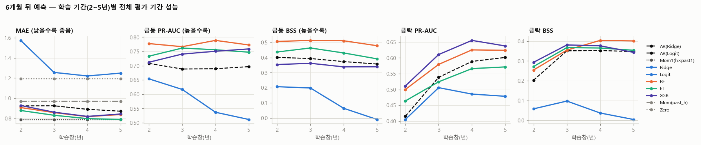
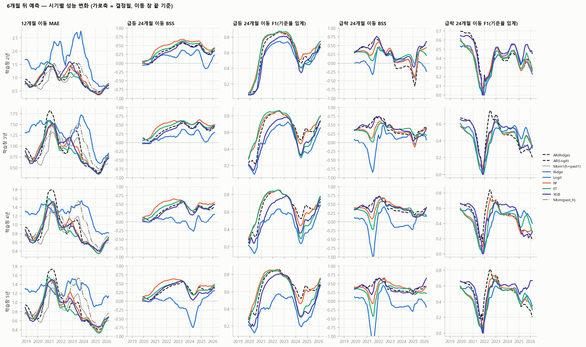
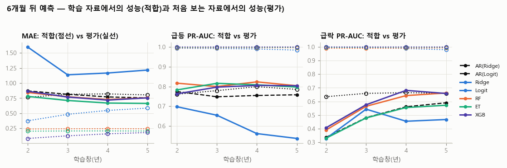
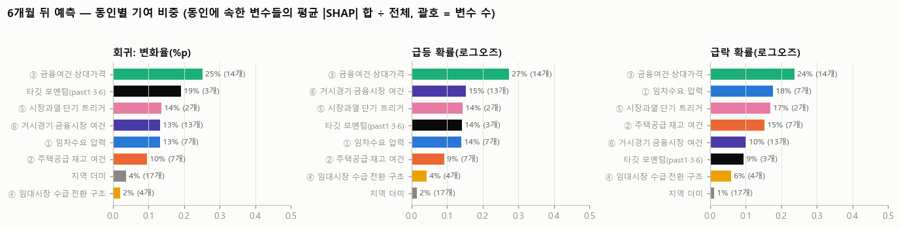
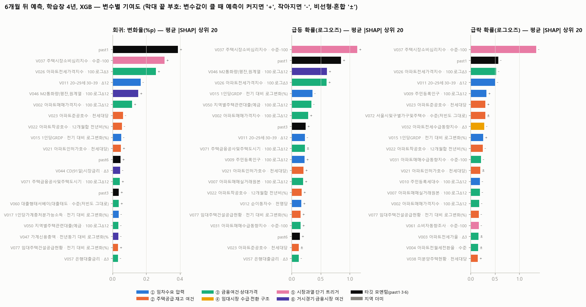
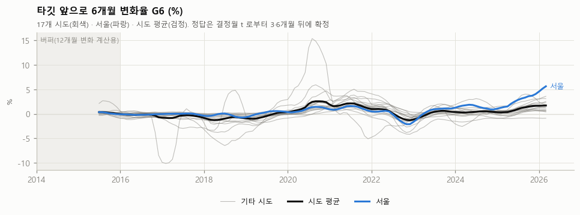
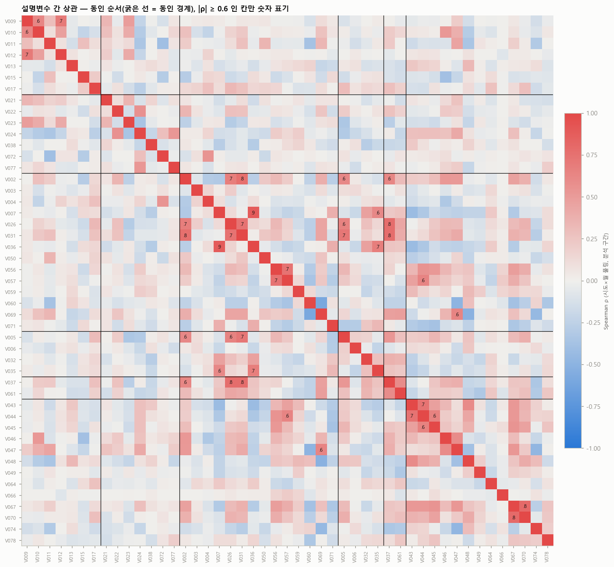

# 10차(2026-10) 재구축 — 팀원용 개요

브랜치 `experiment_KS`, 2026-10-07~10. 9차(RMPI)의 연장이 아니라 **전처리부터 모형까지 처음부터 다시 만든 라운드**다.
이 문서 하나로 (1) 무엇이 달라졌는지, (2) 데이터와 결과가 어디 있는지, (3) 어떻게 다시 만드는지를 확인할 수 있게 썼다.

## 1. 한 줄 요약

- 데이터사전 변수 52개(+사용자 추가 V078)를 **raw API 원자료 기준으로 하나씩 보고** 변환 1개·공표시차·결측 처리를 결정했다(`docs/전처리결정로그_10차.csv`, 변수마다 탐색 카드).
- 그 결정으로 **17개 시도 × 결정월(2014-01~2026-09) 학습 데이터**를 만들었다(설명변수 47열 + 타깃 8열).
- 베이스라인(타깃 자신의 모멘텀) 대비 설명변수의 효과를 **롤링 학습창(2·3·4·5년) 전진 평가**로 쟀고, 급등·급락(±1%) 분류와 변화율 회귀를 Ridge/Logit·RF·ET·XGB로 비교했다.
- 결과: 6개월 뒤 예측에서 트리 모형이 AR 베이스라인보다 MAE 9% 낮고, 급등·급락 분류 PR-AUC가 0.06~0.08 높다. 단, 가장 단순한 mom1(최근 1개월 변화의 연장) 기준으로는 전체 기간 동률이고 이득은 2021~25 국면 전환기에 집중된다. 기여도는 ③ 금융여건·상대가격 동인과 소비심리지수(V037)가 가장 크다. (수치는 5장)

## 2. 9차와 달라진 점

| 항목 | 9차 (RMPI) | 10차 |
|---|---|---|
| 입력 자료 | 취합본 xlsx(1차 결측보완·2차 공표시점반영 시트) | **raw API 원자료만**(`raw/`), 취합본·processed 미사용. 국토부 실거래는 건별 파일을 직접 집계 |
| 변수 처리 | 41열을 동인 지수 6개(RMPI)로 압축, 훈련창 표준화·부호 | **변수당 변환 1개**를 정상성(ADF·KPSS)·탐색창 상관·역할(취약성/트리거)로 결정, 지수 압축 없음 |
| 변수 수 | 공통 41 + 지역 31 | 설명변수 47 (52개 중 흡수 4·종료 1 제외, V078 추가) |
| 특수 처리 | — | 임대주택 공급(V077)은 KOSIS 표가 바뀐 연도를 API로 이어 공공+민간 한 계열, 실거래(V006·V007)는 건별 집계, 주택가격전망CSI(V061~63)는 권역→시도 매핑, 임금(V066)·가계소득(V074)은 개정 계열 접합 |
| 학습 방식 | 2016~ 확장창, 매월, Ridge | **롤링 학습창 2·3·4·5년**(민감도), 매월, 정답 확정 행만(s ≤ t−h) |
| 베이스라인 | mom1(h×최근 1개월 변화) | AR(Ridge: past1·3·6) + 참고로 mom1·lasth·zero |
| 모형 | Ridge | Ridge/Logit, RF, ET, XGB (1차 고정 파라미터, 2차 RF·ET·XGB 중첩 시계열 CV 튜닝) |
| 사건 정의 | 급락 연율 −2% | 급등 G_h ≥ +1%, 급락 G_h ≤ −1% (h = 6 주, 3 보조) |
| 지표 | MAE, DM, Brier | MAE / F1 / PR-AUC / BSS, 학습창 안 적합 성능(과적합 진단), SHAP·순열 중요도 |
| 평가 기간 | 2018-01~2025-12 | 2018-01~2026-03(h=6) / ~2026-06(h=3) |

## 3. 산출물 지도 (GitHub에서 바로 열리는 것 → ✅, html 카드는 내려받아 브라우저로)

| 무엇 | 어디 | 비고 |
|---|---|---|
| 전처리 결정 로그 (변수 52개: 변환·시차·결측·정상성·비고) | [`docs/전처리결정로그_10차.csv`](전처리결정로그_10차.csv) | ✅ |
| 변수별 탐색 카드(raw 상태·후보 변환·정상성·타깃 관계·권고) | `analysis/output/변수카드/V0xx_*.html` | 내려받아 열기 |
| 변수 통합 소개 카드(목록·시계열·상관) | `analysis/output/변수카드/00_변수통합소개_10차.html` | 내려받아 열기; 그림은 `analysis/output/그림_10차/변수소개_*.png` ✅ |
| **학습 데이터(값)** | [`analysis/output/모형입력표_10차_values.csv`](../analysis/output/모형입력표_10차_values.csv) | ✅ 17 시도 × 결정월, region·결정월·구간 + 타깃 8열 + 설명변수 47열 |
| 학습 데이터(수식 버전) | `analysis/output/모형입력표_10차.xlsx` | 원값 열 + 변환 수식 열, 시트 `설명`에 열 뜻 |
| 모형 결과 카드(맨 위 요약·용어·설정·사건 수·민감도·개선·튜닝·시간 변화·과적합·기여도·분석) | `analysis/output/모형결과_10차/모형결과카드_10차.html` | 내려받아 열기; 그림은 `analysis/output/그림_10차/모형결과_*.png` ✅ |
| 학습·검증·평가 구조 대화형 그림(결정월·예측 기간·학습창을 바꿔 가며 확인) | `analysis/output/모형결과_10차/학습구조_시각화_10차.html` | 내려받아 열기(단일 파일) |
| 모형 지표 표 | [`metrics_summary.csv`](../analysis/output/모형결과_10차/metrics_summary.csv) · [`rolling_metrics.csv`](../analysis/output/모형결과_10차/rolling_metrics.csv)(결정월별) · [`fit_metrics.csv`](../analysis/output/모형결과_10차/fit_metrics.csv)(학습창 안 적합) | ✅ |
| 모형 예측값 원자료 | [`predictions_h6.csv`](../analysis/output/모형결과_10차/predictions_h6.csv) · [`predictions_h3.csv`](../analysis/output/모형결과_10차/predictions_h3.csv) | ✅ 모형·학습창·결정월·시도별 예측과 정답 |
| 튜닝(2차) 결과 | `analysis/output/모형결과_10차_tuned/` (`metrics_summary.csv`, `tuned_params.csv` = 결정월별 선택 파라미터) | ✅ |
| 기여도(SHAP·순열) | [`contrib_var.csv`](../analysis/output/모형결과_10차/contrib_var.csv)(변수별) · [`contrib_driver.csv`](../analysis/output/모형결과_10차/contrib_driver.csv)(동인별) · `contrib_driver_time.csv`(시점별) · `contrib_perm.csv` | ✅ |
| 결과 분석 글(전반적 평가·한계·보완) | [`analysis/output/모형결과_10차/분석_notes.html`](../analysis/output/모형결과_10차/분석_notes.html) | 카드 ⑨에 포함 |
| 9차·TH_v19 리뷰(10차 설계의 출발점) | [`리뷰_9차_모형입력_학습방법.md`](리뷰_9차_모형입력_학습방법.md) · [`리뷰_TH_v19_모형입력_학습방법.md`](리뷰_TH_v19_모형입력_학습방법.md) | ✅ |

큰 파일 두 개는 git에 넣지 않았다(재생성 가능): SHAP 긴 형식 `contrib_shap_long.csv`(68MB), 순열 원자료 `contrib_perm_long.csv`.

## 4. 코드 지도 (실행 순서)

| 단계 | 스크립트 | 입력 → 출력 |
|---|---|---|
| 0 수집 | `collect/collect_kosis.py` 등 (`.env` API 키 필요) | API → `raw/` |
| 1 변수 카드·결정 | `analysis/variable_card.py <ID>` / `--decide <ID> 키=값…` | raw → 카드 html, 결정 로그, 입력표 xlsx(`analysis/model_sheet.py`) |
| 2 값 데이터 | `analysis/model_values.py` | 결정 로그 + raw → `모형입력표_10차_values.csv` |
| 3 변수 소개 카드 | `analysis/dataset_card.py` | 값 CSV → `00_변수통합소개_10차.html` |
| 4 모형 | `analysis/rolling_models.py` (`--tune RF ET XGB --tag _tuned` 로 2차) | 값 CSV → `모형결과_10차/` |
| 5 기여도 | `analysis/contrib_analysis.py` | 값 CSV → `contrib_*.csv`, 카드 ⑧ 본문 |
| 6 결과 카드 | `analysis/model_card.py` | 4·5 결과 + `분석_notes.html` → `모형결과카드_10차.html` |
| 7 그림 추출 | `analysis/export_card_figures.py` | 카드 html → `analysis/output/그림_10차/*.png` |

환경: `conda` 환경 `FinancialDataAnalytics`(python 3.11, pandas 2.3, sklearn 1.7, xgboost 3.1, openpyxl), Windows에서는 `PYTHONUTF8=1`로 실행. 실행 시간: 모형 1차 약 40분, 기여도 약 45분, 튜닝 약 8시간.

## 5. 핵심 결과 (최종 자료: V078 = 최근 12개월 변경 합)

전체 평가 기간 2018-01~2026-03(h=6, 1,683행) / ~2026-06(h=3, 1,734행), 17개 시도 풀링. 수치 원본은 `analysis/output/모형결과_10차/metrics_summary.csv`.

**6개월 뒤 예측(주)**

| 과제 | 베이스라인 AR(타깃 과거 변화율만) | 최선 모형 | 개선 | 단순 기준 mom1 |
|---|---|---|---|---|
| 회귀 MAE(%p) | 0.872 (5년 창) | ET 0.791 (5년 창) | −9% | 0.790 (동률) |
| 급등(≥+1%) PR-AUC / BSS | 0.690 / 0.373 | RF 0.789 / 0.511 (4년 창) | +0.10 / +0.14 | — |
| 급락(≤−1%) PR-AUC / BSS | 0.589 / 0.353 | XGB 0.655 / 0.377 (4년 창), RF 0.625 / 0.404 | +0.07 / +0.05 | — |

- 학습창은 4~5년이 안정적이고 2년은 모든 모형에서 불안정(급락 양성 부족).
- 전체 변수를 넣은 선형 모형(Ridge·Logit)은 베이스라인보다 나쁘다(과적합). 트리 모형만 이긴다.
- 가장 단순한 mom1(최근 1개월 변화 × 6)이 AR(Ridge)보다 강한 기준이며, 전체 기간에서는 ET와 동률이다. 설명변수의 이득은 2021~25 국면 전환기에 집중된다(그 기간 ET는 mom1보다 19% 낫다).
- 튜닝(RF·ET·XGB 중첩 시계열 CV): 같은 표본에서 ±0.02 이내의 작은 변화라 보류(카드 ⑤, 이전 자료 기준).

**3개월 뒤 예측(보조)**: 회귀는 XGB 0.316 vs AR 0.359(−12%)이나 mom1 0.309에는 못 미치고, 분류는 AR 베이스라인이 가장 좋거나 비슷하다(급락 AR PR-AUC 0.655). 3개월 안의 급등·급락은 모멘텀이 거의 설명한다.

**과적합(카드 ⑦)**: 트리 모형은 학습창 안 적합 오차가 평가의 1/4~1/6이지만 평가 성능이 베이스라인을 넘고 창이 길수록 개선 → 해로운 과적합은 아님. 전체 변수 Ridge·Logit은 적합만 좋고 평가이 나쁜 전형적 과적합.

**기여도(카드 ⑧, XGB TreeSHAP, 학습창 4년, 6개월 뒤 예측)**: 동인별 비중은 ③ 금융여건·상대가격 24~27%, 타깃 모멘텀 8~18%, ① 임차수요 16~19%, ⑤ 시장과열·단기 트리거 11~17%, ⑥ 거시 10~14%, ② 공급·재고 9~18%(급락에서 큼), ④ 수급·전환 3~7%, 지역 더미 1~4%. 변수 하나로는 주택시장 소비심리지수(V037)가 세 과제 모두 최상위이고 past1·전세가격지수 3개월 변화(V026)·청년 인구 비중 Δ12(V011)·매매가격지수 전년비(V002)·M2 전년비(V046)가 뒤를 잇는다(상위 5개가 기여의 약 45%). 부호는 직관과 맞고(심리·전세·매매 상승·모멘텀·M2 증가 → 월세 상승·급등↑, 준공 증가·보급률 상승 → 급락↑), 전세·매매 변화율과 M2는 임계형 비선형이라 선형 모형이 놓친 부분이 트리 모형 이득의 원천이다. ET·RF의 표본 외 순열 중요도도 같은 변수를 꼽는다. 수치는 `contrib_var.csv`·`contrib_driver.csv`.

**9차·TH_v19와의 비교(같은 mom1 기준)**: TH는 2021~25에서 −9%, 2018~25 전체에서는 mom1보다 7~12% 나빴고 9차 패널은 0~3% 개선에 그쳤다. 10차는 2021~25 −19%, 2018~25 동률로 처음으로 전 기간에서 mom1에 지지 않았고, 급락 분류 PR-AUC 0.66은 사건비율 0.13의 5배다. 다만 국면이 두세 개뿐이고 같은 평가창을 세 실험이 반복해서 본 한계는 그대로다.

### 핵심 그림 (카드에서 뽑은 PNG, 전체 70장은 `analysis/output/그림_10차/`)

학습 기간(2~5년)별 성능, 6개월 뒤 예측 — 트리 모형(RF·ET·XGB)만 베이스라인(검은 점선)을 넘고, 전체 변수 Ridge(파랑)는 더 나쁘다

시기별 성능 — 2020~21 급등기에 모든 모형의 오차가 커지고, 설명변수 모형이 베이스라인을 확실히 이기는 때는 2021·2023 전환기

과적합 점검 — 점선(학습 자료 적합) vs 실선(평가)

동인별 기여 비중과 변수별 기여(SHAP), 6개월 뒤 예측

타깃 G6 시계열(17개 시도)과 설명변수 간 상관(변수 소개 카드)

## 6. 보류·다음 단계

- 튜닝(2차)은 이득이 작고 선택값이 불안정해 보류. 카드 ⑤의 튜닝 결과는 V078을 바꾸기 전 자료로 계산된 것(주석 있음).
- 다음 후보: 변수 축소(중복 묶음 하나씩), RF·XGB 앙상블과 확률 보정, 사건 정의 민감도(±0.5·1.5%), 블록 부트스트랩으로 개선폭 신뢰구간, 월별 자동 재학습 파이프라인(raw가 전부 API 수집이라 가능).
- 서울 25개 구 보조 패널은 값 CSV를 만들지 않았다(구 raw가 없는 변수의 복제 처리 미완).
