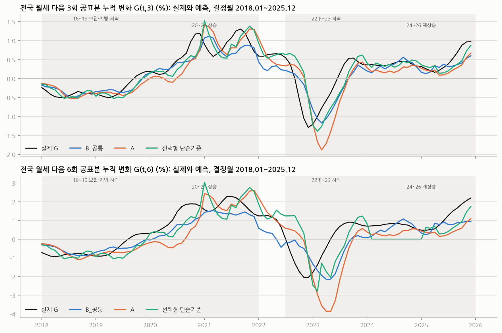
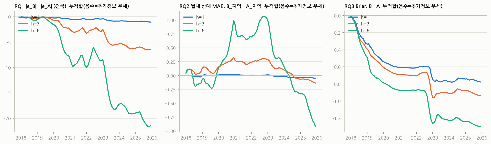
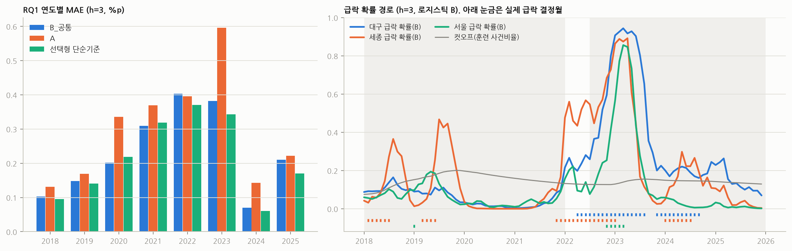
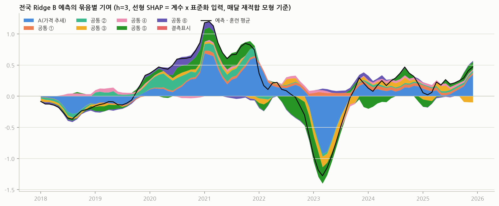
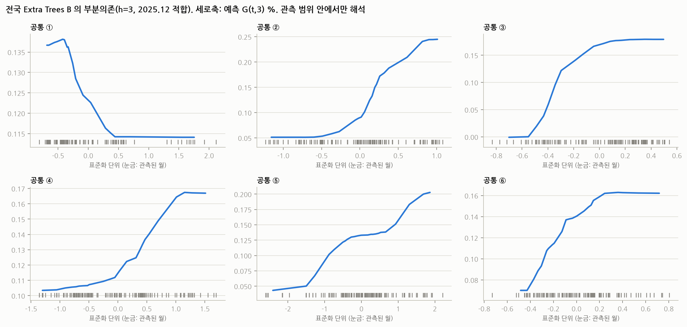
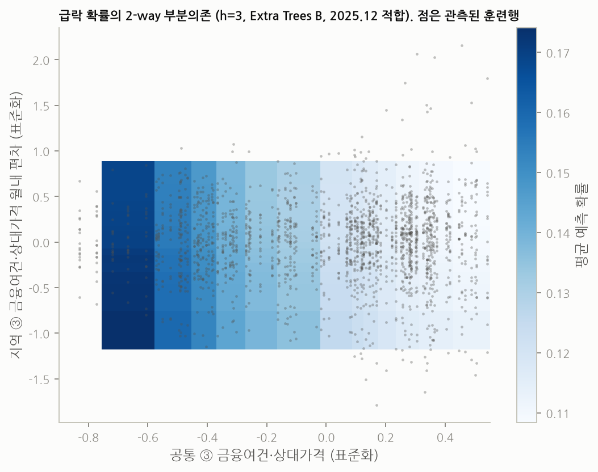

# 아파트 월세 흐름 진단과 급변 예측: 8차 확정 계획의 실행 결과

> 계획: docs/연구계획_8차_확정본.md · 설정: config/plan_v8_settings.yaml (sha256 cb5ae07a7ab2eb1b, v8.1) · 실행 코드: rmpi/ · 산출물: rmpi/output/ · 평가 구간: 결정월 2018-01~2025-12, 월별 재적합

실행 기록(stage6_manifest.csv): 9ca337e; 데이터취합_전처리_20261004.xlsx d4cb52e7a2b7c982; 데이터취합_20261004.xlsx 8e65ad87deeab22c; raw/5_시장과열단기트리거/V001_월세통합가격지수_A_2024_00054.csv 4e58143d259e1a3a; raw/3_금융여건상대가격/V002_매매가격지수_A_2024_00045.csv 843b441425e019a5; raw/3_금융여건상대가격/V026_전세가격지수_A_2024_00050.csv 322a95fb45e22428; raw/7_보완용_사전외/보완_V001_월세가격지수(구)_A_2024_00164.csv 957eae180454f5d2; pandas 3.0.6; numpy 2.4.6; scikit-learn 1.9.1

## 0 핵심 결과 (수치는 아래 표에서 가져옴)

- RQ1(전국 공통 흐름): B_공통의 MAE 는 A 의 0.82·0.77·0.72배(h=1·3·6)로 h=1·3 에서 ‘개선’이지만, 선택형 단순기준 대비는 1.09·1.06·0.86배로 모두 ‘차이 불확실’이다. 선택형 단순기준은 거의 모든 시점에서 ‘h×최근 월변화’(mom1)가 선택됐다. A 자체가 선택형 단순기준보다 나쁘고(비 1.33·1.37·1.20), alpha 를 해마다 다시 고르는 민감도에서는 B 와 A 의 차이가 0.97·0.89·0.75배로 줄어 모두 ‘차이 불확실’이다. 따라서 사전 고정한 alpha=10 이 가격 추세 모형 A 를 과하게 축소했고, B 의 A 대비 개선 중 상당 부분은 그 영향으로 해석해야 한다. 계획의 종합 규칙에 따라 RQ1 은 ‘지지 안 됨’이다.

- RQ2(시도 상대 변화): 지역 RMPI 를 더한 B_지역은 상대 가격 추세 A_지역과 같다(비 0.99·1.00·0.99). 상대 가격 추세 자체는 ‘차이 0 기준’보다 크게 낫다(비 0.52·0.66·0.75). 지역 동인에 정보가 없다는 뜻이 아니라, 가격 추세에 더해 얻는 개선을 확인하지 못한 것이다.

- RQ3(급락 확률): B 의 Brier 는 A 의 0.89·0.88·0.86배로 세 기간 모두 연평균 구간만 0 아래인 ‘개선 신호’다(2년 묶음 구간은 0 을 포함). 개선은 주로 이미 하락 중인 지역(기존 급락 상태)에서 나오고, 비급락 상태에서의 Brier 차이는 작다. 국면 시작 사례의 경보 선행은 대부분 1개월이다.

- 위약 시험: 공통 블록을 무작위 계열로 바꾼 20회의 B 보다 실제 B 의 MAE 가 모두 낮다(분위 0.00·0.00·0.00). 공통 블록에 잡음 이상의 정보가 있지만 그것이 모멘텀 규칙을 이기는 데까지는 이르지 못했다. 대용계열 확장(옛 수도권 지수, 가중치 1)은 B 의 MAE 를 +0.017·+0.122·+0.382%p 바꿔 오히려 나빠졌다. (정오표 2026-10-05: 이 확장 실험은 계획과 달리 옛 체계 행을 합친 훈련표로 관측률 필터·표준화·부호를 다시 계산해 지수 구성이 바뀌었다. 효과 판단을 보류한다. 6장 끝 참조.)

- 해석: 선형 SHAP 과 동인 제거 재학습 모두에서 ⑤ 시장과열·단기 트리거(소비심리·주택가격전망 CSI)가 공통 RMPI 의 기여를 주도한다. 다른 동인을 빼도 MAE 변화는 작다.

- 결합 예측: 공통 성분을 전국 모형으로, 월내 성분을 상대 모형으로 나눈 결합 B 와 같은 입력의 통합 패널 B 는 ‘차이 불확실’이며, h=1 에서는 지역별 mom1 단순 규칙이 둘보다 낫다.

- 트리 모형(Extra Trees)은 모든 과제에서 Ridge 보다 나쁘거나 같았다. 추가 비교모형(부록)에서도 선형 계열이 가장 좋았다.

## 1 사전 지정 주 분석의 판정

판정 규칙(계획 1장): d(t) = L_추가정보 − L_기준. 결정연도 8개 연평균의 95% t구간(자유도 7)과 2년 묶음 4개의 t구간(자유도 3)의 상한이 모두 0 미만이면 ‘개선’, 연평균 구간만이면 ‘개선 신호’. RQ1 은 같은 h 에서 A 대비와 선택형 단순기준 대비가 모두 ‘개선’이어야 그 h 를 개선으로 센다.

| RQ | h=1 | h=3 | h=6 | 요약 |
|---|---|---|---|---|
| RQ1 | 개선(대 A) / 차이 불확실(대 단순기준) | 개선(대 A) / 차이 불확실(대 단순기준) | 차이 불확실(대 A) / 차이 불확실(대 단순기준) | 지지 안 됨 |
| RQ2 | 차이 불확실 | 차이 불확실 | 차이 불확실 | 지지 안 됨 |
| RQ3 | 개선 신호 | 개선 신호 | 개선 신호 | 지지 안 됨 |

주 비교의 수치(손실 차이 평균 d̄, 두 t구간, 손실이 낮았던 연도 수/8, 평균의 비, 블록 12 부트스트랩은 참고):

| 비교 | h | d̄ | 연평균 하한 | 연평균 상한 | 2년 하한 | 2년 상한 | 우세 연도 | 판정 | MAE비율(평균의 비) | 부트12 하한 | 부트12 상한 |
|---|---|---|---|---|---|---|---|---|---|---|---|
| RQ1 B_공통 대 A | 1 | -0.011 | -0.020 | -0.002 | -0.018 | -0.004 | 8 | 개선 | 0.818 | -0.019 | -0.003 |
| RQ1 B_공통 대 선택형 단순기준 | 1 | 0.004 | -0.001 | 0.009 | -0.004 | 0.012 | 4 | 차이 불확실 | 1.090 | -0.001 | 0.011 |
| RQ1 B_공통 대 A | 3 | -0.067 | -0.129 | -0.005 | -0.130 | -0.004 | 7 | 개선 | 0.773 | -0.123 | -0.017 |
| RQ1 B_공통 대 선택형 단순기준 | 3 | 0.014 | -0.004 | 0.032 | -0.020 | 0.047 | 2 | 차이 불확실 | 1.063 | -0.013 | 0.044 |
| RQ1 B_공통 대 A | 6 | -0.224 | -0.453 | 0.006 | -0.442 | -0.005 | 7 | 차이 불확실 | 0.720 | -0.416 | -0.054 |
| RQ1 B_공통 대 선택형 단순기준 | 6 | -0.094 | -0.277 | 0.090 | -0.260 | 0.073 | 5 | 차이 불확실 | 0.860 | -0.227 | 0.047 |
| RQ2 B_지역 대 A_지역 | 1 | -0.000 | -0.002 | 0.001 | -0.002 | 0.001 | 5 | 차이 불확실 | 0.994 | -0.001 | 0.000 |
| RQ2 B_지역 대 A_지역 | 3 | -0.001 | -0.011 | 0.008 | -0.013 | 0.011 | 4 | 차이 불확실 | 0.995 | -0.007 | 0.004 |
| RQ2 B_지역 대 A_지역 | 6 | -0.010 | -0.050 | 0.031 | -0.060 | 0.041 | 5 | 차이 불확실 | 0.985 | -0.036 | 0.016 |
| RQ3 B(공통+지역 RMPI) 대 A | 1 | -0.008 | -0.016 | -0.000 | -0.024 | 0.007 | 7 | 개선 신호 | 0.891 | -0.015 | -0.002 |
| RQ3 B(공통+지역 RMPI) 대 A | 3 | -0.010 | -0.019 | -0.000 | -0.026 | 0.007 | 7 | 개선 신호 | 0.885 | -0.018 | -0.003 |
| RQ3 B(공통+지역 RMPI) 대 A | 6 | -0.014 | -0.027 | -0.000 | -0.035 | 0.008 | 7 | 개선 신호 | 0.862 | -0.024 | -0.005 |

## 2 분석 2 · 전국 공통 흐름 (RQ1)

### 2.1 보조 비교와 민감도 (같은 판정 규칙으로 계산, 판정에는 쓰지 않음)

| 비교 | h | d̄ | 연평균 하한 | 연평균 상한 | 2년 하한 | 2년 상한 | 우세 연도 | 판정 | MAE비율(평균의 비) |
|---|---|---|---|---|---|---|---|---|---|
| 보조 RQ1 A 대 선택형 단순기준 | 1 | 0.015 | 0.005 | 0.025 | 0.000 | 0.030 | 0 | 악화 | 1.333 |
| 보조 RQ1 C_공통 대 A | 1 | 0.002 | -0.010 | 0.013 | -0.012 | 0.015 | 3 | 차이 불확실 | 1.030 |
| 보조 RQ1 C_공통 대 B_공통 | 1 | 0.013 | -0.003 | 0.028 | -0.002 | 0.028 | 2 | 차이 불확실 | 1.260 |
| 보조 RQ1 B 분기재학습 대 A 분기재학습 | 1 | -0.009 | -0.021 | 0.003 | -0.016 | -0.002 | 6 | 차이 불확실 | 0.860 |
| 보조 RQ1 ET_B 대 Ridge B | 1 | 0.024 | 0.002 | 0.045 | 0.002 | 0.046 | 0 | 악화 | 1.489 |
| 보조 RQ1 ET_B 대 ET_A | 1 | -0.004 | -0.007 | -0.001 | -0.008 | 0.000 | 7 | 개선 신호 | 0.949 |
| 민감도 RQ1 B 재튜닝 대 A 재튜닝 | 1 | -0.002 | -0.013 | 0.009 | -0.017 | 0.014 | 6 | 차이 불확실 | 0.973 |
| 민감도 RQ1 B 개정위험제외 대 A | 1 | -0.011 | -0.022 | -0.000 | -0.018 | -0.004 | 7 | 개선 | 0.811 |
| 민감도 RQ1 B g타깃 대 A g타깃 | 1 | -0.022 | -0.042 | -0.003 | -0.042 | -0.003 | 7 | 개선 | 0.774 |
| 민감도 RQ1 B 시차+1 대 A 시차+1 | 1 | -0.011 | -0.021 | -0.002 | -0.018 | -0.004 | 8 | 개선 | 0.809 |
| 민감도 RQ1 B 대 A (2019.01~) | 1 | -0.012 | -0.022 | -0.001 | -0.025 | 0.002 | 7 | 개선 신호 | 0.820 |
| 보조 RQ1 A 대 선택형 단순기준 | 3 | 0.080 | 0.017 | 0.144 | 0.009 | 0.152 | 0 | 악화 | 1.375 |
| 보조 RQ1 C_공통 대 A | 3 | -0.027 | -0.096 | 0.041 | -0.101 | 0.046 | 5 | 차이 불확실 | 0.907 |
| 보조 RQ1 C_공통 대 B_공통 | 3 | 0.039 | -0.035 | 0.114 | -0.047 | 0.126 | 3 | 차이 불확실 | 1.172 |
| 보조 RQ1 B 분기재학습 대 A 분기재학습 | 3 | -0.062 | -0.122 | -0.001 | -0.120 | -0.004 | 7 | 개선 | 0.793 |
| 보조 RQ1 ET_B 대 Ridge B | 3 | 0.059 | -0.017 | 0.136 | 0.020 | 0.098 | 2 | 차이 불확실 | 1.259 |
| 보조 RQ1 ET_B 대 ET_A | 3 | -0.004 | -0.038 | 0.031 | -0.024 | 0.016 | 5 | 차이 불확실 | 0.987 |
| 민감도 RQ1 B 재튜닝 대 A 재튜닝 | 3 | -0.032 | -0.091 | 0.028 | -0.128 | 0.064 | 5 | 차이 불확실 | 0.894 |
| 민감도 RQ1 B 개정위험제외 대 A | 3 | -0.070 | -0.143 | 0.004 | -0.131 | -0.008 | 7 | 차이 불확실 | 0.764 |
| 민감도 RQ1 B g타깃 대 A g타깃 | 3 | -0.096 | -0.189 | -0.004 | -0.201 | 0.009 | 7 | 개선 신호 | 0.755 |
| 민감도 RQ1 B 시차+1 대 A 시차+1 | 3 | -0.064 | -0.125 | -0.002 | -0.123 | -0.004 | 7 | 개선 | 0.785 |
| 민감도 RQ1 B 대 A (2019.01~) | 3 | -0.072 | -0.145 | -0.000 | -0.160 | 0.030 | 6 | 개선 신호 | 0.773 |
| 보조 RQ1 A 대 선택형 단순기준 | 6 | 0.130 | -0.249 | 0.510 | -0.172 | 0.432 | 4 | 차이 불확실 | 1.195 |
| 보조 RQ1 C_공통 대 A | 6 | -0.146 | -0.433 | 0.142 | -0.386 | 0.095 | 5 | 차이 불확실 | 0.817 |
| 보조 RQ1 C_공통 대 B_공통 | 6 | 0.078 | -0.056 | 0.212 | -0.030 | 0.185 | 3 | 차이 불확실 | 1.136 |
| 보조 RQ1 B 분기재학습 대 A 분기재학습 | 6 | -0.221 | -0.447 | 0.006 | -0.447 | 0.006 | 8 | 차이 불확실 | 0.722 |
| 보조 RQ1 ET_B 대 Ridge B | 6 | 0.168 | -0.032 | 0.368 | -0.145 | 0.481 | 1 | 차이 불확실 | 1.293 |
| 보조 RQ1 ET_B 대 ET_A | 6 | -0.041 | -0.098 | 0.017 | -0.131 | 0.049 | 6 | 차이 불확실 | 0.948 |
| 민감도 RQ1 B 재튜닝 대 A 재튜닝 | 6 | -0.227 | -0.577 | 0.123 | -0.848 | 0.394 | 7 | 차이 불확실 | 0.754 |
| 민감도 RQ1 B 개정위험제외 대 A | 6 | -0.218 | -0.457 | 0.021 | -0.408 | -0.028 | 7 | 차이 불확실 | 0.727 |
| 민감도 RQ1 B g타깃 대 A g타깃 | 6 | -0.299 | -0.535 | -0.063 | -0.628 | 0.030 | 8 | 개선 신호 | 0.689 |
| 민감도 RQ1 B 시차+1 대 A 시차+1 | 6 | -0.223 | -0.445 | -0.001 | -0.439 | -0.007 | 7 | 개선 | 0.721 |
| 민감도 RQ1 B 대 A (2019.01~) | 6 | -0.247 | -0.513 | 0.018 | -0.507 | 0.024 | 6 | 차이 불확실 | 0.715 |

### 2.2 연도별 MAE (%p)

| 모형 | h | 전체 | 2018~2020 | 2021~2025 | 2018 | 2019 | 2020 | 2021 | 2022 | 2023 | 2024 | 2025 |
|---|---|---|---|---|---|---|---|---|---|---|---|---|
| et_B | 1 | 0.072 | 0.063 | 0.078 | 0.044 | 0.040 | 0.105 | 0.085 | 0.086 | 0.145 | 0.024 | 0.051 |
| naive_mom1 | 1 | 0.044 | 0.032 | 0.052 | 0.022 | 0.027 | 0.048 | 0.067 | 0.068 | 0.066 | 0.023 | 0.033 |
| naive_selected | 1 | 0.045 | 0.033 | 0.052 | 0.024 | 0.027 | 0.048 | 0.067 | 0.068 | 0.066 | 0.023 | 0.033 |
| naive_train_median | 1 | 0.175 | 0.122 | 0.207 | 0.090 | 0.083 | 0.193 | 0.350 | 0.216 | 0.213 | 0.134 | 0.120 |
| naive_zero | 1 | 0.174 | 0.127 | 0.202 | 0.129 | 0.106 | 0.148 | 0.319 | 0.202 | 0.215 | 0.128 | 0.145 |
| ridge_A | 1 | 0.059 | 0.043 | 0.069 | 0.029 | 0.036 | 0.064 | 0.080 | 0.082 | 0.108 | 0.031 | 0.046 |
| ridge_A_재튜닝 | 1 | 0.061 | 0.048 | 0.069 | 0.053 | 0.036 | 0.055 | 0.080 | 0.096 | 0.077 | 0.031 | 0.059 |
| ridge_B | 1 | 0.049 | 0.032 | 0.059 | 0.023 | 0.025 | 0.048 | 0.077 | 0.081 | 0.074 | 0.022 | 0.038 |
| ridge_B_재튜닝 | 1 | 0.059 | 0.042 | 0.070 | 0.046 | 0.033 | 0.046 | 0.080 | 0.092 | 0.106 | 0.025 | 0.046 |
| ridge_C | 1 | 0.061 | 0.046 | 0.070 | 0.055 | 0.036 | 0.048 | 0.083 | 0.073 | 0.122 | 0.022 | 0.051 |
| et_B | 3 | 0.287 | 0.256 | 0.306 | 0.148 | 0.176 | 0.445 | 0.251 | 0.398 | 0.510 | 0.131 | 0.240 |
| naive_mom1 | 3 | 0.215 | 0.151 | 0.252 | 0.096 | 0.141 | 0.218 | 0.319 | 0.371 | 0.343 | 0.060 | 0.170 |
| naive_selected | 3 | 0.215 | 0.151 | 0.252 | 0.096 | 0.141 | 0.218 | 0.319 | 0.371 | 0.343 | 0.060 | 0.170 |
| naive_train_median | 3 | 0.534 | 0.398 | 0.616 | 0.284 | 0.251 | 0.659 | 1.027 | 0.663 | 0.547 | 0.418 | 0.425 |
| naive_zero | 3 | 0.522 | 0.406 | 0.592 | 0.401 | 0.299 | 0.516 | 0.921 | 0.629 | 0.540 | 0.381 | 0.490 |
| ridge_A | 3 | 0.295 | 0.212 | 0.345 | 0.131 | 0.169 | 0.335 | 0.369 | 0.396 | 0.596 | 0.143 | 0.222 |
| ridge_A_재튜닝 | 3 | 0.299 | 0.235 | 0.337 | 0.140 | 0.154 | 0.411 | 0.369 | 0.392 | 0.416 | 0.259 | 0.250 |
| ridge_B | 3 | 0.228 | 0.151 | 0.275 | 0.103 | 0.148 | 0.201 | 0.309 | 0.403 | 0.381 | 0.070 | 0.210 |
| ridge_B_재튜닝 | 3 | 0.267 | 0.222 | 0.294 | 0.104 | 0.173 | 0.390 | 0.303 | 0.408 | 0.469 | 0.078 | 0.213 |
| ridge_C | 3 | 0.267 | 0.254 | 0.275 | 0.120 | 0.197 | 0.446 | 0.289 | 0.404 | 0.443 | 0.045 | 0.196 |
| et_B | 6 | 0.743 | 0.669 | 0.787 | 0.385 | 0.420 | 1.201 | 0.738 | 1.170 | 0.899 | 0.427 | 0.703 |
| naive_mom1 | 6 | 0.601 | 0.390 | 0.727 | 0.246 | 0.395 | 0.530 | 0.787 | 1.115 | 1.041 | 0.158 | 0.535 |
| naive_selected | 6 | 0.668 | 0.404 | 0.826 | 0.246 | 0.438 | 0.530 | 0.787 | 1.138 | 0.960 | 0.692 | 0.555 |
| naive_train_median | 6 | 1.086 | 0.854 | 1.225 | 0.618 | 0.465 | 1.478 | 2.034 | 1.236 | 0.870 | 0.857 | 1.127 |
| naive_zero | 6 | 1.033 | 0.832 | 1.154 | 0.830 | 0.484 | 1.181 | 1.820 | 1.201 | 0.815 | 0.739 | 1.195 |
| ridge_A | 6 | 0.798 | 0.617 | 0.907 | 0.304 | 0.392 | 1.154 | 0.602 | 0.864 | 1.938 | 0.402 | 0.730 |
| ridge_A_재튜닝 | 6 | 0.920 | 0.647 | 1.084 | 0.304 | 0.392 | 1.246 | 1.845 | 0.854 | 1.211 | 0.557 | 0.953 |
| ridge_B | 6 | 0.575 | 0.404 | 0.677 | 0.246 | 0.335 | 0.632 | 0.439 | 0.951 | 1.192 | 0.274 | 0.528 |
| ridge_B_재튜닝 | 6 | 0.694 | 0.475 | 0.825 | 0.246 | 0.351 | 0.828 | 0.640 | 0.862 | 1.125 | 0.556 | 0.941 |
| ridge_C | 6 | 0.652 | 0.550 | 0.714 | 0.243 | 0.480 | 0.927 | 0.458 | 1.060 | 1.069 | 0.560 | 0.423 |

### 2.3 선택형 단순기준의 선택 분포(시점 수)

| h | 선택 | 시점 수 |
|---|---|---|
| 1 | mom1 | 103 |
| 1 | mom3 | 1 |
| 3 | mom1 | 102 |
| 6 | lasth | 8 |
| 6 | mom1 | 77 |
| 6 | mom3 | 2 |
| 6 | zero | 12 |

### 2.4 2026년 사후 확인, A 대비 표본외 R², 위약 시험, 대용계열 확장 실험

| 항목 | 모형 | h | 값 | 월수 | 연평균 t구간 | 옛 체계 훈련월(첫 시점) |
|---|---|---|---|---|---|---|
| 2026 사후 확인 MAE | ridge_A | 1 | 0.056 | 8 |  |  |
| 2026 사후 확인 MAE | ridge_B | 1 | 0.040 | 8 |  |  |
| 2026 사후 확인 MAE | ridge_C | 1 | 0.032 | 8 |  |  |
| 2026 사후 확인 MAE | naive_selected | 1 | 0.033 | 8 |  |  |
| 2026 사후 확인 MAE | naive_zero | 1 | 0.401 | 8 |  |  |
| A 대비 표본외 R² (1 - SSE_B/SSE_A) | ridge_B | 1 | 0.278 | 96 |  |  |
| 위약 시험: 위약 B MAE 중앙값 | ridge_B_위약 | 1 | 0.061 | 20 |  |  |
| 위약 시험: 실제 B MAE 가 위약 분포에서 차지하는 분위 | ridge_B | 1 | 0.000 | 20 |  |  |
| 위약 시험: 위약 B 가 A 보다 나은 비율 | ridge_B_위약 | 1 | 0.100 | 20 |  |  |
| 확장 실험 MAE 차이(확장 − 주 결과) A main w=1.0 | ridge_A_확장_main_w1.0 | 1 | 0.016 | 96 | [-0.008, 0.040] | 42.000 |
| 확장 실험 MAE 차이(확장 − 주 결과) B main w=1.0 | ridge_B_확장_main_w1.0 | 1 | 0.017 | 96 | [0.004, 0.031] | 42.000 |
| 확장 실험 MAE 차이(확장 − 주 결과) A main w=0.5 | ridge_A_확장_main_w0.5 | 1 | 0.011 | 96 | [-0.007, 0.030] | 42.000 |
| 확장 실험 MAE 차이(확장 − 주 결과) B main w=0.5 | ridge_B_확장_main_w0.5 | 1 | 0.010 | 96 | [0.000, 0.020] | 42.000 |
| 확장 실험 MAE 차이(확장 − 주 결과) A sensitivity w=1.0 | ridge_A_확장_sensitivity_w1.0 | 1 | 0.003 | 96 | [-0.005, 0.012] | 31.000 |
| 확장 실험 MAE 차이(확장 − 주 결과) B sensitivity w=1.0 | ridge_B_확장_sensitivity_w1.0 | 1 | 0.001 | 96 | [-0.007, 0.009] | 31.000 |
| 확장 실험 MAE 차이(확장 − 주 결과) A sensitivity w=0.5 | ridge_A_확장_sensitivity_w0.5 | 1 | 0.002 | 96 | [-0.004, 0.009] | 31.000 |
| 확장 실험 MAE 차이(확장 − 주 결과) B sensitivity w=0.5 | ridge_B_확장_sensitivity_w0.5 | 1 | 0.001 | 96 | [-0.006, 0.007] | 31.000 |
| 2026 사후 확인 MAE | ridge_A | 3 | 0.375 | 6 |  |  |
| 2026 사후 확인 MAE | ridge_B | 3 | 0.296 | 6 |  |  |
| 2026 사후 확인 MAE | ridge_C | 3 | 0.605 | 6 |  |  |
| 2026 사후 확인 MAE | naive_selected | 3 | 0.145 | 6 |  |  |
| 2026 사후 확인 MAE | naive_zero | 3 | 1.229 | 6 |  |  |
| A 대비 표본외 R² (1 - SSE_B/SSE_A) | ridge_B | 3 | 0.432 | 96 |  |  |
| 위약 시험: 위약 B MAE 중앙값 | ridge_B_위약 | 3 | 0.297 | 20 |  |  |
| 위약 시험: 실제 B MAE 가 위약 분포에서 차지하는 분위 | ridge_B | 3 | 0.000 | 20 |  |  |
| 위약 시험: 위약 B 가 A 보다 나은 비율 | ridge_B_위약 | 3 | 0.350 | 20 |  |  |
| 확장 실험 MAE 차이(확장 − 주 결과) A main w=1.0 | ridge_A_확장_main_w1.0 | 3 | 0.080 | 96 | [-0.051, 0.211] | 40.000 |
| 확장 실험 MAE 차이(확장 − 주 결과) B main w=1.0 | ridge_B_확장_main_w1.0 | 3 | 0.122 | 96 | [0.024, 0.220] | 40.000 |
| 확장 실험 MAE 차이(확장 − 주 결과) A main w=0.5 | ridge_A_확장_main_w0.5 | 3 | 0.051 | 96 | [-0.049, 0.151] | 40.000 |
| 확장 실험 MAE 차이(확장 − 주 결과) B main w=0.5 | ridge_B_확장_main_w0.5 | 3 | 0.077 | 96 | [0.004, 0.149] | 40.000 |
| 확장 실험 MAE 차이(확장 − 주 결과) A sensitivity w=1.0 | ridge_A_확장_sensitivity_w1.0 | 3 | 0.009 | 96 | [-0.042, 0.059] | 29.000 |
| 확장 실험 MAE 차이(확장 − 주 결과) B sensitivity w=1.0 | ridge_B_확장_sensitivity_w1.0 | 3 | 0.020 | 96 | [-0.030, 0.070] | 29.000 |
| 확장 실험 MAE 차이(확장 − 주 결과) A sensitivity w=0.5 | ridge_A_확장_sensitivity_w0.5 | 3 | 0.005 | 96 | [-0.032, 0.042] | 29.000 |
| 확장 실험 MAE 차이(확장 − 주 결과) B sensitivity w=0.5 | ridge_B_확장_sensitivity_w0.5 | 3 | 0.013 | 96 | [-0.027, 0.053] | 29.000 |
| 2026 사후 확인 MAE | ridge_A | 6 | 1.262 | 3 |  |  |
| 2026 사후 확인 MAE | ridge_B | 6 | 1.311 | 3 |  |  |
| 2026 사후 확인 MAE | ridge_C | 6 | 1.322 | 3 |  |  |
| 2026 사후 확인 MAE | naive_selected | 6 | 0.536 | 3 |  |  |
| 2026 사후 확인 MAE | naive_zero | 6 | 2.472 | 3 |  |  |
| A 대비 표본외 R² (1 - SSE_B/SSE_A) | ridge_B | 6 | 0.558 | 96 |  |  |
| 위약 시험: 위약 B MAE 중앙값 | ridge_B_위약 | 6 | 0.798 | 20 |  |  |
| 위약 시험: 실제 B MAE 가 위약 분포에서 차지하는 분위 | ridge_B | 6 | 0.000 | 20 |  |  |
| 위약 시험: 위약 B 가 A 보다 나은 비율 | ridge_B_위약 | 6 | 0.500 | 20 |  |  |
| 확장 실험 MAE 차이(확장 − 주 결과) A main w=1.0 | ridge_A_확장_main_w1.0 | 6 | 0.212 | 96 | [-0.174, 0.599] | 37.000 |
| 확장 실험 MAE 차이(확장 − 주 결과) B main w=1.0 | ridge_B_확장_main_w1.0 | 6 | 0.382 | 96 | [-0.002, 0.765] | 37.000 |
| 확장 실험 MAE 차이(확장 − 주 결과) A main w=0.5 | ridge_A_확장_main_w0.5 | 6 | 0.137 | 96 | [-0.134, 0.409] | 37.000 |
| 확장 실험 MAE 차이(확장 − 주 결과) B main w=0.5 | ridge_B_확장_main_w0.5 | 6 | 0.275 | 96 | [-0.033, 0.582] | 37.000 |
| 확장 실험 MAE 차이(확장 − 주 결과) A sensitivity w=1.0 | ridge_A_확장_sensitivity_w1.0 | 6 | 0.019 | 96 | [-0.147, 0.185] | 26.000 |
| 확장 실험 MAE 차이(확장 − 주 결과) B sensitivity w=1.0 | ridge_B_확장_sensitivity_w1.0 | 6 | 0.085 | 96 | [-0.105, 0.275] | 26.000 |
| 확장 실험 MAE 차이(확장 − 주 결과) A sensitivity w=0.5 | ridge_A_확장_sensitivity_w0.5 | 6 | 0.014 | 96 | [-0.110, 0.138] | 26.000 |
| 확장 실험 MAE 차이(확장 − 주 결과) B sensitivity w=0.5 | ridge_B_확장_sensitivity_w0.5 | 6 | 0.063 | 96 | [-0.093, 0.218] | 26.000 |

접합 규칙 결과(stage2_접합요약.csv):

| h | 공식 훈련월(2018.01) | 옛 체계 훈련월 | 합계 | 제외 결정월 | 옛 체계로 남는 2015년 | 민감도 대용계열 옛 체계 훈련월 |
|---|---|---|---|---|---|---|
| 1 | 24 | 42 | 66 | 2015-07~2015-12 | 2015-01~2015-06 | 31 |
| 3 | 22 | 40 | 62 | 2015-05~2015-12 | 2015-01~2015-04 | 29 |
| 6 | 19 | 37 | 56 | 2015-02~2015-12 | 2015-01 | 26 |

## 3 분석 3 · 17개 시도 상대 변화 (RQ2)

| 비교 | h | d̄ | 연평균 하한 | 연평균 상한 | 2년 하한 | 2년 상한 | 우세 연도 | 판정 | MAE비율(평균의 비) |
|---|---|---|---|---|---|---|---|---|---|
| 보조 RQ2 A_지역 대 차이 0 | 1 | -0.075 | -0.092 | -0.057 | -0.094 | -0.055 | 8 | 개선 | 0.521 |
| 보조 RQ2 B_지역 대 차이 0 | 1 | -0.075 | -0.092 | -0.058 | -0.094 | -0.056 | 8 | 개선 | 0.518 |
| 보조 RQ2 C_지역 대 A_지역 | 1 | 0.005 | -0.001 | 0.011 | -0.003 | 0.013 | 2 | 차이 불확실 | 1.065 |
| 보조 RQ2 ET_B 대 Ridge B_지역 | 1 | 0.061 | 0.044 | 0.078 | 0.045 | 0.077 | 0 | 악화 | 1.755 |
| 민감도 RQ2 B 개정위험제외 대 A_지역 | 1 | 0.000 | -0.001 | 0.002 | -0.002 | 0.002 | 6 | 차이 불확실 | 1.001 |
| 민감도 RQ2 B 대 A (2019.01~) | 1 | -0.000 | -0.002 | 0.001 | -0.003 | 0.002 | 4 | 차이 불확실 | 0.997 |
| 보조 RQ2 A_지역 대 차이 0 | 3 | -0.156 | -0.212 | -0.100 | -0.182 | -0.130 | 8 | 개선 | 0.655 |
| 보조 RQ2 B_지역 대 차이 0 | 3 | -0.157 | -0.206 | -0.108 | -0.185 | -0.129 | 8 | 개선 | 0.652 |
| 보조 RQ2 C_지역 대 A_지역 | 3 | 0.025 | -0.003 | 0.052 | -0.006 | 0.055 | 2 | 차이 불확실 | 1.084 |
| 보조 RQ2 ET_B 대 Ridge B_지역 | 3 | 0.131 | 0.082 | 0.180 | 0.103 | 0.159 | 0 | 악화 | 1.444 |
| 민감도 RQ2 B 개정위험제외 대 A_지역 | 3 | 0.003 | -0.009 | 0.015 | -0.013 | 0.018 | 5 | 차이 불확실 | 1.010 |
| 민감도 RQ2 B 대 A (2019.01~) | 3 | -0.002 | -0.013 | 0.009 | -0.020 | 0.014 | 4 | 차이 불확실 | 0.991 |
| 보조 RQ2 A_지역 대 차이 0 | 6 | -0.218 | -0.327 | -0.108 | -0.255 | -0.180 | 8 | 개선 | 0.748 |
| 보조 RQ2 B_지역 대 차이 0 | 6 | -0.227 | -0.307 | -0.147 | -0.259 | -0.196 | 8 | 개선 | 0.737 |
| 보조 RQ2 C_지역 대 A_지역 | 6 | 0.049 | -0.029 | 0.127 | -0.043 | 0.141 | 2 | 차이 불확실 | 1.076 |
| 보조 RQ2 ET_B 대 Ridge B_지역 | 6 | 0.196 | 0.118 | 0.273 | 0.166 | 0.225 | 0 | 악화 | 1.307 |
| 민감도 RQ2 B 개정위험제외 대 A_지역 | 6 | -0.000 | -0.042 | 0.041 | -0.060 | 0.060 | 5 | 차이 불확실 | 1.000 |
| 민감도 RQ2 B 대 A (2019.01~) | 6 | -0.009 | -0.058 | 0.039 | -0.092 | 0.063 | 4 | 차이 불확실 | 0.985 |

연도별 월내 상대 MAE (%p):

| 모형 | h | 전체 | 2018~2020 | 2021~2025 | 2018 | 2019 | 2020 | 2021 | 2022 | 2023 | 2024 | 2025 |
|---|---|---|---|---|---|---|---|---|---|---|---|---|
| et_B | 1 | 0.142 | 0.153 | 0.135 | 0.179 | 0.099 | 0.182 | 0.165 | 0.178 | 0.114 | 0.113 | 0.103 |
| naive_zero | 1 | 0.156 | 0.169 | 0.148 | 0.192 | 0.119 | 0.196 | 0.181 | 0.194 | 0.130 | 0.123 | 0.112 |
| ridge_A | 1 | 0.081 | 0.092 | 0.075 | 0.110 | 0.059 | 0.106 | 0.118 | 0.077 | 0.067 | 0.059 | 0.053 |
| ridge_A_분기재학습 | 1 | 0.082 | 0.093 | 0.076 | 0.112 | 0.060 | 0.107 | 0.123 | 0.077 | 0.068 | 0.059 | 0.053 |
| ridge_B | 1 | 0.081 | 0.093 | 0.074 | 0.108 | 0.062 | 0.107 | 0.116 | 0.077 | 0.065 | 0.058 | 0.052 |
| ridge_B_개정위험제외 | 1 | 0.081 | 0.093 | 0.074 | 0.109 | 0.062 | 0.109 | 0.117 | 0.076 | 0.066 | 0.059 | 0.052 |
| ridge_B_분기재학습 | 1 | 0.082 | 0.094 | 0.075 | 0.110 | 0.064 | 0.109 | 0.122 | 0.078 | 0.066 | 0.058 | 0.052 |
| ridge_C | 1 | 0.086 | 0.104 | 0.076 | 0.120 | 0.074 | 0.118 | 0.112 | 0.083 | 0.071 | 0.062 | 0.051 |
| et_B | 3 | 0.425 | 0.484 | 0.390 | 0.541 | 0.300 | 0.612 | 0.448 | 0.543 | 0.317 | 0.326 | 0.315 |
| naive_zero | 3 | 0.452 | 0.512 | 0.415 | 0.565 | 0.333 | 0.639 | 0.475 | 0.571 | 0.343 | 0.350 | 0.338 |
| ridge_A | 3 | 0.296 | 0.331 | 0.274 | 0.402 | 0.194 | 0.399 | 0.408 | 0.308 | 0.248 | 0.221 | 0.187 |
| ridge_A_분기재학습 | 3 | 0.295 | 0.335 | 0.272 | 0.406 | 0.195 | 0.403 | 0.391 | 0.310 | 0.249 | 0.221 | 0.188 |
| ridge_B | 3 | 0.294 | 0.341 | 0.267 | 0.407 | 0.199 | 0.415 | 0.400 | 0.314 | 0.233 | 0.206 | 0.181 |
| ridge_B_개정위험제외 | 3 | 0.299 | 0.349 | 0.269 | 0.415 | 0.201 | 0.431 | 0.398 | 0.307 | 0.247 | 0.211 | 0.179 |
| ridge_B_분기재학습 | 3 | 0.294 | 0.344 | 0.264 | 0.412 | 0.199 | 0.422 | 0.379 | 0.317 | 0.234 | 0.207 | 0.182 |
| ridge_C | 3 | 0.321 | 0.388 | 0.280 | 0.436 | 0.259 | 0.468 | 0.383 | 0.338 | 0.264 | 0.240 | 0.175 |
| et_B | 6 | 0.834 | 0.958 | 0.759 | 1.045 | 0.567 | 1.263 | 0.901 | 1.018 | 0.587 | 0.612 | 0.677 |
| naive_zero | 6 | 0.865 | 0.989 | 0.791 | 1.066 | 0.606 | 1.296 | 0.933 | 1.057 | 0.611 | 0.646 | 0.710 |
| ridge_A | 6 | 0.648 | 0.719 | 0.605 | 0.860 | 0.404 | 0.894 | 0.832 | 0.659 | 0.579 | 0.493 | 0.462 |
| ridge_A_분기재학습 | 6 | 0.650 | 0.729 | 0.602 | 0.874 | 0.409 | 0.905 | 0.814 | 0.661 | 0.578 | 0.493 | 0.462 |
| ridge_B | 6 | 0.638 | 0.747 | 0.573 | 0.848 | 0.422 | 0.971 | 0.807 | 0.687 | 0.509 | 0.449 | 0.412 |
| ridge_B_개정위험제외 | 6 | 0.648 | 0.767 | 0.576 | 0.870 | 0.433 | 0.997 | 0.810 | 0.658 | 0.544 | 0.458 | 0.411 |
| ridge_B_분기재학습 | 6 | 0.638 | 0.752 | 0.569 | 0.850 | 0.422 | 0.982 | 0.789 | 0.693 | 0.506 | 0.449 | 0.410 |
| ridge_C | 6 | 0.697 | 0.845 | 0.607 | 0.867 | 0.569 | 1.100 | 0.827 | 0.709 | 0.602 | 0.519 | 0.380 |

### 3.1 서울 25개 구 상대 상승 순위 (보조)

| h | 모형 | 월내 상대 MAE | 월내 Spearman(평균) | Spearman 유효월 |
|---|---|---|---|---|
| 1 | A | 0.075 | 0.581 | 96 |
| 1 | B | 0.075 | 0.571 | 96 |
| 1 | C | 0.076 | 0.546 | 96 |
| 1 | zero | 0.099 |  | 0 |
| 3 | A | 0.230 | 0.505 | 96 |
| 3 | B | 0.231 | 0.490 | 96 |
| 3 | C | 0.234 | 0.431 | 96 |
| 3 | zero | 0.267 |  | 0 |
| 6 | A | 0.452 | 0.383 | 96 |
| 6 | B | 0.455 | 0.349 | 96 |
| 6 | C | 0.467 | 0.251 | 96 |
| 6 | zero | 0.483 |  | 0 |

## 4 분석 4 · 급락 확률 (RQ3), 층별·국면 시작, 결합 예측

| 비교 | h | d̄ | 연평균 하한 | 연평균 상한 | 2년 하한 | 2년 상한 | 우세 연도 | 판정 | MAE비율(평균의 비) |
|---|---|---|---|---|---|---|---|---|---|
| 보조 RQ3 B 대 A+공통 RMPI(Bc) | 1 | -0.005 | -0.010 | 0.000 | -0.014 | 0.004 | 7 | 차이 불확실 | 0.933 |
| 보조 RQ3 A+공통 RMPI(Bc) 대 A | 1 | -0.003 | -0.009 | 0.002 | -0.011 | 0.004 | 6 | 차이 불확실 | 0.955 |
| 보조 RQ3 ET_B 대 로지스틱 B | 1 | 0.028 | 0.009 | 0.047 | -0.009 | 0.065 | 0 | 악화 신호 | 1.423 |
| 민감도 RQ3 B 개정위험제외 대 A | 1 | -0.007 | -0.016 | 0.001 | -0.024 | 0.009 | 7 | 차이 불확실 | 0.900 |
| 민감도 RQ3 경계x0.75 B 대 A | 1 | -0.008 | -0.015 | -0.001 | -0.021 | 0.005 | 7 | 개선 신호 | 0.904 |
| 민감도 RQ3 경계x1.25 B 대 A | 1 | -0.005 | -0.013 | 0.003 | -0.019 | 0.008 | 6 | 차이 불확실 | 0.914 |
| 민감도 RQ3 B 대 A (2019.01~) | 1 | -0.005 | -0.011 | 0.000 | -0.012 | 0.002 | 6 | 차이 불확실 | 0.911 |
| 보조 RQ3 B 대 A+공통 RMPI(Bc) | 3 | -0.005 | -0.013 | 0.002 | -0.016 | 0.005 | 5 | 차이 불확실 | 0.933 |
| 보조 RQ3 A+공통 RMPI(Bc) 대 A | 3 | -0.004 | -0.015 | 0.006 | -0.014 | 0.005 | 6 | 차이 불확실 | 0.948 |
| 보조 RQ3 ET_B 대 로지스틱 B | 3 | 0.029 | 0.009 | 0.050 | -0.010 | 0.069 | 0 | 악화 신호 | 1.390 |
| 민감도 RQ3 B 개정위험제외 대 A | 3 | -0.009 | -0.019 | 0.002 | -0.027 | 0.010 | 6 | 차이 불확실 | 0.900 |
| 민감도 RQ3 경계x0.75 B 대 A | 3 | -0.014 | -0.026 | -0.002 | -0.036 | 0.009 | 7 | 개선 신호 | 0.859 |
| 민감도 RQ3 경계x1.25 B 대 A | 3 | -0.007 | -0.018 | 0.004 | -0.024 | 0.010 | 6 | 차이 불확실 | 0.904 |
| 민감도 RQ3 B 대 A (2019.01~) | 3 | -0.007 | -0.014 | 0.001 | -0.016 | 0.003 | 6 | 차이 불확실 | 0.900 |
| 보조 RQ3 B 대 A+공통 RMPI(Bc) | 6 | -0.007 | -0.017 | 0.003 | -0.021 | 0.007 | 5 | 차이 불확실 | 0.922 |
| 보조 RQ3 A+공통 RMPI(Bc) 대 A | 6 | -0.006 | -0.023 | 0.010 | -0.021 | 0.008 | 6 | 차이 불확실 | 0.935 |
| 보조 RQ3 ET_B 대 로지스틱 B | 6 | 0.027 | -0.001 | 0.056 | -0.013 | 0.068 | 1 | 차이 불확실 | 1.324 |
| 민감도 RQ3 B 개정위험제외 대 A | 6 | -0.012 | -0.026 | 0.003 | -0.036 | 0.013 | 6 | 차이 불확실 | 0.881 |
| 민감도 RQ3 경계x0.75 B 대 A | 6 | -0.020 | -0.036 | -0.005 | -0.050 | 0.009 | 7 | 개선 신호 | 0.821 |
| 민감도 RQ3 경계x1.25 B 대 A | 6 | -0.010 | -0.022 | 0.002 | -0.029 | 0.009 | 7 | 차이 불확실 | 0.886 |
| 민감도 RQ3 B 대 A (2019.01~) | 6 | -0.010 | -0.022 | 0.002 | -0.022 | 0.003 | 6 | 차이 불확실 | 0.871 |

### 4.1 급락 지표(전체 기간, 컷오프 = 훈련 사건비율)

| 모형 | h | 행수 | 양성 | 사건비율 | Brier | Brier_기준 | Brier_skill | 평균예측확률-실현빈도 | AP | ROC_AUC | 정밀도 | 재현율 | F1 | F1_항상사건 |
|---|---|---|---|---|---|---|---|---|---|---|---|---|---|---|
| et_B | 1 | 1632 | 244 | 0.150 | 0.094 | 0.128 | 0.269 | 0.016 | 0.656 | 0.912 | 0.338 | 0.971 | 0.501 | 0.260 |
| ridge_A | 1 | 1632 | 244 | 0.150 | 0.074 | 0.128 | 0.423 | 0.005 | 0.737 | 0.928 | 0.466 | 0.951 | 0.625 | 0.260 |
| ridge_B | 1 | 1632 | 244 | 0.150 | 0.066 | 0.128 | 0.486 | 0.008 | 0.785 | 0.944 | 0.447 | 0.943 | 0.606 | 0.260 |
| ridge_Bc | 1 | 1632 | 244 | 0.150 | 0.071 | 0.128 | 0.449 | 0.011 | 0.746 | 0.935 | 0.418 | 0.943 | 0.579 | 0.260 |
| et_B | 3 | 1632 | 225 | 0.138 | 0.104 | 0.122 | 0.148 | 0.016 | 0.396 | 0.823 | 0.283 | 0.982 | 0.440 | 0.242 |
| ridge_A | 3 | 1632 | 225 | 0.138 | 0.085 | 0.122 | 0.307 | 0.012 | 0.560 | 0.876 | 0.401 | 0.907 | 0.556 | 0.242 |
| ridge_B | 3 | 1632 | 225 | 0.138 | 0.075 | 0.122 | 0.387 | 0.013 | 0.644 | 0.917 | 0.390 | 0.942 | 0.552 | 0.242 |
| ridge_Bc | 3 | 1632 | 225 | 0.138 | 0.080 | 0.122 | 0.343 | 0.017 | 0.586 | 0.905 | 0.372 | 0.960 | 0.536 | 0.242 |
| et_B | 6 | 1632 | 216 | 0.132 | 0.112 | 0.121 | 0.071 | 0.014 | 0.235 | 0.649 | 0.235 | 0.977 | 0.379 | 0.234 |
| ridge_A | 6 | 1632 | 216 | 0.132 | 0.098 | 0.121 | 0.186 | 0.013 | 0.385 | 0.786 | 0.335 | 0.838 | 0.478 | 0.234 |
| ridge_B | 6 | 1632 | 216 | 0.132 | 0.085 | 0.121 | 0.298 | 0.022 | 0.518 | 0.872 | 0.322 | 0.931 | 0.479 | 0.234 |
| ridge_Bc | 6 | 1632 | 216 | 0.132 | 0.092 | 0.121 | 0.239 | 0.027 | 0.443 | 0.850 | 0.310 | 0.940 | 0.467 | 0.234 |

연도별 Brier(B 모형)와 양성 수:

| h | 연도 | 행수 | 양성 | Brier | Brier_skill | AP | ROC_AUC | F1 |
|---|---|---|---|---|---|---|---|---|
| 1 | 2018 | 204 | 66 | 0.143 | 0.444 | 0.848 | 0.904 | 0.615 |
| 1 | 2019 | 204 | 61 | 0.127 | 0.431 | 0.801 | 0.884 | 0.647 |
| 1 | 2020 | 204 | 2 | 0.010 | 0.753 | 1.000 | 1.000 | 0.444 |
| 1 | 2021 | 204 | 1 | 0.004 | 0.829 | 0.500 | 0.995 | 0.000 |
| 1 | 2022 | 204 | 30 | 0.051 | 0.591 | 0.978 | 0.996 | 0.682 |
| 1 | 2023 | 204 | 58 | 0.102 | 0.543 | 0.878 | 0.938 | 0.552 |
| 1 | 2024 | 204 | 18 | 0.058 | 0.316 | 0.715 | 0.937 | 0.653 |
| 1 | 2025 | 204 | 8 | 0.032 | 0.337 | 0.416 | 0.916 | 0.381 |
| 3 | 2018 | 204 | 67 | 0.176 | 0.347 | 0.745 | 0.829 | 0.570 |
| 3 | 2019 | 204 | 57 | 0.132 | 0.389 | 0.780 | 0.868 | 0.588 |
| 3 | 2020 | 204 | 1 | 0.007 | 0.792 | 1.000 | 1.000 | 0.250 |
| 3 | 2021 | 204 | 2 | 0.008 | 0.712 | 0.700 | 0.993 | 0.667 |
| 3 | 2022 | 204 | 40 | 0.082 | 0.496 | 0.968 | 0.991 | 0.696 |
| 3 | 2023 | 204 | 41 | 0.126 | 0.242 | 0.746 | 0.909 | 0.425 |
| 3 | 2024 | 204 | 16 | 0.059 | 0.237 | 0.645 | 0.933 | 0.703 |
| 3 | 2025 | 204 | 1 | 0.009 | 0.603 | 0.250 | 0.985 | 0.143 |
| 6 | 2018 | 204 | 70 | 0.208 | 0.286 | 0.656 | 0.739 | 0.534 |
| 6 | 2019 | 204 | 48 | 0.121 | 0.360 | 0.758 | 0.872 | 0.506 |
| 6 | 2020 | 204 | 0 | 0.008 | 0.755 |  |  | 0.000 |
| 6 | 2021 | 204 | 5 | 0.021 | 0.472 | 0.519 | 0.974 | 0.333 |
| 6 | 2022 | 204 | 49 | 0.112 | 0.430 | 0.899 | 0.951 | 0.566 |
| 6 | 2023 | 204 | 30 | 0.147 | -0.147 | 0.563 | 0.824 | 0.330 |
| 6 | 2024 | 204 | 14 | 0.054 | 0.221 | 0.641 | 0.937 | 0.690 |
| 6 | 2025 | 204 | 0 | 0.006 | 0.655 |  |  | 0.000 |

### 4.2 예측 시점 상태별 층 (판정 없음)

| 모형 | h | 층 | 행수 | 유효월수 | Brier | Brier_skill | AP | ROC_AUC | F1 | 2018 | 2019 | 2020 | 2021 | 2022 | 2023 | 2024 | 2025 |
|---|---|---|---|---|---|---|---|---|---|---|---|---|---|---|---|---|---|
| ridge_A | 1 | 비급락 상태 | 1387 | 96 | 0.038 | 0.237 | 0.151 | 0.834 | 0.266 |  |  |  |  |  |  |  |  |
| ridge_A | 1 | 기존 급락 상태 | 245 | 65 | 0.280 | 0.514 | 0.882 | 0.642 | 0.880 |  |  |  |  |  |  |  |  |
| ridge_B | 1 | 비급락 상태 | 1387 | 96 | 0.036 | 0.279 | 0.219 | 0.866 | 0.239 |  |  |  |  |  |  |  |  |
| ridge_B | 1 | 기존 급락 상태 | 245 | 65 | 0.238 | 0.587 | 0.903 | 0.695 | 0.884 |  |  |  |  |  |  |  |  |
| B−A Brier 차이 | 1 | 비급락 상태 | 1387 | 96 | -0.002 |  |  |  |  | 0.001 | -0.002 | -0.007 | -0.001 | -0.003 | 0.001 | -0.001 | -0.004 |
| B−A Brier 차이 | 1 | 기존 급락 상태 | 245 | 65 | -0.042 |  |  |  |  | -0.093 | -0.047 | 0.025 |  | -0.037 | -0.022 | 0.032 | 0.008 |
| ridge_A | 3 | 비급락 상태 | 1401 | 96 | 0.048 | 0.178 | 0.144 | 0.759 | 0.282 |  |  |  |  |  |  |  |  |
| ridge_A | 3 | 기존 급락 상태 | 231 | 62 | 0.304 | 0.398 | 0.713 | 0.524 | 0.803 |  |  |  |  |  |  |  |  |
| ridge_B | 3 | 비급락 상태 | 1401 | 96 | 0.043 | 0.264 | 0.276 | 0.865 | 0.296 |  |  |  |  |  |  |  |  |
| ridge_B | 3 | 기존 급락 상태 | 231 | 62 | 0.266 | 0.474 | 0.766 | 0.602 | 0.809 |  |  |  |  |  |  |  |  |
| B−A Brier 차이 | 3 | 비급락 상태 | 1401 | 96 | -0.005 |  |  |  |  | -0.004 | -0.005 | -0.008 | -0.001 | -0.016 | 0.005 | -0.004 | -0.005 |
| B−A Brier 차이 | 3 | 기존 급락 상태 | 231 | 62 | -0.038 |  |  |  |  | -0.102 | -0.044 | -0.005 |  | -0.020 | -0.013 | 0.067 | -0.022 |
| ridge_A | 6 | 비급락 상태 | 1401 | 96 | 0.064 | 0.152 | 0.204 | 0.698 | 0.316 |  |  |  |  |  |  |  |  |
| ridge_A | 6 | 기존 급락 상태 | 231 | 66 | 0.303 | 0.226 | 0.516 | 0.492 | 0.671 |  |  |  |  |  |  |  |  |
| ridge_B | 6 | 비급락 상태 | 1401 | 96 | 0.057 | 0.250 | 0.350 | 0.844 | 0.341 |  |  |  |  |  |  |  |  |
| ridge_B | 6 | 기존 급락 상태 | 231 | 66 | 0.252 | 0.355 | 0.636 | 0.631 | 0.687 |  |  |  |  |  |  |  |  |
| B−A Brier 차이 | 6 | 비급락 상태 | 1401 | 96 | -0.007 |  |  |  |  | -0.013 | -0.010 | -0.008 | -0.000 | -0.026 | 0.007 | -0.004 | -0.005 |
| B−A Brier 차이 | 6 | 기존 급락 상태 | 231 | 66 | -0.051 |  |  |  |  | -0.112 | -0.057 | -0.009 |  | -0.087 | -0.012 | 0.018 | 0.004 |

### 4.3 국면 시작 사례 (6개 결정월 비사건 뒤 첫 사건, B 모형 확률)

| h | 국면수 | 경보적중 | 평균선행개월 |
|---|---|---|---|
| 1 | 28 | 21 | 1.43 |
| 3 | 22 | 16 | 1.50 |
| 6 | 17 | 15 | 1.40 |

| h | 정상기 경보 빈도 |
|---|---|
| 1 | 0.205 |
| 3 | 0.235 |
| 6 | 0.299 |

사례표 전체: rmpi/output/stage6_급락_국면시작.csv

### 4.4 급등 (보조, 학습 양성 30행 이상부터)

| 모형 | h | 평가 시작 | 월수 | 양성 | 사건비율 | Brier | Brier_skill | AP | ROC_AUC | F1 | F1_항상사건 |
|---|---|---|---|---|---|---|---|---|---|---|---|
| logit_A_급등 | 1 | 2020-10 | 63 | 262 | 0.245 | 0.137 | 0.340 | 0.755 | 0.886 | 0.675 | 0.393 |
| logit_B_급등 | 1 | 2020-10 | 63 | 262 | 0.245 | 0.135 | 0.349 | 0.764 | 0.909 | 0.669 | 0.393 |
| logit_A_급등 | 3 | 2020-11 | 62 | 245 | 0.232 | 0.140 | 0.298 | 0.676 | 0.864 | 0.657 | 0.377 |
| logit_B_급등 | 3 | 2020-11 | 62 | 245 | 0.232 | 0.140 | 0.301 | 0.692 | 0.891 | 0.675 | 0.377 |
| logit_A_급등 | 6 | 2021-01 | 60 | 229 | 0.225 | 0.145 | 0.253 | 0.626 | 0.842 | 0.630 | 0.367 |
| logit_B_급등 | 6 | 2021-01 | 60 | 229 | 0.225 | 0.144 | 0.260 | 0.678 | 0.865 | 0.643 | 0.367 |

### 4.5 결합 예측 (Ĝ = Ḡ̂ + r̃) 과 통합 패널

| 모형 | h | 시도별 MAE | 공통 MAE | 월내 상대 MAE | 월수 |
|---|---|---|---|---|---|
| 결합 B(Ḡ̂_B + r̃_B) | 1 | 0.092 | 0.054 | 0.081 | 96 |
| 결합 A(Ḡ̂_A + r̃_A) | 1 | 0.101 | 0.066 | 0.081 | 96 |
| 결합 혼합(Ḡ̂_B + r̃_A) | 1 | 0.093 | 0.054 | 0.081 | 96 |
| 통합 패널 ridge_A | 1 | 0.095 | 0.062 | 0.081 | 96 |
| 통합 패널 ridge_B | 1 | 0.089 | 0.047 | 0.080 | 96 |
| 단순 naive_zero | 1 | 0.203 | 0.157 | 0.156 | 96 |
| 단순 naive_mom1 | 1 | 0.084 | 0.047 | 0.079 | 96 |
| 단순 naive_mom3 | 1 | 0.105 | 0.072 | 0.093 | 96 |
| 단순 naive_lasth | 1 | 0.084 | 0.047 | 0.079 | 96 |
| 결합 B(Ḡ̂_B + r̃_B) | 3 | 0.352 | 0.232 | 0.294 | 96 |
| 결합 A(Ḡ̂_A + r̃_A) | 3 | 0.409 | 0.303 | 0.296 | 96 |
| 결합 혼합(Ḡ̂_B + r̃_A) | 3 | 0.354 | 0.232 | 0.296 | 96 |
| 통합 패널 ridge_A | 3 | 0.379 | 0.281 | 0.294 | 96 |
| 통합 패널 ridge_B | 3 | 0.341 | 0.201 | 0.294 | 96 |
| 단순 naive_zero | 3 | 0.599 | 0.474 | 0.452 | 96 |
| 단순 naive_mom1 | 3 | 0.317 | 0.219 | 0.281 | 96 |
| 단순 naive_mom3 | 3 | 0.368 | 0.278 | 0.310 | 96 |
| 단순 naive_lasth | 3 | 0.368 | 0.278 | 0.311 | 96 |
| 결합 B(Ḡ̂_B + r̃_B) | 6 | 0.825 | 0.568 | 0.638 | 96 |
| 결합 A(Ḡ̂_A + r̃_A) | 6 | 1.034 | 0.811 | 0.648 | 96 |
| 결합 혼합(Ḡ̂_B + r̃_A) | 6 | 0.841 | 0.568 | 0.648 | 96 |
| 통합 패널 ridge_A | 6 | 0.906 | 0.667 | 0.649 | 96 |
| 통합 패널 ridge_B | 6 | 0.773 | 0.504 | 0.639 | 96 |
| 단순 naive_zero | 6 | 1.175 | 0.938 | 0.865 | 96 |
| 단순 naive_mom1 | 6 | 0.799 | 0.601 | 0.658 | 96 |
| 단순 naive_mom3 | 6 | 0.876 | 0.674 | 0.703 | 96 |
| 단순 naive_lasth | 6 | 0.978 | 0.715 | 0.773 | 96 |

| 비교 | h | d̄ | 연평균 하한 | 연평균 상한 | 2년 하한 | 2년 상한 | 우세 연도 | 판정 | MAE비율(평균의 비) |
|---|---|---|---|---|---|---|---|---|---|
| 보조 결합 B 대 통합 패널 B | 1 | 0.003 | -0.003 | 0.008 | -0.000 | 0.005 | 3 | 차이 불확실 | 1.029 |
| 보조 결합 B 대 단순 lasth(지역별) | 1 | 0.008 | -0.002 | 0.017 | 0.001 | 0.015 | 3 | 차이 불확실 | 1.095 |
| 보조 결합 B 대 통합 패널 B | 3 | 0.010 | -0.002 | 0.023 | -0.008 | 0.029 | 2 | 차이 불확실 | 1.030 |
| 보조 결합 B 대 단순 lasth(지역별) | 3 | -0.017 | -0.063 | 0.029 | -0.048 | 0.014 | 6 | 차이 불확실 | 0.954 |
| 보조 결합 B 대 통합 패널 B | 6 | 0.053 | -0.021 | 0.127 | -0.044 | 0.149 | 1 | 차이 불확실 | 1.068 |
| 보조 결합 B 대 단순 lasth(지역별) | 6 | -0.152 | -0.281 | -0.023 | -0.257 | -0.048 | 7 | 개선 | 0.844 |

Extra Trees 잎당 서로 다른 결정월 수(진단):

| 시점 | h | 타깃 | 잎당_월수_최소(50트리 중앙) | 잎당_월수_중앙(50트리 중앙) |
|---|---|---|---|---|
| 2018-01 | 1 | r | 24.0 | 24.0 |
| 2025-12 | 1 | r | 102.0 | 118.5 |
| 2018-01 | 1 | down | 5.0 | 13.0 |
| 2025-12 | 1 | down | 6.5 | 23.2 |
| 2018-01 | 3 | r | 22.0 | 22.0 |
| 2025-12 | 3 | r | 117.0 | 117.0 |
| 2018-01 | 3 | down | 10.5 | 18.2 |
| 2025-12 | 3 | down | 10.0 | 35.8 |
| 2018-01 | 6 | r | 19.0 | 19.0 |
| 2025-12 | 6 | r | 114.0 | 114.0 |
| 2018-01 | 6 | down | 19.0 | 19.0 |
| 2025-12 | 6 | down | 18.0 | 57.0 |

## 5 분석 5 · 해석

### 5.1 전국 Ridge B 의 묶음별 평균 |기여| (선형 SHAP, %p)

| 묶음 | 1 | 3 | 6 |
|---|---|---|---|
| A(가격 추세) | 0.0206 | 0.0496 | 0.0892 |
| 결측표시 | 0.0000 | 0.0000 | 0.0000 |
| 공통 ① | 0.0052 | 0.0323 | 0.0904 |
| 공통 ② | 0.0145 | 0.0561 | 0.1390 |
| 공통 ③ | 0.0084 | 0.0523 | 0.1212 |
| 공통 ④ | 0.0059 | 0.0266 | 0.0778 |
| 공통 ⑤ | 0.0300 | 0.1072 | 0.1748 |
| 공통 ⑥ | 0.0066 | 0.0313 | 0.1150 |

### 5.2 동인 제거 후 재학습 (손실 변화, 양수 = 제거하면 나빠짐)

| 과제 | 제거 동인 | 1 | 3 | 6 |
|---|---|---|---|---|
| RQ1 B_공통(전국 MAE) | (없음) | 0.0000 | 0.0000 | 0.0000 |
| RQ1 B_공통(전국 MAE) | ① | 0.0001 | 0.0012 | 0.0018 |
| RQ1 B_공통(전국 MAE) | ② | -0.0003 | -0.0056 | 0.0053 |
| RQ1 B_공통(전국 MAE) | ③ | -0.0011 | 0.0005 | 0.0031 |
| RQ1 B_공통(전국 MAE) | ④ | 0.0008 | 0.0000 | -0.0045 |
| RQ1 B_공통(전국 MAE) | ⑤ | 0.0093 | 0.0401 | 0.0688 |
| RQ1 B_공통(전국 MAE) | ⑥ | -0.0001 | -0.0006 | -0.0078 |
| RQ3 B(패널 Brier) | (없음) | 0.0000 | 0.0000 | 0.0000 |
| RQ3 B(패널 Brier) | ① | 0.0001 | 0.0003 | -0.0002 |
| RQ3 B(패널 Brier) | ② | 0.0006 | 0.0000 | 0.0003 |
| RQ3 B(패널 Brier) | ③ | -0.0009 | -0.0015 | -0.0002 |
| RQ3 B(패널 Brier) | ④ | 0.0012 | 0.0003 | 0.0008 |
| RQ3 B(패널 Brier) | ⑤ | 0.0055 | 0.0097 | 0.0098 |
| RQ3 B(패널 Brier) | ⑥ | -0.0000 | -0.0002 | 0.0021 |

### 5.3 부분의존

### 5.4 추가 비교모형 (부록, 고정 설정, 결론에 쓰지 않음)

| 과제 | 모형 | 1 | 3 | 6 |
|---|---|---|---|---|
| RQ1 전국 B 입력 | DecisionTree(depth3, leaf6) | 0.0695 | 0.3383 | 0.8527 |
| RQ1 전국 B 입력 | ElasticNet(0.01, l1=0.5) | 0.0425 | 0.2221 | 0.6134 |
| RQ1 전국 B 입력 | KNN(k=2) (저차원: A+RMPI) | 0.0575 | 0.2889 | 0.6303 |
| RQ1 전국 B 입력 | Lasso(alpha=0.01) | 0.0475 | 0.2218 | 0.6146 |
| RQ1 전국 B 입력 | RandomForest(300, depth4, leaf6) | 0.0682 | 0.2973 | 0.7870 |
| RQ1 전국 B 입력 | SVR(C=1, eps=0.1 표준화) (저차원: A+RMPI) | 0.0656 | 0.3405 | 0.8261 |
| RQ1 전국 B 입력 | XGBoost(200, depth2, lr0.05) | 0.0495 | 0.2525 | 0.6295 |
| RQ1 전국 B 입력 | 선형회귀 | 0.0385 | 0.2646 | 0.6431 |
| RQ2 패널 B_지역 입력(월내 평균 0 보정) | DecisionTree(depth3, leaf136) |  |  | 0.6790 |
| RQ2 패널 B_지역 입력(월내 평균 0 보정) | DecisionTree(depth3, leaf34) | 0.1008 |  |  |
| RQ2 패널 B_지역 입력(월내 평균 0 보정) | DecisionTree(depth3, leaf68) |  | 0.3195 |  |
| RQ2 패널 B_지역 입력(월내 평균 0 보정) | ElasticNet(0.01, l1=0.5) | 0.0785 | 0.2975 | 0.6715 |
| RQ2 패널 B_지역 입력(월내 평균 0 보정) | KNN(k=34) | 0.0967 | 0.3083 | 0.6466 |
| RQ2 패널 B_지역 입력(월내 평균 0 보정) | Lasso(alpha=0.01) | 0.0783 | 0.2956 | 0.6700 |
| RQ2 패널 B_지역 입력(월내 평균 0 보정) | RandomForest(300, depth4, leaf136) |  |  | 0.6653 |
| RQ2 패널 B_지역 입력(월내 평균 0 보정) | RandomForest(300, depth4, leaf34) | 0.0923 |  |  |
| RQ2 패널 B_지역 입력(월내 평균 0 보정) | RandomForest(300, depth4, leaf68) |  | 0.2975 |  |
| RQ2 패널 B_지역 입력(월내 평균 0 보정) | SVR(C=1, eps=0.1 표준화) | 0.0858 | 0.2937 | 0.6590 |
| RQ2 패널 B_지역 입력(월내 평균 0 보정) | XGBoost(200, depth2, lr0.05) | 0.0809 | 0.2915 | 0.6487 |
| RQ2 패널 B_지역 입력(월내 평균 0 보정) | 선형회귀 | 0.0813 | 0.3028 | 0.6805 |

### 5.5 팀 보고서(TH v9)와의 비교

TH v9 의 수치는 보고서에 적힌 값(6개월 변화율, 17개 시도)이며 같은 행의 예측값을 공유받기 전까지는 설계 차이(목표 정의·학습 구간·재학습 주기)가 남는다.

| 기간 | 출처 | 모형 | 시도별 MAE | 지역평균(공통) MAE | 월내차이 MAE |
|---|---|---|---|---|---|
| 2021~2025 | 본 연구(h=6) | 통합 패널 Ridge B(A+공통·지역 RMPI) | 0.763 | 0.480 | 0.570 |
| 2021~2025 | 본 연구(h=6) | 통합 패널 Ridge A | 0.853 | 0.581 | 0.602 |
| 2021~2025 | 본 연구(h=6) | 단순 mom1(지역별) | 0.818 | 0.607 | 0.641 |
| 2021~2025 | 본 연구(h=6) | 단순 변화율 0 | 1.168 | 0.881 | 0.791 |
| 2021~2025 | 본 연구(h=6) | 결합 B(Ḡ̂_B + r̃_B) | 0.817 | 0.531 | 0.573 |
| 2018~2025 | 본 연구(h=6) | 통합 패널 Ridge B(A+공통·지역 RMPI) | 0.773 | 0.504 | 0.639 |
| 2018~2025 | 본 연구(h=6) | 통합 패널 Ridge A | 0.906 | 0.667 | 0.649 |
| 2018~2025 | 본 연구(h=6) | 단순 mom1(지역별) | 0.799 | 0.601 | 0.658 |
| 2018~2025 | 본 연구(h=6) | 단순 변화율 0 | 1.175 | 0.938 | 0.865 |
| 2018~2025 | 본 연구(h=6) | 결합 B(Ḡ̂_B + r̃_B) | 0.825 | 0.568 | 0.638 |
| 2021~2025 | TH v9 보고(17개 시도, 6개월 변화율, 기준 전체형) | Extra Trees | 0.824 | 0.473 | 0.772 |
| 2021~2025 | TH v9 보고 | Ridge | 0.929 |  |  |
| 2021~2025 | TH v9 보고 | Random Forest | 0.831 |  |  |
| 2021~2025 | TH v9 보고 | XGBoost | 0.857 |  |  |
| 2021~2025 | TH v9 보고 | 전체 학습 중앙값 기준 | 1.170 |  |  |
| 2021~2025 | TH v9 보고 | 차이 0 기준(월내차이) |  |  | 0.791 |
| 2018~2025 | TH v9 보고(시차 추가형) | Extra Trees | 0.903 |  |  |
| 2018~2025 | TH v9 보고(시차 추가형) | Ridge | 0.953 |  |  |

## 6 통제 항목, 한계, 결정 기록

5단계 점검(stage5_점검.csv): 1 날짜 분할기(정답 확인 시점 <= T) 통과, 2 타깃 재계산(원자료 G = 패널 G) 통과, 3 과거 절단 시 특징 불변 통과, 4 마스킹 교란 시험 통과, 5 접합 규칙 행별 판정 통과, 6 보정된 지역 상대 예측의 월별 평균 0 통과, 7 결합 예측의 월별 지역 평균 = 공통 성분 예측값 통과, 8 기준 지역 평균의 지역 구성 불변 통과, 9 위약 시험 작동 통과, 10 저장 모형 예측 재현 통과, 11 선택형 단순기준 예외 규칙 통과, 12 전국 A 입력 가용성(2016.01~2025.12) 통과

RMPI 구성에서 제외된 항목(최초 훈련기간 기준, stage4_구성명세.csv):

| h | 블록 | 입력 | 제외이유 | 동인제외이유 |
|---|---|---|---|---|
| 3 | common | V071|로그Δ12 | 관측률 0.68 < 0.7 |  |
| 6 | common | V071|로그Δ12 | 관측률 0.63 < 0.7 |  |

### 6.0 정오표 (2026-10-05, 9차 설계 검토 중 확인)

대용계열 확장 실험(이 보고서 2.4절; 8차 계획 5장의 확장 실험)은 계획(공식 구간 훈련자료로 고른 편입 변수를 확장 모형에도 유지)과 다르게 구현됐다. engine.national_run 은 옛 체계 행을 합친 훈련표 전체를 RMPI 변환기에 넘기고, RMPI.fit 은 그 표 전체에서 관측률(70% 필터)·표준화 척도·부호를 다시 계산한다. 그 결과 첫 평가 시점(2018-01)에서 주 모형 B 는 공통 블록 입력 48개 중 48·47·47개(h=1·3·6)를 쓰는 반면 확장 모형(가중치 1)은 37·32·27개만 남고, 둘 다 남은 입력 가운데 부호가 뒤집힌 것이 6·8·10개, 관측률이 0.1 이상 달라진 입력이 29개다(analysis/plan_v9_extension_check.py, 출력 analysis/output/plan_v9_extension_check*.csv). 따라서 2.4절의 확장 실험 MAE 차이는 '학습자료를 늘린 효과' 와 '지수 구성이 바뀐 효과' 가 섞인 값이며, 확장이 득이 없다는 결론의 근거로 쓸 수 없다. 주 결과(공식 지수만으로 학습·평가)와 다른 민감도에는 영향이 없다. 수치는 고치지 않고 그대로 두며, 효과 판단은 보류한다.

### 6.1 판정 규칙의 모의실험 (analysis/plan_v7_inference_sim.py, 2026-10-05 재작성)

원래 스크립트는 저장소에 없어 계획서의 설정 설명대로 다시 만들었다. 차이가 없을 때(귀무) 각 규칙이 ‘개선’ 또는 기각으로 판정하는 비율(%), AR(1) φ별:

| 규칙 | 0.6 | 0.7 | 0.8 | 0.9 |
|---|---|---|---|---|
| 5/8 연도 우세(단독) | 36.8 | 37.2 | 39.0 | 39.7 |
| B12 블록 12 상한<0 | 7.7 | 7.2 | 11.3 | 14.9 |
| B12 블록 12 양측 0 미포함 | 14.1 | 14.8 | 20.9 | 29.3 |
| B18 블록 18 상한<0 | 8.4 | 8.2 | 11.8 | 15.0 |
| B18 블록 18 양측 0 미포함 | 16.2 | 16.2 | 21.9 | 28.8 |
| B6 블록 6 상한<0 | 8.1 | 8.0 | 13.5 | 19.2 |
| B6 블록 6 양측 0 미포함 | 15.4 | 16.4 | 25.8 | 38.5 |
| R1 연평균 상한<0 | 3.2 | 3.8 | 5.6 | 9.3 |
| R2 두 구간 상한<0 (계획 ‘개선’) | 1.5 | 1.6 | 2.5 | 3.9 |
| R3 R1 & 5/8 연도 우세 | 3.2 | 3.8 | 5.6 | 9.3 |
| T2 연평균 구간 0 미포함(양측) | 6.4 | 7.7 | 10.2 | 19.1 |

계획서 1장 문장과의 대조(φ 0.6~0.9, 차이 없음): 연평균 구간만 3.2~9.3% (계획서 3.0~9.5%), 두 구간 결합 1.5~3.9% (1.4~4.0%), 연평균 t구간 양측 6.4~19.1% (6.6~18.2%), 블록 부트스트랩 양측 14.1~38.5% (12.6~36.5%). 재작성한 스크립트의 수치로 계획서 1장을 고쳐 적어야 한다.

평균을 −0.5σ 옮긴 대립에서의 판정 비율(검정력, %):

| 규칙 | 0.6 | 0.7 | 0.8 | 0.9 |
|---|---|---|---|---|
| B12 블록 12 상한<0 | 81.5 | 69.8 | 61.1 | 56.1 |
| R1 연평균 상한<0 | 64.6 | 54.4 | 46.0 | 42.7 |
| R2 두 구간 상한<0 (계획 ‘개선’) | 41.2 | 32.8 | 25.1 | 22.1 |

- 하이퍼파라미터는 설정 파일에 사전 고정했다(Ridge 전국 alpha 10, 패널 170, 로지스틱 C 1/170). 평가 결과를 본 뒤 바꾸지 않았고, 매년 1월 전진 검증으로 다시 고르는 재튜닝은 민감도로만 보고한다.

- 2018~2025년은 설계 전에 일부 통계가 열람된 구간이므로 ‘설계 동결 후 역사적 재검증’이다(계획 부록 A).

- 입력은 최신 개정자료에 공표 시차를 적용한 의사 실시간 자료다. V013·V015·V017·V021~V023·V066·V074 는 공표 당시 값과 다를 수 있어 제외 민감도를 함께 보고했다.

- 판정에 쓴 두 t구간은 연도 간 의존성과 적은 묶음 수 때문에 명목 신뢰수준을 보장하지 않는다. 블록 부트스트랩은 참고 결과다.

- 전향 검증(저장일·입력 마감일 기록)은 설계 동결 뒤 실제 저장 시점부터 시작한다. 이 보고서의 2026년 사후 확인은 최신 자료로 계산한 사후 값이다.

- 재현 경로 메모: 계획 12장이 가리키는 analysis/plan_v7_inference_sim.py, config/plan_v8_settings.yaml, analysis/check_settings.py, docs/연구계획_8차_확정본.docx 가운데 이 브랜치에는 설정 파일과 check_settings.py 를 이번 실행에서 새로 만들었고(11장 ①~⑦ 값은 계획 본문대로), 모의실험 스크립트와 docx 원본은 제공되지 않아 포함하지 않았다. 계획 본문의 pandoc 사본을 docs/연구계획_8차_확정본.md 로 두었다.

- 산출물 목록: 1단계 config/plan_v8_settings.yaml·analysis/output/check_settings.csv, 2단계 stage2_*.csv, 3단계 fig3_*.png·stage3_*.csv, 4단계 stage4_*.csv·fig4_*.png, 5단계 stage5_점검.csv, 6단계 stage6_*.csv·fig6_*.png, 7단계 stage7_*.csv·fig7_*.png (모두 rmpi/output/).
