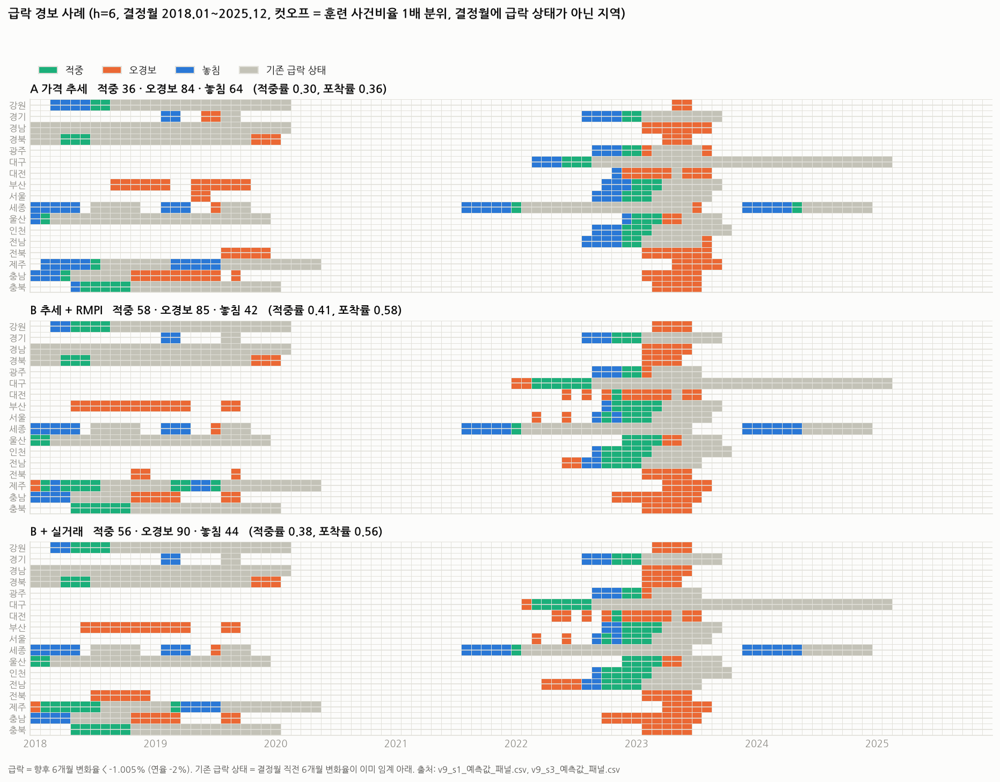

# 아파트 월세 흐름 진단과 급변 예측: 9차 후속 탐색 분석 결과

설정 config/plan_v9_settings.yaml (v9.0, sha ad642f9eb4bde1db), 입력 데이터취합_전처리_20261005.xlsx. 이 분석은 8차 결과를 보고 설계한 **후속 탐색 분석**이다(설계안 docs/연구계획_9차_보완설계안.md). 어떤 결과도 사전 지정 검증으로 쓰지 않으며, 8차 판정 규칙(두 t구간)은 참고로만 계산해 적는다. 2018.01~2025.12 의 96개 결정월, h = 1·3·6. 실거래 관련 결과는 최신 수정자료(2026.10.01~05 수집)를 이용한 보조 분석이다.

## 0 핵심 결과

- ① 기준 재정리(전진 교차검증 최소 alpha): B/A MAE 비 0.79·0.89·0.98, B/선택형 단순기준 0.94·1.26·1.11, A/선택형 1.19·1.41·1.13 (h=1·3·6).
- ① 기준 재정리(8차 고정 alpha 10): B/A MAE 비 0.84·0.82·0.77, B/선택형 단순기준 1.11·1.13·0.92, A/선택형 1.33·1.37·1.20 (h=1·3·6).
- ② 보정 구조(전국): M1/M0 1.009·1.022·1.028, M2/M1 0.804·1.050·1.070, M2/M0 0.811·1.073·1.099.
- ② 보정 구조(패널): M1/M0 1.003·1.008·1.014, M2/M1 0.979·0.965·0.987, M2/M0 0.982·0.973·1.000, M3/M2 1.001·1.003·1.012.
- ③ 실거래 추가: RQ2 B+실거래/B MAE 비 1.012·1.009·1.009, RQ3 Brier 비 1.004·1.008·1.009.
- ④ 급락 경보(h=6, 목표 빈도 1배): panel_down_A: 적중률 0.30, 포착률 0.36, 실제 빈도 0.09, 동월 AUC 0.82; panel_down_B: 적중률 0.41, 포착률 0.58, 실제 빈도 0.10, 동월 AUC 0.84; panel_down_B+RT: 적중률 0.38, 포착률 0.56, 실제 빈도 0.10, 동월 AUC 0.84.

## 1 ① 기준 재정리: 같은 튜닝 아래 A 와 B

전국 Ridge 의 alpha 를 매년 1월 훈련자료 안 전진 교차검증(검증 12개월) 평균 손실 최소로 골랐다. 고정 10(8차)과 1-SE(8차 민감도)는 비교용이다. 선택형 단순기준은 8차 정의 그대로다.

| 비교 | h | MAE_기준 | MAE_비교 | MAE비율 | 평균개선율(%) | 연평균_하한 | 연평균_상한 | 2년_하한 | 2년_상한 | 우세연도 | 8차규칙판정(참고) |
|---|---|---|---|---|---|---|---|---|---|---|---|
| B vs A (cvmin) | 1 | 0.053 | 0.042 | 0.786 | 21.390 | -0.022 | -0.000 | -0.029 | 0.006 | 7/8 | 개선 신호 |
| B vs 선택형 단순기준 (cvmin) | 1 | 0.045 | 0.042 | 0.936 | 6.389 | -0.016 | 0.010 | -0.016 | 0.010 | 3/8 | 차이 불확실 |
| A vs 선택형 단순기준 (cvmin) | 1 | 0.045 | 0.053 | 1.191 | -19.083 | 0.001 | 0.016 | 0.002 | 0.015 | 2/8 | 악화 |
| B vs mom1 (cvmin) | 1 | 0.044 | 0.042 | 0.941 | 5.932 | -0.016 | 0.011 | -0.016 | 0.011 | 3/8 | 차이 불확실 |
| B vs A (fixed10) | 1 | 0.059 | 0.050 | 0.837 | 16.346 | -0.019 | -0.001 | -0.014 | -0.005 | 7/8 | 개선 |
| B vs 선택형 단순기준 (fixed10) | 1 | 0.045 | 0.050 | 1.115 | -11.488 | -0.001 | 0.012 | -0.006 | 0.016 | 3/8 | 차이 불확실 |
| A vs 선택형 단순기준 (fixed10) | 1 | 0.045 | 0.059 | 1.333 | -33.273 | 0.005 | 0.025 | 0.000 | 0.030 | 0/8 | 악화 |
| B vs mom1 (fixed10) | 1 | 0.044 | 0.050 | 1.120 | -12.031 | -0.001 | 0.012 | -0.006 | 0.016 | 2/8 | 차이 불확실 |
| B vs A (1se) | 1 | 0.061 | 0.058 | 0.956 | 4.433 | -0.012 | 0.006 | -0.015 | 0.010 | 4/8 | 차이 불확실 |
| B vs 선택형 단순기준 (1se) | 1 | 0.045 | 0.058 | 1.305 | -30.496 | 0.003 | 0.024 | -0.003 | 0.030 | 2/8 | 악화 신호 |
| A vs 선택형 단순기준 (1se) | 1 | 0.045 | 0.061 | 1.365 | -36.549 | 0.008 | 0.024 | 0.009 | 0.023 | 0/8 | 악화 |
| B vs mom1 (1se) | 1 | 0.044 | 0.058 | 1.311 | -31.131 | 0.003 | 0.025 | -0.003 | 0.031 | 2/8 | 악화 신호 |
| B vs A (cvmin) | 3 | 0.302 | 0.270 | 0.893 | 10.680 | -0.076 | 0.011 | -0.088 | 0.023 | 6/8 | 차이 불확실 |
| B vs 선택형 단순기준 (cvmin) | 3 | 0.215 | 0.270 | 1.259 | -25.936 | 0.015 | 0.096 | -0.002 | 0.113 | 0/8 | 악화 신호 |
| A vs 선택형 단순기준 (cvmin) | 3 | 0.215 | 0.302 | 1.410 | -40.994 | 0.036 | 0.140 | 0.027 | 0.149 | 0/8 | 악화 |
| B vs mom1 (cvmin) | 3 | 0.215 | 0.270 | 1.259 | -25.936 | 0.015 | 0.096 | -0.002 | 0.113 | 0/8 | 악화 신호 |
| B vs A (fixed10) | 3 | 0.295 | 0.242 | 0.821 | 17.893 | -0.113 | 0.007 | -0.111 | 0.006 | 6/8 | 차이 불확실 |
| B vs 선택형 단순기준 (fixed10) | 3 | 0.215 | 0.242 | 1.129 | -12.894 | -0.001 | 0.056 | -0.029 | 0.085 | 2/8 | 차이 불확실 |
| A vs 선택형 단순기준 (fixed10) | 3 | 0.215 | 0.295 | 1.375 | -37.497 | 0.017 | 0.144 | 0.009 | 0.152 | 0/8 | 악화 |
| B vs mom1 (fixed10) | 3 | 0.215 | 0.242 | 1.129 | -12.894 | -0.001 | 0.056 | -0.029 | 0.085 | 2/8 | 차이 불확실 |
| B vs A (1se) | 3 | 0.299 | 0.286 | 0.956 | 4.419 | -0.082 | 0.056 | -0.122 | 0.096 | 4/8 | 차이 불확실 |
| B vs 선택형 단순기준 (1se) | 3 | 0.215 | 0.286 | 1.331 | -33.142 | -0.003 | 0.145 | -0.004 | 0.146 | 1/8 | 차이 불확실 |
| A vs 선택형 단순기준 (1se) | 3 | 0.215 | 0.299 | 1.393 | -39.298 | 0.024 | 0.145 | -0.002 | 0.171 | 0/8 | 악화 신호 |
| B vs mom1 (1se) | 3 | 0.215 | 0.286 | 1.331 | -33.142 | -0.003 | 0.145 | -0.004 | 0.146 | 1/8 | 차이 불확실 |
| B vs A (cvmin) | 6 | 0.757 | 0.740 | 0.977 | 2.280 | -0.165 | 0.130 | -0.176 | 0.141 | 4/8 | 차이 불확실 |
| B vs 선택형 단순기준 (cvmin) | 6 | 0.668 | 0.740 | 1.108 | -10.751 | -0.130 | 0.274 | -0.012 | 0.155 | 4/8 | 차이 불확실 |
| A vs 선택형 단순기준 (cvmin) | 6 | 0.668 | 0.757 | 1.133 | -13.334 | -0.200 | 0.378 | -0.089 | 0.268 | 4/8 | 차이 불확실 |
| B vs mom1 (cvmin) | 6 | 0.601 | 0.740 | 1.232 | -23.167 | -0.037 | 0.315 | -0.110 | 0.388 | 2/8 | 차이 불확실 |
| B vs A (fixed10) | 6 | 0.798 | 0.615 | 0.770 | 23.003 | -0.397 | 0.030 | -0.385 | 0.017 | 6/8 | 차이 불확실 |
| B vs 선택형 단순기준 (fixed10) | 6 | 0.668 | 0.615 | 0.920 | 7.988 | -0.255 | 0.149 | -0.279 | 0.173 | 5/8 | 차이 불확실 |
| A vs 선택형 단순기준 (fixed10) | 6 | 0.668 | 0.798 | 1.195 | -19.501 | -0.249 | 0.510 | -0.172 | 0.432 | 4/8 | 차이 불확실 |
| B vs mom1 (fixed10) | 6 | 0.601 | 0.615 | 1.023 | -2.327 | -0.138 | 0.166 | -0.123 | 0.151 | 3/8 | 차이 불확실 |
| B vs A (1se) | 6 | 0.920 | 0.736 | 0.800 | 20.029 | -0.536 | 0.168 | -0.767 | 0.398 | 5/8 | 차이 불확실 |
| B vs 선택형 단순기준 (1se) | 6 | 0.668 | 0.736 | 1.102 | -10.169 | -0.149 | 0.285 | -0.068 | 0.204 | 4/8 | 차이 불확실 |
| A vs 선택형 단순기준 (1se) | 6 | 0.668 | 0.920 | 1.378 | -37.761 | -0.128 | 0.633 | -0.429 | 0.933 | 3/8 | 차이 불확실 |
| B vs mom1 (1se) | 6 | 0.601 | 0.736 | 1.225 | -22.520 | -0.082 | 0.353 | -0.176 | 0.447 | 2/8 | 차이 불확실 |

선택된 alpha(전진 교차검증 최소, 1월 재선택):

| 정보군 | h | 2018-01 | 2019-01 | 2020-01 | 2021-01 | 2022-01 | 2023-01 | 2024-01 | 2025-01 | 2026-01 |
|---|---|---|---|---|---|---|---|---|---|---|
| A | 1 | 10.00 | 0.10 | 0.32 | 0.18 | 42.17 | 0.02 | 0.06 | 10.00 | 0.06 |
| A | 3 | 10.00 | 0.06 | 4.22 | 1.78 | 17.78 | 100.00 | 562.34 | 23.71 | 10.00 |
| A | 6 |  | 0.06 | 31.62 | 10.00 | 31.62 | 74.99 | 1000.00 | 74.99 | 31.62 |
| B | 1 | 31.62 | 10.00 | 0.01 | 0.07 | 0.56 | 0.06 | 0.18 | 10.00 | 0.03 |
| B | 3 | 1.33 | 10.00 | 23.71 | 0.04 | 10.00 | 31.62 | 1.78 | 10.00 | 13.34 |
| B | 6 |  | 0.56 | 42.17 | 0.56 | 10.00 | 56.23 | 749.89 | 17782.79 | 23.71 |

빈칸은 전진 폴드가 설정 최소치(4)에 못 미쳐 대체값 alpha 10 을 쓴 경우(2018-01 h=6). 최소 손실의 1% 안에 든 후보 수의 중앙값은 h=1: 7개, h=3: 4개, h=6: 3개로, 교차검증 곡선이 평평해 선택값이 연도마다 크게 바뀐다(해석은 6장). 격자는 1단계 25점 + 2단계 4점 = 29점이고, 1단계 최소가 끝점이면 한 자릿수 연장한 뒤 2단계를 그 최소 둘레에 다시 두므로 그 해의 격자점수는 35 가 된다(연장 끝에서 반 자릿수 더 나감; 선택값에는 영향이 거의 없다).

Diebold-Mariano 참고(판정에 쓰지 않음):

| 비교 | h | DM_HLN | p |
|---|---|---|---|
| B vs A (cvmin) | 1 | -3.176 | 0.002 |
| B vs mom1 (cvmin) | 1 | -0.841 | 0.402 |
| B vs A (fixed10) | 1 | -2.750 | 0.007 |
| B vs mom1 (fixed10) | 1 | 1.574 | 0.119 |
| B vs A (1se) | 1 | -0.688 | 0.493 |
| B vs mom1 (1se) | 1 | 3.376 | 0.001 |
| B vs A (cvmin) | 3 | -1.118 | 0.266 |
| B vs mom1 (cvmin) | 3 | 1.960 | 0.053 |
| B vs A (fixed10) | 3 | -1.854 | 0.067 |
| B vs mom1 (fixed10) | 3 | 1.151 | 0.252 |
| B vs A (1se) | 3 | -0.598 | 0.551 |
| B vs mom1 (1se) | 3 | 2.604 | 0.011 |
| B vs A (cvmin) | 6 | -0.218 | 0.828 |
| B vs mom1 (cvmin) | 6 | 1.460 | 0.148 |
| B vs A (fixed10) | 6 | -1.804 | 0.074 |
| B vs mom1 (fixed10) | 6 | 0.158 | 0.875 |
| B vs A (1se) | 6 | -1.810 | 0.074 |
| B vs mom1 (1se) | 6 | 1.430 | 0.156 |

## 2 ② 보정 구조: M0 → M1 → M2 (전국), M0 → M3 (통합 패널)

학습 목표 = 실제 변화 − mom1, 최종 예측 = mom1 + 보정값. M1 은 절편만, M1′은 mom1 계수 학습, M2 는 매매·전세 추세와 RMPI, M3 는 M2 + 실거래 두 입력(RMPI 구성·가중·전처리 동일). 경제정보 기여 = M2 − M1, 실거래 기여 = M3 − M2.

| 단위 | 비교 | h | MAE_기준 | MAE_비교 | MAE비율 | 평균개선율(%) | 연평균_하한 | 연평균_상한 | 2년_하한 | 2년_상한 | 우세연도 | 8차규칙판정(참고) |
|---|---|---|---|---|---|---|---|---|---|---|---|---|
| 전국 | 전국 M1 vs M0 | 1 | 0.044 | 0.045 | 1.009 | -0.928 | -0.000 | 0.001 | -0.000 | 0.001 | 3/8 | 차이 불확실 |
| 전국 | 전국 M2 vs M1 | 1 | 0.045 | 0.036 | 0.804 | 19.600 | -0.020 | 0.002 | -0.023 | 0.005 | 7/8 | 차이 불확실 |
| 전국 | 전국 M2 vs M0 | 1 | 0.044 | 0.036 | 0.811 | 18.854 | -0.019 | 0.003 | -0.022 | 0.005 | 7/8 | 차이 불확실 |
| 전국 | 전국 M2 vs M1s | 1 | 0.046 | 0.036 | 0.779 | 22.071 | -0.020 | -0.000 | -0.021 | 0.000 | 8/8 | 개선 신호 |
| 전국 | 전국 M1s vs M0 | 1 | 0.044 | 0.046 | 1.041 | -4.128 | -0.002 | 0.005 | -0.002 | 0.006 | 3/8 | 차이 불확실 |
| 전국 | 전국 M2+past36 vs M2 | 1 | 0.036 | 0.038 | 1.053 | -5.253 | -0.002 | 0.006 | -0.005 | 0.009 | 3/8 | 차이 불확실 |
| 패널 | 패널 M1 vs M0 | 1 | 0.084 | 0.084 | 1.003 | -0.288 | -0.000 | 0.001 | -0.000 | 0.001 | 2/8 | 차이 불확실 |
| 패널 | 패널 M2 vs M1 | 1 | 0.084 | 0.082 | 0.979 | 2.055 | -0.005 | 0.002 | -0.006 | 0.003 | 6/8 | 차이 불확실 |
| 패널 | 패널 M2 vs M0 | 1 | 0.084 | 0.082 | 0.982 | 1.773 | -0.005 | 0.002 | -0.006 | 0.003 | 6/8 | 차이 불확실 |
| 패널 | 패널 M2 vs M1s | 1 | 0.085 | 0.082 | 0.967 | 3.331 | -0.011 | 0.005 | -0.008 | 0.002 | 4/8 | 차이 불확실 |
| 패널 | 패널 M3 vs M2 | 1 | 0.082 | 0.082 | 1.001 | -0.075 | -0.001 | 0.001 | -0.002 | 0.002 | 5/8 | 차이 불확실 |
| 패널 | 패널 M3 vs M0 | 1 | 0.084 | 0.082 | 0.983 | 1.699 | -0.006 | 0.003 | -0.007 | 0.005 | 6/8 | 차이 불확실 |
| 패널 | 패널 M2+past36 vs M2 | 1 | 0.082 | 0.083 | 1.013 | -1.332 | -0.004 | 0.006 | -0.006 | 0.008 | 2/8 | 차이 불확실 |
| 전국 | 전국 M1 vs M0 | 3 | 0.215 | 0.219 | 1.022 | -2.213 | -0.001 | 0.010 | -0.004 | 0.013 | 2/8 | 차이 불확실 |
| 전국 | 전국 M2 vs M1 | 3 | 0.219 | 0.230 | 1.050 | -4.951 | -0.028 | 0.050 | -0.042 | 0.063 | 3/8 | 차이 불확실 |
| 전국 | 전국 M2 vs M0 | 3 | 0.215 | 0.230 | 1.073 | -7.274 | -0.026 | 0.057 | -0.035 | 0.067 | 3/8 | 차이 불확실 |
| 전국 | 전국 M2 vs M1s | 3 | 0.230 | 0.230 | 1.003 | -0.274 | -0.033 | 0.034 | -0.043 | 0.044 | 4/8 | 차이 불확실 |
| 전국 | 전국 M1s vs M0 | 3 | 0.215 | 0.230 | 1.070 | -6.981 | -0.014 | 0.044 | -0.026 | 0.056 | 1/8 | 차이 불확실 |
| 전국 | 전국 M2+past36 vs M2 | 3 | 0.230 | 0.212 | 0.920 | 7.976 | -0.062 | 0.025 | -0.083 | 0.046 | 4/8 | 차이 불확실 |
| 패널 | 패널 M1 vs M0 | 3 | 0.317 | 0.319 | 1.008 | -0.833 | -0.002 | 0.007 | -0.002 | 0.008 | 3/8 | 차이 불확실 |
| 패널 | 패널 M2 vs M1 | 3 | 0.319 | 0.308 | 0.965 | 3.523 | -0.039 | 0.016 | -0.051 | 0.028 | 5/8 | 차이 불확실 |
| 패널 | 패널 M2 vs M0 | 3 | 0.317 | 0.308 | 0.973 | 2.719 | -0.035 | 0.018 | -0.044 | 0.027 | 4/8 | 차이 불확실 |
| 패널 | 패널 M2 vs M1s | 3 | 0.346 | 0.308 | 0.890 | 10.993 | -0.108 | 0.031 | -0.085 | 0.009 | 7/8 | 차이 불확실 |
| 패널 | 패널 M3 vs M2 | 3 | 0.308 | 0.309 | 1.003 | -0.321 | -0.004 | 0.006 | -0.002 | 0.004 | 2/8 | 차이 불확실 |
| 패널 | 패널 M3 vs M0 | 3 | 0.317 | 0.309 | 0.976 | 2.406 | -0.037 | 0.022 | -0.046 | 0.031 | 5/8 | 차이 불확실 |
| 패널 | 패널 M2+past36 vs M2 | 3 | 0.308 | 0.318 | 1.032 | -3.221 | -0.026 | 0.046 | -0.046 | 0.066 | 3/8 | 차이 불확실 |
| 전국 | 전국 M1 vs M0 | 6 | 0.601 | 0.617 | 1.028 | -2.755 | -0.007 | 0.040 | -0.023 | 0.056 | 2/8 | 차이 불확실 |
| 전국 | 전국 M2 vs M1 | 6 | 0.617 | 0.660 | 1.070 | -6.955 | -0.201 | 0.286 | -0.324 | 0.410 | 4/8 | 차이 불확실 |
| 전국 | 전국 M2 vs M0 | 6 | 0.601 | 0.660 | 1.099 | -9.901 | -0.176 | 0.295 | -0.273 | 0.392 | 3/8 | 차이 불확실 |
| 전국 | 전국 M2 vs M1s | 6 | 0.615 | 0.660 | 1.073 | -7.283 | -0.201 | 0.291 | -0.190 | 0.280 | 5/8 | 차이 불확실 |
| 전국 | 전국 M1s vs M0 | 6 | 0.601 | 0.615 | 1.024 | -2.440 | -0.111 | 0.141 | -0.146 | 0.175 | 3/8 | 차이 불확실 |
| 전국 | 전국 M2+past36 vs M2 | 6 | 0.660 | 0.594 | 0.900 | 10.019 | -0.237 | 0.105 | -0.246 | 0.114 | 4/8 | 차이 불확실 |
| 패널 | 패널 M1 vs M0 | 6 | 0.799 | 0.810 | 1.014 | -1.365 | -0.007 | 0.029 | -0.017 | 0.039 | 4/8 | 차이 불확실 |
| 패널 | 패널 M2 vs M1 | 6 | 0.810 | 0.799 | 0.987 | 1.326 | -0.240 | 0.218 | -0.375 | 0.353 | 5/8 | 차이 불확실 |
| 패널 | 패널 M2 vs M0 | 6 | 0.799 | 0.799 | 1.000 | -0.021 | -0.223 | 0.224 | -0.362 | 0.362 | 4/8 | 차이 불확실 |
| 패널 | 패널 M2 vs M1s | 6 | 0.866 | 0.799 | 0.923 | 7.682 | -0.344 | 0.211 | -0.490 | 0.357 | 5/8 | 차이 불확실 |
| 패널 | 패널 M3 vs M2 | 6 | 0.799 | 0.809 | 1.012 | -1.174 | -0.008 | 0.027 | -0.020 | 0.039 | 3/8 | 차이 불확실 |
| 패널 | 패널 M3 vs M0 | 6 | 0.799 | 0.809 | 1.012 | -1.196 | -0.205 | 0.224 | -0.330 | 0.349 | 5/8 | 차이 불확실 |
| 패널 | 패널 M2+past36 vs M2 | 6 | 0.799 | 0.802 | 1.004 | -0.354 | -0.139 | 0.145 | -0.238 | 0.243 | 4/8 | 차이 불확실 |

연도별 손실 차이 d(비교 − 기준, 연평균; 음수면 비교 모형이 낫다):

| 단위 | 비교 | h | d_2018 | d_2019 | d_2020 | d_2021 | d_2022 | d_2023 | d_2024 | d_2025 |
|---|---|---|---|---|---|---|---|---|---|---|
| 전국 | 전국 M1 vs M0 | 1 | -0.001 | 0.001 | -0.001 | 0.002 | 0.000 | 0.001 | 0.000 | -0.001 |
| 전국 | 전국 M2 vs M1 | 1 | -0.000 | -0.007 | -0.005 | 0.000 | -0.003 | -0.040 | -0.002 | -0.013 |
| 전국 | 전국 M2 vs M0 | 1 | -0.001 | -0.006 | -0.006 | 0.002 | -0.003 | -0.039 | -0.002 | -0.013 |
| 전국 | 전국 M2 vs M1s | 1 | -0.005 | -0.007 | -0.004 | -0.009 | -0.003 | -0.037 | -0.001 | -0.015 |
| 전국 | 전국 M1s vs M0 | 1 | 0.005 | 0.002 | -0.001 | 0.011 | 0.000 | -0.002 | -0.001 | 0.002 |
| 전국 | 전국 M2+past36 vs M2 | 1 | 0.000 | -0.001 | -0.002 | -0.004 | 0.004 | 0.010 | 0.002 | 0.006 |
| 패널 | 패널 M1 vs M0 | 1 | 0.000 | 0.001 | -0.001 | 0.001 | 0.000 | 0.001 | 0.000 | -0.000 |
| 패널 | 패널 M2 vs M1 | 1 | -0.000 | -0.008 | -0.000 | 0.005 | -0.001 | -0.007 | 0.001 | -0.003 |
| 패널 | 패널 M2 vs M0 | 1 | -0.000 | -0.007 | -0.001 | 0.006 | -0.000 | -0.007 | 0.001 | -0.003 |
| 패널 | 패널 M2 vs M1s | 1 | -0.009 | -0.004 | -0.020 | 0.012 | 0.001 | 0.001 | 0.002 | -0.006 |
| 패널 | 패널 M3 vs M2 | 1 | -0.000 | 0.000 | -0.000 | 0.003 | -0.000 | -0.002 | -0.000 | 0.000 |
| 패널 | 패널 M3 vs M0 | 1 | -0.000 | -0.007 | -0.001 | 0.009 | -0.000 | -0.009 | 0.000 | -0.003 |
| 패널 | 패널 M2+past36 vs M2 | 1 | 0.003 | 0.003 | 0.000 | -0.009 | 0.013 | 0.000 | -0.001 | 0.000 |
| 전국 | 전국 M1 vs M0 | 3 | 0.002 | 0.009 | -0.006 | 0.009 | 0.009 | 0.015 | 0.002 | -0.002 |
| 전국 | 전국 M2 vs M1 | 3 | 0.008 | -0.024 | 0.004 | 0.116 | -0.000 | 0.001 | 0.023 | -0.042 |
| 전국 | 전국 M2 vs M0 | 3 | 0.010 | -0.016 | -0.002 | 0.125 | 0.009 | 0.016 | 0.025 | -0.043 |
| 전국 | 전국 M2 vs M1s | 3 | -0.028 | -0.025 | -0.010 | 0.045 | 0.002 | 0.057 | 0.024 | -0.060 |
| 전국 | 전국 M1s vs M0 | 3 | 0.038 | 0.010 | 0.008 | 0.080 | 0.007 | -0.041 | 0.001 | 0.017 |
| 전국 | 전국 M2+past36 vs M2 | 3 | 0.003 | 0.023 | -0.010 | -0.127 | -0.000 | -0.067 | 0.011 | 0.020 |
| 패널 | 패널 M1 vs M0 | 3 | 0.001 | 0.008 | -0.006 | 0.007 | 0.007 | 0.005 | -0.000 | -0.001 |
| 패널 | 패널 M2 vs M1 | 3 | 0.000 | -0.045 | 0.013 | 0.031 | -0.001 | -0.071 | -0.000 | -0.017 |
| 패널 | 패널 M2 vs M0 | 3 | 0.001 | -0.036 | 0.006 | 0.038 | 0.006 | -0.066 | -0.000 | -0.018 |
| 패널 | 패널 M2 vs M1s | 3 | -0.064 | -0.035 | -0.217 | 0.071 | -0.006 | -0.003 | -0.001 | -0.050 |
| 패널 | 패널 M3 vs M2 | 3 | 0.000 | 0.001 | -0.007 | 0.013 | 0.002 | -0.004 | 0.000 | 0.004 |
| 패널 | 패널 M3 vs M0 | 3 | 0.001 | -0.036 | -0.001 | 0.051 | 0.008 | -0.071 | -0.000 | -0.014 |
| 패널 | 패널 M2+past36 vs M2 | 3 | -0.004 | 0.001 | 0.018 | -0.051 | 0.102 | 0.021 | -0.010 | 0.002 |
| 전국 | 전국 M1 vs M0 | 6 | 0.000 | 0.051 | -0.021 | 0.008 | 0.059 | 0.036 | 0.003 | -0.004 |
| 전국 | 전국 M2 vs M1 | 6 | 0.024 | -0.139 | 0.155 | 0.568 | -0.015 | -0.337 | 0.293 | -0.206 |
| 전국 | 전국 M2 vs M0 | 6 | 0.024 | -0.088 | 0.134 | 0.576 | 0.044 | -0.301 | 0.296 | -0.210 |
| 전국 | 전국 M2 vs M1s | 6 | -0.043 | -0.113 | -0.137 | 0.656 | 0.046 | -0.037 | 0.271 | -0.285 |
| 전국 | 전국 M1s vs M0 | 6 | 0.067 | 0.025 | 0.271 | -0.080 | -0.002 | -0.264 | 0.025 | 0.075 |
| 전국 | 전국 M2+past36 vs M2 | 6 | 0.013 | 0.002 | -0.027 | -0.441 | -0.242 | 0.185 | -0.148 | 0.130 |
| 패널 | 패널 M1 vs M0 | 6 | -0.000 | 0.043 | -0.013 | 0.006 | 0.042 | 0.018 | -0.001 | -0.008 |
| 패널 | 패널 M2 vs M1 | 6 | 0.584 | -0.008 | 0.073 | -0.106 | -0.186 | -0.351 | 0.012 | -0.102 |
| 패널 | 패널 M2 vs M0 | 6 | 0.584 | 0.035 | 0.060 | -0.101 | -0.144 | -0.333 | 0.011 | -0.110 |
| 패널 | 패널 M2 vs M1s | 6 | 0.443 | 0.086 | -0.733 | -0.039 | -0.057 | -0.061 | 0.058 | -0.230 |
| 패널 | 패널 M3 vs M2 | 6 | -0.008 | -0.000 | 0.003 | 0.013 | 0.054 | 0.017 | -0.016 | 0.012 |
| 패널 | 패널 M3 vs M0 | 6 | 0.575 | 0.035 | 0.063 | -0.088 | -0.090 | -0.316 | -0.004 | -0.098 |
| 패널 | 패널 M2+past36 vs M2 | 6 | -0.336 | -0.010 | 0.069 | -0.043 | 0.220 | 0.170 | -0.070 | 0.021 |

지역별 MAE(통합 패널, 모형별):

| ('region', '') | (1, 'M0') | (1, 'M1') | (1, 'M1s') | (1, 'M2') | (1, 'M2+past36') | (1, 'M3') | (3, 'M0') | (3, 'M1') | (3, 'M1s') | (3, 'M2') | (3, 'M2+past36') | (3, 'M3') | (6, 'M0') | (6, 'M1') | (6, 'M1s') | (6, 'M2') | (6, 'M2+past36') | (6, 'M3') |
|---|---|---|---|---|---|---|---|---|---|---|---|---|---|---|---|---|---|---|
| 강원 | 0.065 | 0.065 | 0.064 | 0.064 | 0.064 | 0.064 | 0.237 | 0.238 | 0.256 | 0.236 | 0.248 | 0.237 | 0.576 | 0.589 | 0.627 | 0.681 | 0.602 | 0.700 |
| 경기 | 0.067 | 0.068 | 0.071 | 0.055 | 0.059 | 0.056 | 0.323 | 0.328 | 0.353 | 0.271 | 0.275 | 0.282 | 0.902 | 0.911 | 0.957 | 0.872 | 0.831 | 0.865 |
| 경남 | 0.075 | 0.075 | 0.080 | 0.071 | 0.078 | 0.071 | 0.301 | 0.304 | 0.363 | 0.273 | 0.307 | 0.272 | 0.789 | 0.798 | 0.908 | 0.788 | 0.848 | 0.791 |
| 경북 | 0.057 | 0.057 | 0.057 | 0.057 | 0.062 | 0.057 | 0.183 | 0.183 | 0.211 | 0.182 | 0.226 | 0.181 | 0.453 | 0.455 | 0.535 | 0.526 | 0.581 | 0.536 |
| 광주 | 0.038 | 0.038 | 0.039 | 0.039 | 0.038 | 0.039 | 0.143 | 0.148 | 0.170 | 0.142 | 0.137 | 0.145 | 0.368 | 0.384 | 0.438 | 0.343 | 0.350 | 0.356 |
| 대구 | 0.057 | 0.057 | 0.063 | 0.056 | 0.056 | 0.056 | 0.234 | 0.241 | 0.292 | 0.228 | 0.221 | 0.233 | 0.650 | 0.681 | 0.802 | 0.685 | 0.666 | 0.702 |
| 대전 | 0.087 | 0.088 | 0.083 | 0.087 | 0.083 | 0.087 | 0.329 | 0.335 | 0.343 | 0.337 | 0.315 | 0.339 | 0.807 | 0.827 | 0.866 | 0.776 | 0.704 | 0.793 |
| 부산 | 0.052 | 0.052 | 0.052 | 0.053 | 0.053 | 0.052 | 0.200 | 0.201 | 0.201 | 0.199 | 0.196 | 0.199 | 0.502 | 0.508 | 0.528 | 0.466 | 0.504 | 0.463 |
| 서울 | 0.056 | 0.056 | 0.064 | 0.053 | 0.052 | 0.052 | 0.279 | 0.283 | 0.311 | 0.258 | 0.267 | 0.259 | 0.748 | 0.753 | 0.798 | 0.873 | 0.759 | 0.871 |
| 세종 | 0.323 | 0.324 | 0.315 | 0.315 | 0.307 | 0.315 | 1.274 | 1.280 | 1.202 | 1.264 | 1.203 | 1.258 | 2.979 | 2.997 | 2.617 | 2.607 | 2.654 | 2.636 |
| 울산 | 0.131 | 0.131 | 0.145 | 0.130 | 0.143 | 0.130 | 0.497 | 0.498 | 0.679 | 0.504 | 0.560 | 0.499 | 1.304 | 1.314 | 1.757 | 1.370 | 1.548 | 1.381 |
| 인천 | 0.089 | 0.089 | 0.090 | 0.086 | 0.081 | 0.086 | 0.320 | 0.321 | 0.350 | 0.296 | 0.276 | 0.299 | 0.875 | 0.885 | 0.937 | 0.820 | 0.729 | 0.830 |
| 전남 | 0.043 | 0.043 | 0.044 | 0.047 | 0.043 | 0.047 | 0.154 | 0.157 | 0.183 | 0.164 | 0.156 | 0.171 | 0.372 | 0.387 | 0.491 | 0.434 | 0.431 | 0.458 |
| 전북 | 0.048 | 0.048 | 0.048 | 0.050 | 0.049 | 0.050 | 0.164 | 0.164 | 0.170 | 0.167 | 0.178 | 0.164 | 0.428 | 0.428 | 0.449 | 0.514 | 0.477 | 0.526 |
| 제주 | 0.103 | 0.102 | 0.097 | 0.102 | 0.104 | 0.102 | 0.305 | 0.301 | 0.303 | 0.280 | 0.324 | 0.274 | 0.727 | 0.730 | 0.725 | 0.688 | 0.775 | 0.700 |
| 충남 | 0.067 | 0.067 | 0.066 | 0.066 | 0.067 | 0.066 | 0.238 | 0.241 | 0.244 | 0.238 | 0.256 | 0.238 | 0.582 | 0.598 | 0.589 | 0.607 | 0.588 | 0.600 |
| 충북 | 0.066 | 0.066 | 0.067 | 0.065 | 0.077 | 0.066 | 0.207 | 0.207 | 0.256 | 0.203 | 0.263 | 0.206 | 0.527 | 0.528 | 0.698 | 0.542 | 0.590 | 0.542 |

보정모형 alpha 선택(1월):

| 단위 | 모형 | h | 2018-01 | 2019-01 | 2020-01 | 2021-01 | 2022-01 | 2023-01 | 2024-01 | 2025-01 | 2026-01 |
|---|---|---|---|---|---|---|---|---|---|---|---|
| 전국 | M2 | 1.0 | 1000.0 | 1.8 | 10.0 | 4.2 | 0.2 | 5.6 | 7.5 | 10.0 | 1.0 |
| 전국 | M2 | 3.0 | 10.0 | 0.6 | 10.0 | 0.4 | 3162.3 | 100.0 | 7.5 | 56.2 | 31.6 |
| 전국 | M2 | 6.0 |  | 10.0 | 13.3 | 0.1 | 562.3 | 31.6 | 1.3 | 31.6 | 0.2 |
| 전국 | M2+past36 | 1.0 | 1000.0 | 3.2 | 7.5 | 10.0 | 1.0 | 13.3 | 0.6 | 31.6 | 23.7 |
| 전국 | M2+past36 | 3.0 | 10.0 | 3162.3 | 13.3 | 0.7 | 5623.4 | 17.8 | 1.3 | 177.8 | 23.7 |
| 전국 | M2+past36 | 6.0 |  | 10.0 | 17.8 | 0.0 | 0.0 | 42.2 | 10.0 | 177.8 | 10.0 |
| 패널 | M2 | 1.0 | 1778.3 | 749.9 | 421.7 | 1000.0 | 17782.8 | 133.4 | 316.2 | 562.3 |  |
| 패널 | M2 | 3.0 | 10000.0 | 1000.0 | 421.7 | 1333.5 | 17782.8 | 237.1 | 237.1 | 749.9 |  |
| 패널 | M2 | 6.0 |  | 31622.8 | 1333.5 | 749.9 | 316.2 | 421.7 | 10.0 | 237.1 |  |
| 패널 | M2+past36 | 1.0 | 1333.5 | 5623.4 | 421.7 | 562.3 | 133.4 | 1333.5 | 1000.0 | 1778.3 |  |
| 패널 | M2+past36 | 3.0 | 10000.0 | 1778.3 | 133.4 | 562.3 | 31.6 | 1778.3 | 749.9 | 1333.5 |  |
| 패널 | M2+past36 | 6.0 |  | 31622.8 | 1333.5 | 42.2 | 31.6 | 2371.4 | 562.3 | 421.7 |  |
| 패널 | M3 | 1.0 | 1778.3 | 749.9 | 421.7 | 1000.0 | 17782.8 | 237.1 | 316.2 | 562.3 |  |
| 패널 | M3 | 3.0 | 10000.0 | 1000.0 | 562.3 | 1333.5 | 17782.8 | 421.7 | 177.8 | 562.3 |  |
| 패널 | M3 | 6.0 |  | 31622.8 | 1333.5 | 1000.0 | 562.3 | 562.3 | 133.4 | 237.1 |  |

빈칸은 전진 폴드 부족으로 대체값 10 을 쓴 경우(2018-01, h=6). alpha 는 모형마다 따로 고르므로 M3 와 M2 의 선택값이 다른 해가 있다. 따라서 M3 − M2 는 '실거래 두 입력 + 그 입력이 있을 때 다시 고른 alpha' 의 효과다(설정대로이며, 구성·가중·전처리는 같다). 보정모형의 적합(RMPI 변환·대체·표준화·계수)은 매 결정월 다시 하고 alpha 만 1월에 고른다. 구성 명세는 첫·마지막 결정월 것을 v9_s2_구성명세_*.csv 에 둔다.

Diebold-Mariano 참고:

| 비교 | h | DM_HLN | p |
|---|---|---|---|
| 전국 M1 vs M0 | 1 | 1.248 | 0.215 |
| 전국 M2 vs M1 | 1 | -3.236 | 0.002 |
| 전국 M2 vs M0 | 1 | -3.040 | 0.003 |
| 전국 M2 vs M1s | 1 | -3.900 | 0.000 |
| 전국 M1s vs M0 | 1 | 1.510 | 0.134 |
| 전국 M2+past36 vs M2 | 1 | 1.368 | 0.175 |
| 패널 M1 vs M0 | 1 | 1.414 | 0.161 |
| 패널 M2 vs M1 | 1 | -1.484 | 0.141 |
| 패널 M2 vs M0 | 1 | -1.205 | 0.231 |
| 패널 M2 vs M1s | 1 | -1.060 | 0.292 |
| 패널 M3 vs M2 | 1 | 0.178 | 0.859 |
| 패널 M3 vs M0 | 1 | -1.137 | 0.259 |
| 패널 M2+past36 vs M2 | 1 | 0.550 | 0.584 |
| 전국 M1 vs M0 | 3 | 1.769 | 0.080 |
| 전국 M2 vs M1 | 3 | 0.833 | 0.407 |
| 전국 M2 vs M0 | 3 | 1.167 | 0.246 |
| 전국 M2 vs M1s | 3 | 0.041 | 0.968 |
| 전국 M1s vs M0 | 3 | 1.725 | 0.088 |
| 전국 M2+past36 vs M2 | 3 | -1.327 | 0.188 |
| 패널 M1 vs M0 | 3 | 1.574 | 0.119 |
| 패널 M2 vs M1 | 3 | -1.497 | 0.138 |
| 패널 M2 vs M0 | 3 | -1.116 | 0.267 |
| 패널 M2 vs M1s | 3 | -1.615 | 0.110 |
| 패널 M3 vs M2 | 3 | 0.505 | 0.615 |
| 패널 M3 vs M0 | 3 | -0.938 | 0.351 |
| 패널 M2+past36 vs M2 | 3 | 0.555 | 0.580 |
| 전국 M1 vs M0 | 6 | 1.643 | 0.104 |
| 전국 M2 vs M1 | 6 | 0.564 | 0.574 |
| 전국 M2 vs M0 | 6 | 0.803 | 0.424 |
| 전국 M2 vs M1s | 6 | 0.539 | 0.591 |
| 전국 M1s vs M0 | 6 | 0.364 | 0.716 |
| 전국 M2+past36 vs M2 | 6 | -1.247 | 0.216 |
| 패널 M1 vs M0 | 6 | 1.481 | 0.142 |
| 패널 M2 vs M1 | 6 | -0.156 | 0.876 |
| 패널 M2 vs M0 | 6 | 0.002 | 0.998 |
| 패널 M2 vs M1s | 6 | -0.828 | 0.410 |
| 패널 M3 vs M2 | 6 | 1.480 | 0.142 |
| 패널 M3 vs M0 | 6 | 0.147 | 0.884 |
| 패널 M2+past36 vs M2 | 6 | 0.044 | 0.965 |

## 3 ③ 실거래 정보의 추가 효과

지역 블록 처리의 별도 입력 두 개(월세 비중 로짓 3개월합 Δ12, 천세대당 전월세 거래량 로그 3개월합 Δ12). 신고제 경계 2021.07~2022.08 결측. 최신 수정자료 보조 분석. data_asof 2026-10 절단은 2차 시트 행 2026-09·10 을 비우므로(2차 행은 거래월보다 한 달 뒤), 쓸 수 있는 마지막 실거래 행은 2026-08 이고 1차 시트 기준으로는 최신 거래월 세 달(2026.08~10)이 빠진다. 2018~2025 평가에는 영향이 없고 2026 사후 확인 구간에만 해당한다.

| 비교 | h | 월수 | MAE_기준 | MAE_비교 | MAE비율 | 평균개선율(%) | d평균 | 연평균_하한 | 연평균_상한 | 2년_하한 | 2년_상한 | 우세연도 | 8차규칙판정(참고) | d_2018 | d_2019 | d_2020 | d_2021 | d_2022 | d_2023 | d_2024 | d_2025 | 지표 | Brier_기준 | Brier_비교 | 비율 |
|---|---|---|---|---|---|---|---|---|---|---|---|---|---|---|---|---|---|---|---|---|---|---|---|---|---|
| RQ2 B+실거래 vs B | 1 | 96 | 0.082 | 0.083 | 1.012 | -1.191 | 0.001 | -0.000 | 0.002 | -0.001 | 0.003 | 2/8 | 차이 불확실 | 0.004 | 0.000 | 0.000 | 0.000 | -0.001 | 0.002 | -0.001 | 0.002 | MAE |  |  |  |
| RQ3 B+실거래 vs B | 1 | 96 |  |  |  | -0.407 | 0.000 | -0.000 | 0.001 | -0.001 | 0.001 | 2/8 | 차이 불확실 |  |  |  |  |  |  |  |  | Brier | 0.066 | 0.067 | 1.004 |
| RQ2 B+실거래 vs B | 3 | 96 | 0.303 | 0.306 | 1.009 | -0.938 | 0.003 | -0.003 | 0.008 | -0.002 | 0.007 | 4/8 | 차이 불확실 | 0.015 | -0.003 | -0.002 | 0.000 | -0.001 | 0.009 | -0.001 | 0.006 | MAE |  |  |  |
| RQ3 B+실거래 vs B | 3 | 96 |  |  |  | -0.770 | 0.001 | -0.000 | 0.001 | -0.001 | 0.002 | 3/8 | 차이 불확실 |  |  |  |  |  |  |  |  | Brier | 0.077 | 0.077 | 1.008 |
| RQ2 B+실거래 vs B | 6 | 96 | 0.654 | 0.660 | 1.009 | -0.871 | 0.006 | -0.006 | 0.017 | -0.010 | 0.022 | 3/8 | 차이 불확실 | 0.027 | 0.001 | -0.006 | -0.011 | 0.001 | 0.012 | -0.003 | 0.023 | MAE |  |  |  |
| RQ3 B+실거래 vs B | 6 | 96 |  |  |  | -0.871 | 0.001 | -0.000 | 0.002 | -0.001 | 0.002 | 2/8 | 차이 불확실 |  |  |  |  |  |  |  |  | Brier | 0.087 | 0.088 | 1.009 |

민감도(h=6):

| 비교 | h | MAE_기준 | MAE_비교 | MAE비율 | 우세연도 | 민감도 |
|---|---|---|---|---|---|---|
| 패널 M3 vs M2 (12개월합Δ12) | 6 | 0.799 | 0.802 | 1.004 | 2/8 | 12개월합Δ12 |
| RQ2 B+실거래 vs B (12개월합Δ12) | 6 | 0.654 | 0.659 | 1.008 | 3/8 | 12개월합Δ12 |
| 패널 M3 vs M2 (원열+1개월시차) | 6 | 0.799 | 0.808 | 1.011 | 2/8 | 원열+1개월시차 |
| RQ2 B+실거래 vs B (원열+1개월시차) | 6 | 0.654 | 0.660 | 1.010 | 2/8 | 원열+1개월시차 |

실거래 자료 진단(2단계):

| region | 월세건수_첫관측 | 월세건수_2021H2/2020H2(2차행) | 월세비중_2016 | 월세비중_2025 | RT_mix_경계결측행 | RT_mix_관측률_평가 | RT_act_관측률_평가 |
|---|---|---|---|---|---|---|---|
| 강원 | 2011-02 | 1.380 | 0.479 | 0.458 | 14 | 0.854 | 0.854 |
| 경기 | 2011-02 | 1.630 | 0.390 | 0.465 | 14 | 0.854 | 0.854 |
| 경남 | 2011-02 | 1.140 | 0.436 | 0.475 | 14 | 0.854 | 0.854 |
| 경북 | 2011-02 | 2.190 | 0.402 | 0.494 | 14 | 0.854 | 0.854 |
| 광주 | 2011-02 | 1.440 | 0.472 | 0.503 | 14 | 0.854 | 0.854 |
| 대구 | 2011-02 | 1.630 | 0.327 | 0.521 | 14 | 0.854 | 0.854 |
| 대전 | 2011-02 | 1.510 | 0.357 | 0.509 | 14 | 0.854 | 0.854 |
| 부산 | 2011-02 | 1.270 | 0.423 | 0.472 | 14 | 0.854 | 0.854 |
| 서울 | 2011-02 | 1.550 | 0.350 | 0.442 | 14 | 0.854 | 0.854 |
| 세종 | 2011-02 | 2.130 | 0.400 | 0.485 | 14 | 0.854 | 0.854 |
| 울산 | 2011-02 | 1.850 | 0.356 | 0.508 | 14 | 0.854 | 0.854 |
| 인천 | 2011-02 | 1.350 | 0.381 | 0.468 | 14 | 0.854 | 0.854 |
| 전남 | 2011-02 | 1.510 | 0.453 | 0.373 | 14 | 0.854 | 0.854 |
| 전북 | 2011-02 | 1.280 | 0.501 | 0.509 | 14 | 0.854 | 0.854 |
| 제주 | 2011-02 | 2.280 | 0.512 | 0.685 | 14 | 0.854 | 0.854 |
| 충남 | 2011-02 | 1.170 | 0.419 | 0.583 | 14 | 0.854 | 0.854 |
| 충북 | 2011-02 | 1.480 | 0.363 | 0.526 | 14 | 0.854 | 0.854 |

## 4 ④ 급락 경보의 실용성 (비급락 상태 지역, 보조 보고)

컷오프는 각 모형의 훈련기간 예측확률 분포에서 '훈련 사건비율 × 배수' 상위 비율의 분위. 훈련 사건비율은 훈련 행 전체(결정월에 이미 급락 상태인 행 포함)의 비율이고(h=6 평균 약 0.14), 지표는 결정월에 급락 상태가 아닌 행(사건비율 약 0.07)에서만 계산하므로 '목표 빈도'와 실제 경보 빈도는 같지 않다. 실제 경보 빈도를 병기한다. 유의성 검정 없음. 국면 시작(6개 결정월 연속 비사건 뒤 첫 사건)은 평가 첫 달 앞의 2017년 사건 이력을 붙여 판정하고, 선행 경보는 비급락 상태 행의 경보만 센다. 2018년 상반기에 시작한 국면은 경보 창(시작 전 6개월)의 일부가 평가 구간 밖이라 창 안 가용 결정월 수가 6 보다 작다.

| 모형 | h | 목표빈도(사건비율배수) | 행수 | 사건수 | 경보수 | 경보빈도_실제 | 경보적중률 | 급락포착률 | F1 | 동월지역쌍_AUC | AUC_유효월수 | 국면시작수 | 국면포착률 | 평균선행개월(포착분) |
|---|---|---|---|---|---|---|---|---|---|---|---|---|---|---|
| panel_down_A | 1 | 1 | 1387 | 49 | 90 | 0.065 | 0.189 | 0.347 | 0.245 | 0.828 | 25 | 28 | 0.214 | 0.667 |
| panel_down_A | 1 | 2 | 1387 | 49 | 259 | 0.187 | 0.147 | 0.776 | 0.247 | 0.828 | 25 | 28 | 0.643 | 1.444 |
| panel_down_A | 3 | 1 | 1401 | 69 | 94 | 0.067 | 0.223 | 0.304 | 0.258 | 0.842 | 29 | 22 | 0.136 | 1.667 |
| panel_down_A | 3 | 2 | 1401 | 69 | 261 | 0.186 | 0.172 | 0.652 | 0.273 | 0.842 | 29 | 22 | 0.409 | 2.000 |
| panel_down_A | 6 | 1 | 1401 | 100 | 120 | 0.086 | 0.300 | 0.360 | 0.327 | 0.823 | 41 | 17 | 0.059 | 5.000 |
| panel_down_A | 6 | 2 | 1401 | 100 | 268 | 0.191 | 0.216 | 0.580 | 0.315 | 0.823 | 41 | 17 | 0.294 | 2.800 |
| panel_down_B | 1 | 1 | 1387 | 49 | 94 | 0.068 | 0.245 | 0.469 | 0.322 | 0.841 | 25 | 28 | 0.321 | 1.333 |
| panel_down_B | 1 | 2 | 1387 | 49 | 263 | 0.190 | 0.156 | 0.837 | 0.263 | 0.841 | 25 | 28 | 0.750 | 2.190 |
| panel_down_B | 3 | 1 | 1401 | 69 | 114 | 0.081 | 0.298 | 0.493 | 0.372 | 0.846 | 29 | 22 | 0.318 | 1.714 |
| panel_down_B | 3 | 2 | 1401 | 69 | 261 | 0.186 | 0.215 | 0.812 | 0.339 | 0.846 | 29 | 22 | 0.727 | 1.812 |
| panel_down_B | 6 | 1 | 1401 | 100 | 143 | 0.102 | 0.406 | 0.580 | 0.477 | 0.845 | 41 | 17 | 0.412 | 1.857 |
| panel_down_B | 6 | 2 | 1401 | 100 | 323 | 0.231 | 0.251 | 0.810 | 0.383 | 0.845 | 41 | 17 | 0.824 | 3.071 |
| panel_down_B+RT | 1 | 1 | 1387 | 49 | 97 | 0.070 | 0.237 | 0.469 | 0.315 | 0.847 | 25 | 28 | 0.357 | 1.200 |
| panel_down_B+RT | 1 | 2 | 1387 | 49 | 263 | 0.190 | 0.152 | 0.816 | 0.256 | 0.847 | 25 | 28 | 0.750 | 2.476 |
| panel_down_B+RT | 3 | 1 | 1401 | 69 | 110 | 0.079 | 0.300 | 0.478 | 0.369 | 0.835 | 29 | 22 | 0.273 | 1.833 |
| panel_down_B+RT | 3 | 2 | 1401 | 69 | 258 | 0.184 | 0.209 | 0.783 | 0.330 | 0.835 | 29 | 22 | 0.727 | 1.750 |
| panel_down_B+RT | 6 | 1 | 1401 | 100 | 146 | 0.104 | 0.384 | 0.560 | 0.455 | 0.842 | 41 | 17 | 0.412 | 2.000 |
| panel_down_B+RT | 6 | 2 | 1401 | 100 | 336 | 0.240 | 0.241 | 0.810 | 0.372 | 0.842 | 41 | 17 | 0.824 | 3.643 |

국면 시작 포착(1배 컷오프):

| 모형 | h | 국면수 | 포착 | 평균선행 | 창6개월미만 |
|---|---|---|---|---|---|
| panel_down_A | 1 | 28 | 6 | 0.667 | 5 |
| panel_down_A | 3 | 22 | 3 | 1.667 | 3 |
| panel_down_A | 6 | 17 | 1 | 5.000 | 4 |
| panel_down_B | 1 | 28 | 9 | 1.333 | 5 |
| panel_down_B | 3 | 22 | 7 | 1.714 | 3 |
| panel_down_B | 6 | 17 | 7 | 1.857 | 4 |
| panel_down_B+RT | 1 | 28 | 10 | 1.200 | 5 |
| panel_down_B+RT | 3 | 22 | 6 | 1.833 | 3 |
| panel_down_B+RT | 6 | 17 | 7 | 2.000 | 4 |

사례 집계(h=6, 1배 컷오프; 전체 사례표는 v9_s4_사례표_h6.csv):

| 모형 | 놓침 | 오경보 | 적중 |
|---|---|---|---|
| panel_down_A | 64 | 84 | 36 |
| panel_down_B | 42 | 85 | 58 |
| panel_down_B+RT | 44 | 90 | 56 |

그림 6-4. 지역 × 결정월 격자. 초록 적중, 주황 오경보, 파랑 놓침, 회색은 결정월에 이미 급락 상태라 경보 대상에서 뺀 칸(rmpi/run_v9_fig.py).

## 5 해석과 보조 분석 (7단계)

### 5.1 동인 제거 (M2, alpha 를 주 실행 선택값의 중앙값으로 고정)

'(없음, alpha 고정 재실행)' 행의 손실변화는 주 실행(cv_min alpha) 대비이고, 동인을 뺀 행의 손실변화는 alpha 고정 재실행 대비다(양수 = 빼면 나빠짐). 고정 alpha 는 전 기간 선택값의 중앙값이라 사후 정보가 섞인 진단이다.

| 단위 | h | 뺀 동인 | alpha | MAE | MAE_주실행 | 손실변화(%) | 손실변화_기준 |
|---|---|---|---|---|---|---|---|
| 전국 | 1 | (없음, alpha 고정 재실행) | 5.623 | 0.033 | 0.036 | -6.972 | 주 실행(cv_min alpha) 대비 |
| 전국 | 1 | ① 임차수요 압력 | 5.623 | 0.034 | 0.036 | 1.074 | alpha 고정 재실행 대비 |
| 전국 | 1 | ② 주택공급·재고 여건 | 5.623 | 0.034 | 0.036 | 0.564 | alpha 고정 재실행 대비 |
| 전국 | 1 | ③ 금융여건·상대가격 | 5.623 | 0.033 | 0.036 | -0.850 | alpha 고정 재실행 대비 |
| 전국 | 1 | ④ 임대시장 수급·전환 구조 | 5.623 | 0.034 | 0.036 | 1.657 | alpha 고정 재실행 대비 |
| 전국 | 1 | ⑤ 시장과열·단기 트리거 | 5.623 | 0.041 | 0.036 | 23.686 | alpha 고정 재실행 대비 |
| 전국 | 1 | ⑥ 거시경기·금융시장 여건 | 5.623 | 0.034 | 0.036 | 0.121 | alpha 고정 재실행 대비 |
| 전국 | 3 | (없음, alpha 고정 재실행) | 10.000 | 0.204 | 0.230 | -11.510 | 주 실행(cv_min alpha) 대비 |
| 전국 | 3 | ① 임차수요 압력 | 10.000 | 0.202 | 0.230 | -0.641 | alpha 고정 재실행 대비 |
| 전국 | 3 | ② 주택공급·재고 여건 | 10.000 | 0.202 | 0.230 | -0.865 | alpha 고정 재실행 대비 |
| 전국 | 3 | ③ 금융여건·상대가격 | 10.000 | 0.197 | 0.230 | -3.247 | alpha 고정 재실행 대비 |
| 전국 | 3 | ④ 임대시장 수급·전환 구조 | 10.000 | 0.204 | 0.230 | 0.066 | alpha 고정 재실행 대비 |
| 전국 | 3 | ⑤ 시장과열·단기 트리거 | 10.000 | 0.227 | 0.230 | 11.526 | alpha 고정 재실행 대비 |
| 전국 | 3 | ⑥ 거시경기·금융시장 여건 | 10.000 | 0.194 | 0.230 | -4.679 | alpha 고정 재실행 대비 |
| 전국 | 6 | (없음, alpha 고정 재실행) | 11.668 | 0.536 | 0.660 | -18.769 | 주 실행(cv_min alpha) 대비 |
| 전국 | 6 | ① 임차수요 압력 | 11.668 | 0.528 | 0.660 | -1.598 | alpha 고정 재실행 대비 |
| 전국 | 6 | ② 주택공급·재고 여건 | 11.668 | 0.547 | 0.660 | 1.945 | alpha 고정 재실행 대비 |
| 전국 | 6 | ③ 금융여건·상대가격 | 11.668 | 0.534 | 0.660 | -0.394 | alpha 고정 재실행 대비 |
| 전국 | 6 | ④ 임대시장 수급·전환 구조 | 11.668 | 0.533 | 0.660 | -0.547 | alpha 고정 재실행 대비 |
| 전국 | 6 | ⑤ 시장과열·단기 트리거 | 11.668 | 0.555 | 0.660 | 3.559 | alpha 고정 재실행 대비 |
| 전국 | 6 | ⑥ 거시경기·금융시장 여건 | 11.668 | 0.545 | 0.660 | 1.673 | alpha 고정 재실행 대비 |
| 패널 | 1 | (없음, alpha 고정 재실행) | 656.118 | 0.081 | 0.082 | -2.005 | 주 실행(cv_min alpha) 대비 |
| 패널 | 1 | ① 임차수요 압력 | 656.118 | 0.081 | 0.082 | 0.019 | alpha 고정 재실행 대비 |
| 패널 | 1 | ② 주택공급·재고 여건 | 656.118 | 0.081 | 0.082 | 0.021 | alpha 고정 재실행 대비 |
| 패널 | 1 | ③ 금융여건·상대가격 | 656.118 | 0.080 | 0.082 | -0.108 | alpha 고정 재실행 대비 |
| 패널 | 1 | ④ 임대시장 수급·전환 구조 | 656.118 | 0.081 | 0.082 | 0.217 | alpha 고정 재실행 대비 |
| 패널 | 1 | ⑤ 시장과열·단기 트리거 | 656.118 | 0.083 | 0.082 | 2.766 | alpha 고정 재실행 대비 |
| 패널 | 1 | ⑥ 거시경기·금융시장 여건 | 656.118 | 0.081 | 0.082 | 0.079 | alpha 고정 재실행 대비 |
| 패널 | 3 | (없음, alpha 고정 재실행) | 874.947 | 0.302 | 0.308 | -2.118 | 주 실행(cv_min alpha) 대비 |
| 패널 | 3 | ① 임차수요 압력 | 874.947 | 0.301 | 0.308 | -0.325 | alpha 고정 재실행 대비 |
| 패널 | 3 | ② 주택공급·재고 여건 | 874.947 | 0.302 | 0.308 | 0.151 | alpha 고정 재실행 대비 |
| 패널 | 3 | ③ 금융여건·상대가격 | 874.947 | 0.301 | 0.308 | -0.359 | alpha 고정 재실행 대비 |
| 패널 | 3 | ④ 임대시장 수급·전환 구조 | 874.947 | 0.302 | 0.308 | 0.172 | alpha 고정 재실행 대비 |
| 패널 | 3 | ⑤ 시장과열·단기 트리거 | 874.947 | 0.317 | 0.308 | 4.959 | alpha 고정 재실행 대비 |
| 패널 | 3 | ⑥ 거시경기·금융시장 여건 | 874.947 | 0.302 | 0.308 | -0.056 | alpha 고정 재실행 대비 |
| 패널 | 6 | (없음, alpha 고정 재실행) | 421.697 | 0.736 | 0.799 | -7.929 | 주 실행(cv_min alpha) 대비 |
| 패널 | 6 | ① 임차수요 압력 | 421.697 | 0.735 | 0.799 | -0.188 | alpha 고정 재실행 대비 |
| 패널 | 6 | ② 주택공급·재고 여건 | 421.697 | 0.718 | 0.799 | -2.406 | alpha 고정 재실행 대비 |
| 패널 | 6 | ③ 금융여건·상대가격 | 421.697 | 0.735 | 0.799 | -0.162 | alpha 고정 재실행 대비 |
| 패널 | 6 | ④ 임대시장 수급·전환 구조 | 421.697 | 0.730 | 0.799 | -0.876 | alpha 고정 재실행 대비 |
| 패널 | 6 | ⑤ 시장과열·단기 트리거 | 421.697 | 0.767 | 0.799 | 4.266 | alpha 고정 재실행 대비 |
| 패널 | 6 | ⑥ 거시경기·금융시장 여건 | 421.697 | 0.759 | 0.799 | 3.104 | alpha 고정 재실행 대비 |

### 5.2 신고제 이후 실거래 수준형과 상대 변화 (2022.07~, 사후·기술 통계)

| h | 수준형 | 기간 | 행수 | 풀링 Spearman | 월내 순위상관 평균 | 월내 SD | 유효월 | 후속 r 평균_하 | 후속 r 평균_중 | 후속 r 평균_상 |
|---|---|---|---|---|---|---|---|---|---|---|
| 1 | logit_share_dev | 2022-07~2026-08 | 850 | -0.146 | -0.144 | 0.227 | 50 | 0.032 | 0.015 | -0.044 |
| 1 | log_turnover_dev | 2022-07~2026-08 | 850 | 0.147 | 0.174 | 0.365 | 50 | -0.010 | -0.042 | 0.045 |
| 3 | logit_share_dev | 2022-07~2026-06 | 816 | -0.159 | -0.178 | 0.248 | 48 | 0.096 | 0.047 | -0.136 |
| 3 | log_turnover_dev | 2022-07~2026-06 | 816 | 0.154 | 0.183 | 0.357 | 48 | -0.032 | -0.123 | 0.134 |
| 6 | logit_share_dev | 2022-07~2026-03 | 765 | -0.199 | -0.211 | 0.248 | 45 | 0.196 | 0.108 | -0.286 |
| 6 | log_turnover_dev | 2022-07~2026-03 | 765 | 0.161 | 0.197 | 0.343 | 45 | -0.067 | -0.230 | 0.259 |

### 5.3 서울 25개 구 보조 (목표 r, alpha 170 고정)

| h | 모형 | 월내 상대 MAE | 월내 Spearman(평균) | Spearman 유효월 |
|---|---|---|---|---|
| 1 | A | 0.075 | 0.581 | 96 |
| 1 | B | 0.075 | 0.571 | 96 |
| 1 | B+RT | 0.075 | 0.571 | 96 |
| 1 | zero | 0.099 |  | 0 |
| 3 | A | 0.230 | 0.505 | 96 |
| 3 | B | 0.231 | 0.490 | 96 |
| 3 | B+RT | 0.231 | 0.488 | 96 |
| 3 | zero | 0.267 |  | 0 |
| 6 | A | 0.452 | 0.383 | 96 |
| 6 | B | 0.455 | 0.349 | 96 |
| 6 | B+RT | 0.455 | 0.355 | 96 |
| 6 | zero | 0.483 |  | 0 |

### 5.4 TH V11 과 같은 행 비교 (17개 시도, h=6, 2021~2025, 6개월 변화율 MAE %p)

TH V11 은 분기 재학습·훈련 시작 2015.07·매매·전세지수 제외, 우리는 월별 재학습·훈련 시작 2016.01·매매·전세 추세 포함. 같은 행에서의 수치 비교이며 설계 차이는 남는다.

| 모형 | 출처 | 행수 | MAE | 비고 |
|---|---|---|---|---|
| (정답 일치 점검) | 점검 | 1020 | 0.000 | TH actual − 우리 y 최대 절대 차 |
| Extra Trees | TH V11 | 1020 | 0.773 | 분기 재학습, 훈련 2015.07~ |
| Linear | TH V11 | 1020 | 0.889 | 분기 재학습, 훈련 2015.07~ |
| Past6 persistence | TH V11 | 1020 | 1.006 | 분기 재학습, 훈련 2015.07~ |
| Random Forest | TH V11 | 1020 | 0.767 | 분기 재학습, 훈련 2015.07~ |
| Training median | TH V11 | 1020 | 1.170 | 분기 재학습, 훈련 2015.07~ |
| XGBoost | TH V11 | 1020 | 0.721 | 분기 재학습, 훈련 2015.07~ |
| Zero growth | TH V11 | 1020 | 1.168 | 분기 재학습, 훈련 2015.07~ |
| 8차_통합패널_ridge_B | 우리(8차) | 1020 | 0.763 | 월별 재학습, 훈련 2016.01~ |
| corr_M0 | 우리(9차 통합 패널) | 1020 | 0.818 | 월별 재학습, 훈련 2016.01~ |
| corr_M1 | 우리(9차 통합 패널) | 1020 | 0.829 | 월별 재학습, 훈련 2016.01~ |
| corr_M2 | 우리(9차 통합 패널) | 1020 | 0.682 | 월별 재학습, 훈련 2016.01~ |
| corr_M3 | 우리(9차 통합 패널) | 1020 | 0.699 | 월별 재학습, 훈련 2016.01~ |

연도별:

| 모형 | 2021 | 2022 | 2023 | 2024 | 2025 |
|---|---|---|---|---|---|
| 8차_통합패널_ridge_B | 0.856 | 1.035 | 0.891 | 0.496 | 0.534 |
| Extra Trees | 0.943 | 1.107 | 0.758 | 0.446 | 0.610 |
| Linear | 1.046 | 0.901 | 1.077 | 0.679 | 0.741 |
| Past6 persistence | 1.224 | 1.358 | 1.186 | 0.563 | 0.699 |
| Random Forest | 0.923 | 0.970 | 0.857 | 0.462 | 0.624 |
| Training median | 1.976 | 1.337 | 0.780 | 0.735 | 1.021 |
| XGBoost | 1.023 | 0.837 | 0.694 | 0.444 | 0.609 |
| Zero growth | 1.912 | 1.331 | 0.775 | 0.753 | 1.070 |
| corr_M0 | 1.197 | 1.003 | 0.838 | 0.475 | 0.576 |
| corr_M1 | 1.203 | 1.045 | 0.856 | 0.474 | 0.568 |
| corr_M2 | 1.096 | 0.859 | 0.504 | 0.487 | 0.466 |
| corr_M3 | 1.109 | 0.913 | 0.522 | 0.471 | 0.477 |

## 6 해석과 특이사항 (연구자 메모, 추정 보고)

아래는 1~5장의 표를 읽은 메모다. 비교 대부분이 8차 규칙으로 '차이 불확실'이고 판정이 나온 몇 경우도 참고용이므로, 방향과 크기를 적되 판정하지 않는다.

### 6.1 ① 같은 튜닝 아래 A 와 B
- 전진 교차검증 최소 alpha(cv_min)는 h=1 에서 A·B 모두의 손실을 낮췄다. B 의 h=1 MAE 0.042 는 mom1(0.044)과 선택형 단순기준(0.045)보다 낮다(비 0.94, 구간은 0 포함). cv_min 아래에서 B 가 두 단순기준 모두보다 낮은 수평선은 h=1 뿐이다.
- h=3·6 에서는 cv_min 이 8차 고정 10 보다 나빴다(B h=6: 0.740 대 0.615). 선택 alpha 가 연도마다 수십~수백 배 바뀌고(B h=6: 0.56 → 42 → 0.56 → 10 → 56 → 750 → 17,783), 1% 안 후보가 3~5개라 선택이 거의 임의적이다. 1-SE 는 모든 수평선에서 가장 나빴다.
- 그 결과 '같은 튜닝 아래' B/A 비는 0.79·0.89·0.98 로, h=1 에서 B 우위가 가장 뚜렷하고 h=6 에서는 거의 사라진다. 8차의 h=6 B/A 0.77 은 고정 alpha 10 이 B 에 유리하게 작용한 몫을 포함한다고 읽힌다. 다만 어느 튜닝도 사전 지정이 아니었으므로 어느 쪽이 '맞는' 비교인지 확정하지 않는다.
- A(가격 추세만의 Ridge)는 어떤 튜닝에서도 단순기준보다 나빴다(비 1.13~1.41). 8차 소견과 같다.

### 6.2 ② 보정 구조
- 절편 보정 M1 은 전국·패널 모두 M0 보다 1~3% 나쁘다. 훈련기간 평균 잔차가 평가기간에 이어지지 않는다. M1′(mom1 계수 학습)도 M0 보다 2~9% 나빠, mom1 계수를 1 로 두는 쪽이 낫다.
- 경제정보 기여(M2 − M1)는 수평선에 따라 갈린다. 전국 h=1 에서 20% 개선(M2 MAE 0.036; mom1 0.044, ① 의 B 0.042 보다 낮고 DM 참고 p=0.002, 8/8 연도 중 7개 우세)이지만, h=3·6 에서는 5%·7% 악화다. h=6 의 연도별 d 는 2021(+0.57)·2024(+0.29)·2020(+0.16)에서 크게 나쁘고 2023(−0.34)·2025(−0.21)·2019(−0.14)에서 좋아, 상승 전환기(2020~21)에 보정이 하락 쪽으로 치우친 것으로 읽힌다.
- 통합 패널에서는 M2 − M1 이 h=1·3·6 에서 2%·4%·1% 개선이나 모두 구간이 0 을 넓게 포함한다. 패널 alpha 가 수백~수만으로 선택돼 보정항이 작게 축소된 상태라 패널 보정모형은 M0 에 가깝게 작동한다.
- M2+past36(과거 3·6개월 변화 추가)은 전국 h=3·6 에서 8%·10% 개선, h=1 에서 5% 악화다. 긴 수평선의 잔차에는 중기 추세 정보가, 1개월에는 잡음이 된다. 민감도 항목이므로 주 모형을 바꾸지 않는다.
- 지역별로는 세종의 MAE 가 다른 지역의 몇 배다(h=6 M2 기준 세종 2.61, 다른 지역 0.34~1.37). 어느 모형도 세종을 개선하지 못하며 패널 손실의 큰 몫을 차지한다.

### 6.3 ③ 실거래 정보
- 변화형 두 입력(월세 비중 로짓 Δ12, 천세대당 거래량 로그 Δ12)의 순수 추가 효과는 0 에 가깝거나 약간 음이다(RQ2 MAE 비 1.009~1.012, RQ3 Brier 비 1.004~1.009, 패널 M3/M2 1.001~1.012). 12개월합과 1개월 추가 시차 민감도도 같다(1.004~1.011). 구성명세에서 두 입력은 관측률 0.88~1.00 으로 유지됐으므로 '입력이 빠져서'가 아니다.
- M3 는 M2 와 구성·가중·전처리가 같지만 alpha 를 따로 고르므로 M3 − M2 에는 alpha 재선택의 효과가 섞인다(2장 표). 그래도 차이가 1% 안이라 결론은 같다.
- 과거 건수가 2026.10 일괄 수집본이라 낙관 편향 가능성이 있는데도 효과가 0 이므로, 수집 시점 편향이 이 결론의 방향을 바꾸지는 않는다.
- 반면 신고제 이후 수준형(5.2)은 월세 비중 수준이 높은 지역일수록 이후 상대 월세가 덜 오르고(순위상관 −0.15~−0.21), 거래회전율이 높은 지역일수록 더 오르는(+0.15~+0.20) 관계를 보인다. h=6 상·하 삼분위의 후속 r 평균 차이는 0.3~0.5%p 다. 수준형은 신고제 전후 비교가 불가능해 주 분석에서 뺀 형태라 사후 기술통계로만 적고, 월 1회 재수집으로 쌓이는 시점별 자료에서 수준형을 쓸 수 있는지는 2026년 전향 검증 과제로 남긴다.

### 6.4 ④ 급락 경보
- 같은 목표 경보 빈도에서 B 가 A 보다 적중률·포착률 모두 높다(h=6 1배: 0.41/0.58 대 0.30/0.36). 국면 시작 17개(2017년 이력 포함) 중 1배 컷오프로 B 는 7개, A 는 1개를 미리 잡았고 2배에서는 14개 대 5개다. 실거래 추가는 B 와 거의 같다.
- 컷오프의 목표 비율은 훈련 행 전체의 사건비율(B h=6 평균 0.14; 1배 ≈ 14%, 2배 ≈ 28%)이다. 비급락 상태 행에서 잰 실제 경보 빈도(B h=6: 1배 10%, 2배 23%)는 이 행들의 사건비율 자체가 낮아(약 7%) 목표보다 낮고, 기존 급락 상태 행을 포함한 전체 행에서 재면 1배 20%, 2배 33%로 목표보다 높다. 후자가 훈련 분포와 같은 모집단이므로, 평가기간의 예측확률 분포가 훈련기간보다 위에 있다는 말은 전체 행 기준에서만 성립한다.
- 그림 6-4 와 국면표에서 2022 하반기~2023 하락 국면은 B 가 대구·서울·대전·전남을 시작 2~5개월 전에, 울산은 시작 달에 잡았고 인천·부산·광주·경기는 놓쳤다. 세종의 급락(2018-01, 2019-02, 2021-08, 2023-12)은 2023-12 를 A 가 5개월 전에 잡은 것 말고는 모두 놓쳤다. 2019-02 세종은 창 안의 경보가 이미 급락 상태인 달의 것뿐이라 포착으로 세지 않았다. 2018 상반기에 시작한 4개 국면은 창이 평가 구간 밖까지 걸쳐 가용 결정월이 1~5개뿐이다.
- 오경보는 2018~2019 의 부산·충남과 2023 국면 후반~종료 뒤의 충남·대전·경남·전북·제주·충북·강원·경북에 몰려 '하락이 끝난 뒤에도 계속 켜지는' 형태다. 2024 는 세종의 2023 말 국면이 결정월 1~5월까지 사건으로 이어진 것(A 만 2024-05 적중)뿐이고, 2025 는 사건도 경보도 없다.
- 동월 지역쌍 AUC 는 0.82~0.85 로 같은 달 안의 순위 변별은 있으나 모형 간 차이는 0.02 안이다.

### 6.5 7단계 보조 분석
- 동인 제거: M2 의 경제정보 기여는 ⑤ 시장과열·단기 트리거에 집중된다(빼면 전국 h=1 +24%, h=3 +12%, h=6 +4%; 패널 +3%·+5%·+4%). 나머지 동인은 ±5% 안이고 ⑥ 거시경기는 전국 h=3 에서 빼는 쪽이 5% 낫다.
- alpha 를 주 실행 선택값의 중앙값으로 고정해 다시 돌리면 전국 MAE 가 h=1·3·6 에서 7%·12%·19%, 패널에서 2%·2%·8% 낮다. 전 기간 선택값을 쓴 사후 진단이라 성능 주장에는 쓰지 않지만, 튜닝 불안정의 비용이 이 정도임을 보여 준다.
- 서울 25구: A·B·B+실거래의 월내 상대 MAE 차이가 0.001 안이고 0 예측보다 6~24% 낮다(h=6 → h=1). 구 단위에서는 RMPI 와 실거래 추가가 효과가 없다(8차와 같음).
- TH V11 같은 행 비교(1,020행, h=6, 2021~2025): corr_M2 0.682 < corr_M3 0.699 < XGBoost 0.721 < 8차 ridge_B 0.763 < Random Forest 0.767 < Extra Trees 0.773. 2023 에 차이가 가장 크고(M2 0.504 대 XGBoost 0.694) 2021 은 TH 모형이 낫다(0.92~1.05 대 1.10). 월별 재학습·훈련 시작 2016.01·매매·전세 추세 포함이라는 설계 차이는 남는다.

### 6.6 특이사항과 후속 과제
- alpha 선택의 불안정이 9차의 가장 큰 방법상 특이사항이다. 전진 교차검증 곡선이 평평할 때 '로그 10 에 가장 가까운 후보' 규칙으로 가는데도 1% 안 후보가 많아 연도별 선택이 수십 배씩 뛴다. 다음 설계에서는 평평 구간이면 직전 연도 선택값을 유지하는 규칙이나 후보 간 모형 평균을 사전 지정해 두는 것을 검토한다.
- 보정모형의 적합 주기가 결과를 바꾼다(6.7). 매달 재적합은 h=1 에 유리하고 연 1회 적합은 h=3·6 에 유리했다. 적합 주기도 alpha 와 같이 사전 지정 항목이며, 2026년 전향 검증(정답 2026.09 까지의 사후 확인 구간)에서 전국 M2(매달)·M2(연 1회)·B(고정 10)·mom1 을 함께 추적한다.
- 2018-01 의 h=6 선택은 전진 폴드 2개뿐이라 대체값 10 이다(모든 전국·보정모형 공통). 2018 년 h=6 결과는 튜닝 없는 결과다.
- 경보 컷오프는 훈련기간 분위라 평가기간의 실제 경보 빈도(전체 행 기준)가 목표보다 높았다. 실무 적용 시 빈도 목표를 맞추려면 최근 N개월 예측확률 분위로 갱신하는 방식이 필요하나, 이 보고에서는 사전 지정대로 고정 컷오프를 유지했다.
- 독립 검증(코드 누수·스크립트·보고서 수치, 4개 관점과 반박 검증)에서 사실로 확인된 지적은 모두 반영했다: 보정모형 월별 재적합, 국면 시작의 2017 이력과 비급락 행 경보, 설정 객체 부작용, 공통 프레임의 미사용 열, 표 표기. 정답 가용성·내부 폴드·컷오프의 과거 절단 불변은 검증에서 재현으로 확인됐다.

### 6.7 참고: 보정모형 적합 주기 (매달 재적합 = 본 보고, 연 1회 적합 = 검증 전 실행)

검증에서 보정모형 M2·M3 의 적합이 alpha 선택과 같이 1월에만 이루어지던 결함(2~12월은 1월 모형 재사용)이 확인되어 매 결정월 재적합으로 고쳤다. 고치기 전 실행의 비교표를 rmpi/output_v9/참고_수정전/ 에 두고 여기서 적합 주기의 민감도로만 읽는다(설정·입력 동일, 결과 커밋 40045dd). M0·M1·M1′ 과 ①·③ 의 B 모형은 두 실행에서 같다.

| 비교 | h | MAE_매달재적합 | 비율_매달재적합 | MAE_연1회적합 | 비율_연1회적합 |
|---|---|---|---|---|---|
| 전국 M2 vs M0 | 1 | 0.036 | 0.811 | 0.046 | 1.029 |
| 전국 M2 vs M1 | 1 | 0.036 | 0.804 | 0.046 | 1.020 |
| 패널 M2 vs M0 | 1 | 0.082 | 0.982 | 0.087 | 1.045 |
| 패널 M2 vs M1 | 1 | 0.082 | 0.979 | 0.087 | 1.042 |
| 패널 M3 vs M2 | 1 | 0.082 | 1.001 | 0.087 | 0.997 |
| 전국 M2 vs M0 | 3 | 0.230 | 1.073 | 0.206 | 0.960 |
| 전국 M2 vs M1 | 3 | 0.230 | 1.050 | 0.206 | 0.939 |
| 패널 M2 vs M0 | 3 | 0.308 | 0.973 | 0.305 | 0.962 |
| 패널 M2 vs M1 | 3 | 0.308 | 0.965 | 0.305 | 0.954 |
| 패널 M3 vs M2 | 3 | 0.309 | 1.003 | 0.305 | 0.999 |
| 전국 M2 vs M0 | 6 | 0.660 | 1.099 | 0.550 | 0.916 |
| 전국 M2 vs M1 | 6 | 0.660 | 1.070 | 0.550 | 0.891 |
| 패널 M2 vs M0 | 6 | 0.799 | 1.000 | 0.819 | 1.025 |
| 패널 M2 vs M1 | 6 | 0.799 | 0.987 | 0.819 | 1.011 |
| 패널 M3 vs M2 | 6 | 0.809 | 1.012 | 0.832 | 1.016 |

TH V11 같은 행(1,020행, h=6) 의 보정모형 MAE:

| 모형 | MAE_매달재적합 | MAE_연1회적합 |
|---|---|---|
| corr_M0 | 0.818 | 0.818 |
| corr_M1 | 0.829 | 0.829 |
| corr_M2 | 0.682 | 0.683 |
| corr_M3 | 0.699 | 0.706 |

## 7 통제 항목과 한계

5단계 점검: 1 날짜 분할기(정답 확인 시점 <= T) 통과; 2 타깃 재계산(원자료 G = 패널 G) 통과; 3 과거 절단 시 특징 불변 통과; 4 마스킹 교란 시험 통과; 5 접합 규칙 행별 판정 통과; 6 보정된 지역 상대 예측의 월별 평균 0 통과; 7 결합 예측의 월별 지역 평균 = 공통 성분 예측값 통과; 8 기준 지역 평균의 지역 구성 불변 통과; 9 위약 시험 작동 통과; 10 저장 모형 예측 재현 통과; 11 선택형 단순기준 예외 규칙 통과; 12 전국 A 입력 가용성(2016.01~2025.12) 통과; 13 보정 구조(M0 = h×past1, M1 = M0 + 훈련 평균 잔차, 훈련 행 정답 확인 <= T) 통과; 14 중첩 alpha 선택의 내부 폴드가 과거 자료 안에 있음 통과; 15 경보 컷오프 열 생성(2배 컷오프 <= 1배 컷오프) 통과; 16 별도 입력 과거 절단 불변 통과

- 평가 구간 2018~2025 는 8차에서 이미 본 구간이다. 이 보고의 모든 비교는 후속 탐색이며, 2026년 사후 확인과 전향 검증만이 표본외 진단이다.
- 실거래 과거 건수는 2026.10.01~05 일괄 수집본이라 당시 알 수 있던 건수가 아니다(낙관 편향 가능). 월 1회 재수집으로 시점별 건수를 쌓는다.
- 보정모형의 alpha 는 기간별로 전진 교차검증에서 골랐다. 평가기간의 선택값을 향후 적정값으로 확정하지 않는다.
- 8차 판정 규칙(두 t구간)은 참고로만 적었고, 동등성 판정은 하지 않는다.

산출물 manifest(6단계 마지막 호출 기록): settings=config/plan_v9_settings.yaml ad642f9eb4bde1db v9.0; input=데이터취합_전처리_20261005.xlsx 9a5ead982279195f; commit=38cb51e; steps=[1, 2, 3, 4]; seconds=2551. commit 은 실행 시작 시점의 HEAD 이고 실행 코드는 검증 수정분을 담은 07eba5d 와 같다(수정분은 실행 직후 커밋). 7단계 manifest 는 v9_stage7_manifest.csv.
